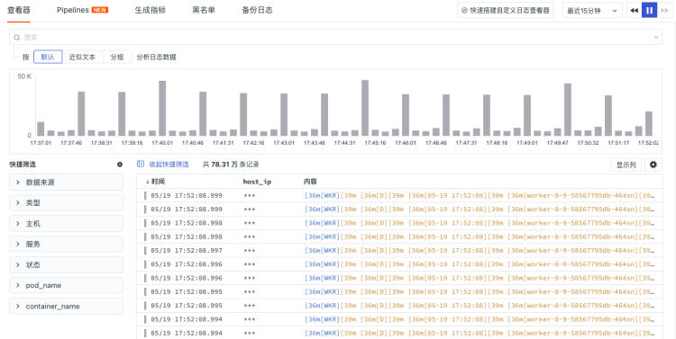

# 敏感数据脱敏
---

数据采集上报到观测云工作空间以后，部分数据中存在的一些敏感信息字段，比如 IP 地址、用户信息等，针对这部分信息可以通过配置敏感字段来做脱敏处理。

**注意**：

- 不同的数据类型，可以自定义配置该数据下的敏感字段（字段名区分大小写）。数据类型包含：日志、基础对象、资源目录、事件、应用性能、用户访问、安全巡检、网络、Profile；        
    
- 字段配置脱敏后，字符串（string）类型字段数据返回显示 "***"；              
    
- 仅支持添加脱敏规则时，已选定分发的成员角色查看原始数据，其余成员在对应的查看器或者图表中无法查看脱敏前信息。       

## 添加脱敏规则

点击**管理 > 数据权限管理 > 敏感数据脱敏**，点击**添加脱敏规则**，即可开始添加敏感字段。

输入当前脱敏规则的名称，选择对应的数据类型后，输入需要脱敏的字段。

写入正则表达式，即可通过正则语法针对字段值内容进行脱敏配置。目前支持您直接选用[模板库](./regex.md)或自定义输入。点击预览，输入原文，点击脱敏即可查看脱敏效果。

如图所示，观测云会根据左侧正则表达式匹配结果，匹配到的结果按照 `***` 脱敏处理。

您可以**基于角色级别**配置敏感数据屏蔽规则，选定需要分发的角色即可；支持多选。

点击**确定**即可查看已经配置的敏感字段，如 `host_ip` 等。

<!--
### 查看脱敏效果

#### 在日志查看器查看脱敏效果

在数据授权管理配置了日志数据的敏感字段 `host_ip` 以后，工作空间标准成员和只读成员在日志查看器只能看到脱敏后的 `host_ip` 。

#### 在场景查看脱敏效果

在数据授权管理配置了日志数据的敏感字段 `host_ip` 以后，工作空间标准成员和只读成员在场景仪表板的日志流图中只能看到脱敏后的 `host_ip` 。

-->
## 规则列表管理

- 搜索：在页面右侧搜索栏，您可直接输入规则名称进行搜索；
- 编辑：点击即可修改当前规则；
- 删除：如无需当前规则，点击删除即可；
- 批量操作：在规则列表，您可以批量启用、禁用或删除特定规则。

