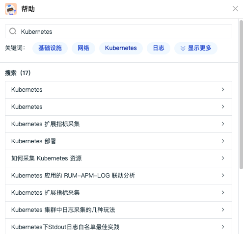

# 帮助
---

<<< custom_key.brand_name >>>帮助您在工作空间快速查看基础入门、进阶指南、最佳实践、DataKit、Func 等文档，通过点击提供的关键词或者在搜索栏直接输入关键字进行搜素，帮助您快速获取相关的文档说明。

在<<< custom_key.brand_name >>>工作空间，点击左侧菜单**帮助**，即可打开帮助对话框。

<!-- 

点击**关键字**即可进行搜索。

点击**显示更多**可查看更多关键字。

鼠标悬停在帮助菜单，可选择直接进入<<< custom_key.brand_name >>>帮助中心和更新日志。

-->

