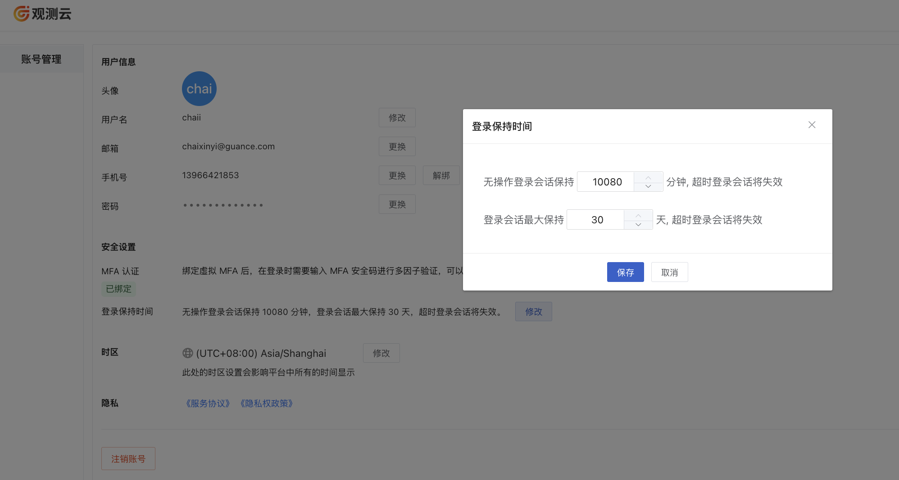
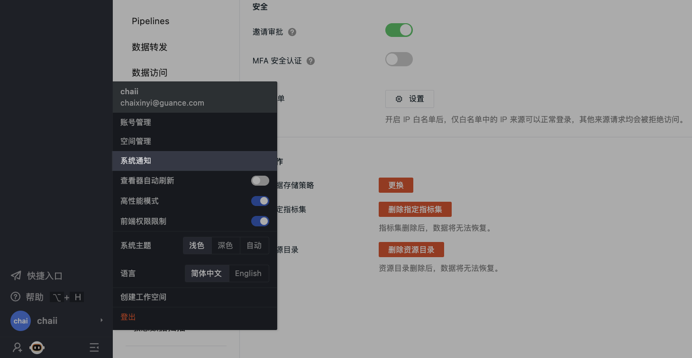

# 工作空间管理
---

工作空间是{{{ custom_key.brand_name }}}的基本操作单元。在{{{ custom_key.brand_name }}}工作空间内，您可以使用{{{ custom_key.brand_name }}}提供的多样化功能。而**工作空间管理**是针对当前工作空间进行的设置、管理和操作。在加入工作空间并被分配到权限后，您可以对该空间的基本信息、成员权限、SSO 登录、数据权限、API Key、通知对象、内置视图、图表和快照分享等进行管理。

下文将从**个人账户层级**向您介绍**如何注册登录帐户并进入您的工作空间、关注您的帐户安全、设置您的工作空间外观**。

## 工作空间相关

### 创建工作空间 {#create}

您可以通过创建或者被邀请的方式加入一个或多个工作空间。

在以任何方式加入工作空间之前，需要先[注册{{{ custom_key.brand_name }}}账号](https://auth.guance.com/businessRegister)。[注册完成](../plans/commercial-huaweiyun.md)后，您可以通过[{{{ custom_key.brand_name }}}官网](https://www.guance.com/)，点击**登录**，选择注册站点，输入登录账号和密码，登录到{{{ custom_key.brand_name }}}控制台。系统会默认为您创建一个工作空间，并赋予**拥有者**权限。

在现有的工作空间内，您可以从以下两个入口创建其他工作空间：

=== "入口 1"

    点击左下角的**账号 > 创建工作空间**。

    

=== "入口 2"

    点击左上角的**工作空间名称 > 新建工作空间**。

    

进入创建工作空间窗口：

1. 输入工作空间名称；
2. 选择该工作空间语言；
3. 按需为该工作空间添加描述；
4. 点击**确定**。

### SSO 账号登录 {#sso}

除了通过注册{{{ custom_key.brand_name }}}账号登录以外，还支持企业用户通过 [SSO 单点登录](../management/sso/index.md)的方式登录到{{{ custom_key.brand_name }}}。

通过 SSO 登录的账号，默认使用 SSO 配置的登录保持时间。

### 快速搜索 {#quick-entry}

在左侧导航栏 > 快速搜索，可快速查看当前工作空间内最近访问的页面和其他各功能相关页面：

## 账号安全设置

### MFA 认证 {#mfa}

{{{ custom_key.brand_name }}}提供 MFA 认证管理，帮助在账号用户名和密码之外再额外增加一层安全保护。开启 MFA 认证后，您在登录时需要进行二次校验，从而帮助您提高账户的安全性。

> 更多详情，可参考 [MFA 管理](mfa-management.md)。

### 登录保持时间 {#login-hold-time}

{{{ custom_key.brand_name }}}支持为登录到工作空间的账号设置会话保持时间，包括工作空间注册的账号和 SSO 单点登录的账号。

注册账号可在工作空间，点击左下角**账号 > 账号管理**，在登录保持时间，点击修改默认的登录会话保持时间，包括无操作登录会话保持时间和登录会话最大保持时间。设置以后，超时登录会话会失效。

- 无操作登录会话保持时间：支持设置范围 30 ~ 10080 分钟，默认为 10080 分钟；
- 登录会话最大保持时间：支持设置范围 1 ~ 30 天，默认为 30 天。

### 数据隔离和数据授权

若您公司有多个部门需要隔离数据，您可以创建多个工作空间，并邀请相关部门或者关系人加入对应的工作空间。

若您需要对所有部门不同工作空间的数据进行统一查看，您可以通过配置[数据授权](./data-authorization.md)的方式，授权多个工作空间的数据给到当前的工作空间，通过场景仪表板和笔记的图表组件进行查询和展示。

### 注销账号 {#cancel}

**注意**：该入口仅本地账号可见，单点登录账号无此入口。

:material-numeric-1-circle-outline: 选择上图任一方式进行身份验证；

:material-numeric-2-circle-outline: 若当前账号为工作空间的拥有者，请先移交这一角色权限；

:material-numeric-3-circle-outline: 在当前账号为非拥有者的前提下，进入第三步。在确认注销前需注意：

1. 账号将无法登录进入{{{ custom_key.brand_name }}}工作空间；  
2. 账号在工作空间内所有关联信息将被清除且无法找回；  
3. 账号提交的未关闭工单将于 7 个工作日内做关闭处理。

阅读并同意相关协议后，点击**确认注销**，即可注销当前账号。

???+ warning "账号被注销后："

    1. 针对普通商业版：账号注销后，被注销的邮箱依旧可以被再次注册。注册后为一个全新的账号，历史账号的数据不会被关联显示。
    2. 针对部署版：可以通过[管理后台 > 添加用户](../deployment/user.md#add)进行创建。

## 个人账号设置 {#personal}

**注意**：如果在管理后台选择隐藏头像，此处关于查看器自动刷新、高性能模式等配置项可前往**管理 > 个人设置**进行修改。

### 用户信息

在工作空间，点击左侧**账号 > 账号管理**，您可以修改头像、用户名、邮箱、手机和密码。

### 时区 {#zone}

{{{ custom_key.brand_name }}}支持成员修改时区，从而切换到对应的工作空间时区查看数据。{{{ custom_key.brand_name }}}默认跟随“浏览器时间”，即本地浏览器检测到的时间。

在工作空间，点击左下角**账号 > 账号管理 > 时区**，即可修改当前的时区。
您也可以在{{{ custom_key.brand_name }}}提供的[时间控件](../getting-started/function-details/explorer-search.md#time)来快速修改时区。

**注意**：设置新的时区后，您当前账号所在的所有工作空间均按照设置后的时区进行显示，请谨慎操作。

#### 工作空间时区 {#workspace}

考虑到有时工作空间的数据基于一个时区上报，而当前工作空间的成员可能所处不同国家或地区，为保证各成员能在同一时区分析数据、排查故障。您可前往**工作空间管理 > 空间设置 > 高级设置 > 工作空间时区**为成员统一配置时区。配置完成后，当工作空间的其他成员选定了配置好的**工作空间时区**，其时区状态会跟随配置好的空间时区变化而变化。

???+ warning

    - 仅当前工作空间的 Owner 及 Administrator 拥有工作空间时区配置权限；          
    - 当工作空间时区被设置后，不会自动更改成员所在工作空间的时区，需成员手动选择；          
    - 当工作空间的其他成员时区选定了工作空间时区，若工作空间时区被删除，成员时区会自动变为**浏览器时间**。    

### 系统通知 {#system-notice}

您可以在导航栏 > **系统通知**统一查看当前账号下工作空间存在的异常状态，比如：数据转发规则、云账号可用状态、告警规则、数据使用上线等。

点击上方的订阅按钮，当有新消息时，{{{ custom_key.brand_name }}}会发送相关邮件至您的邮箱。

### 高性能模式

{{{ custom_key.brand_name }}}支持图表高性能加载模式，默认关闭。

*示例：*

开启高性能模式以后，所有图表不进行动态加载，在点击进入页面的时候直接全部加载，即在超出当前页面使用往下滑动查看时图表已全部加载完成，可直接查看展示结果。

**注意**：高性能模式开启后，仅影响当前用户查看图表的场景。

### 系统主题 {#theme}

{{{ custom_key.brand_name }}}支持切换主题颜色。

若系统主题选择【自动】，则可根据电脑外观自动切换主题颜色。

## 更多阅读

- [ :fontawesome-solid-arrow-right-long: &nbsp; **工作空间锁定/解锁/解散**](../billing-center/workspace-management.md#workspace-lock#lock)

