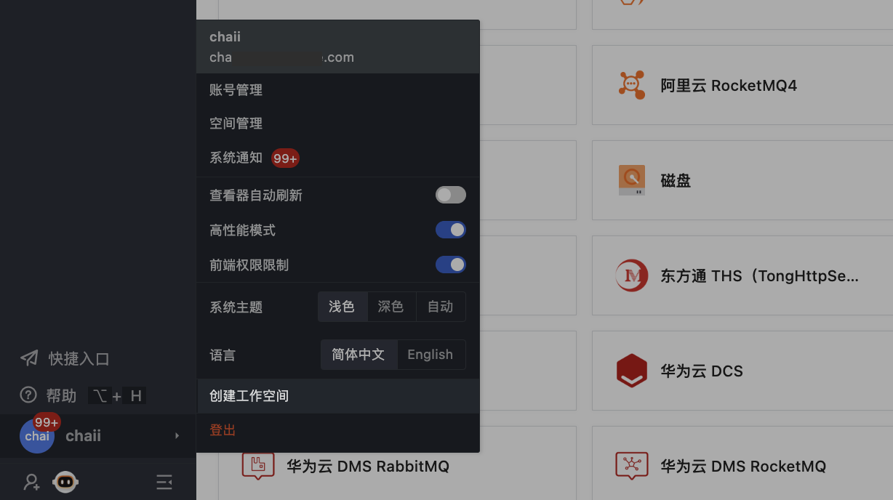
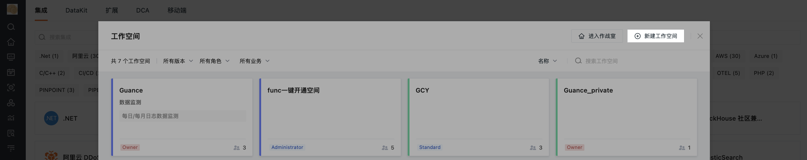
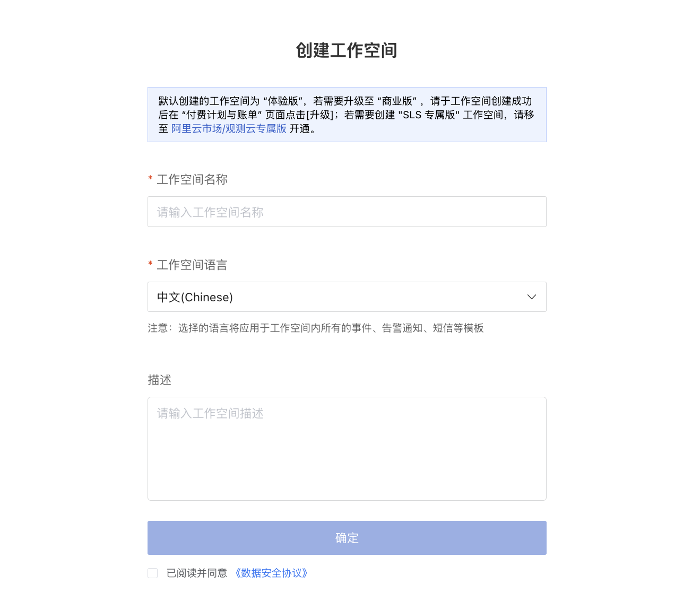
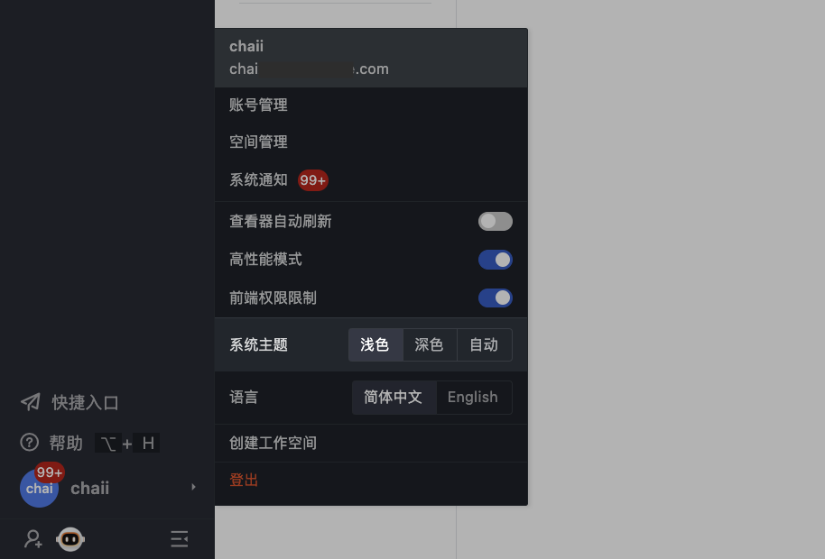

# 工作空间管理
---

工作空间是观测云的基本操作单元。在观测云工作空间内，您可以使用观测云提供的多样化功能。而**工作空间管理**是针对当前工作空间进行的设置、管理和操作。在加入工作空间并被分配到权限后，您可以对该空间的基本信息、成员权限、SSO 登录、数据权限、API Key、通知对象、内置视图、图表和快照分享等进行管理。

下文将从**个人账户层级**向您介绍**如何注册登录帐户并进入您的工作空间、关注您的帐户安全、设置您的工作空间外观**。

## 工作空间相关

### 创建工作空间 {#create}

您可以通过创建或者被邀请的方式加入一个或多个工作空间。

在以任何方式加入工作空间之前，需要先[注册观测云账号](https://auth.guance.com/businessRegister)。[注册完成](../billing/trail.md#register-trail)后，您可以通过 [观测云官网](https://www.guance.com/)，点击**登录**，选择注册站点，输入登录账号和密码，登录到观测云控制台。系统会默认为您创建一个工作空间，并赋予**拥有者**权限。

在现有的工作空间内，您还可以从以下两个入口创建其他多个工作空间：

- 入口 1：

点击左下角的**账号 > 创建工作空间**。

- 入口 2：

点击左上角的**工作空间名称 > 新建工作空间**。

在**创建工作空间**窗口，输入工作空间名称，选择该工作空间语言。您还可以根据角色来选择不同的工作空间目录风格属性。

- 不同角色下的工作空间目录默认展示如下：

=== "研发"

    

=== "运维"

    

=== "测试"

    

=== "默认"

    

若您需要进一步设置菜单，可前往**管理 > 高级设置 > [功能菜单管理](./settings/customized-menu.md)** 进行修改。

???+ warning "注意"

    - 工作空间语言该配置影响工作空间内事件、告警、短信等模板。切换到英文后，上述对应模板将默认使用英文模板，请知悉； 
    - 单个观测云站点下，仅支持绑定一个手机号码、一个邮箱，暂不支持港澳台和国外手机号码；
    - 不同站点的账号独立不互通，更多站点说明，可参考 [站点说明](../billing/commercial-register.md#site)；
    - 支持选择[单点登录](../management/sso/index.md) 到观测云。

> 您可按需参考文档 [阿里云市场开通观测云专属版](../billing/commercial-aliyun-sls.md) 来创建 SLS 专属版工作空间。

### SSO 账号登录 {#sso}

除了通过注册观测云账号登录以外，还支持企业用户通过 [SSO 单点登录](../management/sso/index.md)的方式登录到观测云。

通过 SSO 登录的账号，默认使用 SSO 配置的登录保持时间，在账号管理修改后，使用修改后的登录保持时间。

## 账户安全相关

观测云一直重视用户的账号安全，下列是一些相关的安全设置。

### MFA 认证 {#mfa}

观测云提供 MFA 认证管理，帮助在账号用户名和密码之外再额外增加一层安全保护。开启 MFA 认证后，您在登录时需要进行二次校验，从而帮助您提高账户的安全性。

> 更多详情，可参考 [MFA 管理](mfa-management.md)。

### 登录保持时间 {#login-hold-time}

观测云支持为登录到工作空间的账号设置会话保持时间，包括工作空间注册的账号和 SSO 单点登录的账号。

注册账号可在工作空间，点击左下角**账号 > 账号管理**，在登录保持时间，点击修改默认的登录会话保持时间，包括无操作登录会话保持时间和登录会话最大保持时间。设置以后，超时登录会话会失效。

- 无操作登录会话保持时间：支持设置范围 180 ～ 1440 分钟，默认为 180 分钟；
- 登录会话最大保持时间：支持设置范围 0 ～ 7 天，其中 0 表示永不超时，默认为 7 天。

### 数据隔离和数据授权

若您公司有多个部门需要隔离数据，您可以创建多个工作空间，并邀请相关部门或者关系人加入对应的工作空间。

若您需要对所有部门不同工作空间的数据进行统一查看，您可以通过配置数据授权的方式，授权多个工作空间的数据给到当前的工作空间，通过场景仪表板和笔记的图表组件进行查询和展示。

> 更多配置详情，可参考 [数据授权](data-authorization.md)。

## 个人偏好设置

### 个人资料

在工作空间，点击左侧**账号 > 账号管理**，您可以修改头像、用户名、邮箱、手机和密码。

### 时区 {#zone}

观测云支持成员修改时区，从而切换到对应的工作空间时区查看数据。观测云默认跟随“浏览器时间”，即本地浏览器检测到的时间。

在工作空间，点击左下角**账号 > 账号管理 > 时区**，即可修改当前的时区。

**注意**：设置新的时区后，您当前账号所在的所有工作空间均按照设置后的时区进行显示，请谨慎操作。

您也可以在观测云提供的[时间控件](../getting-started/function-details/explorer-search.md#time)来快速修改时区。

#### 工作空间时区 {#workspace}

考虑到有时工作空间的数据基于一个时区上报，而当前工作空间的成员可能所处不同国家或地区，为保证各成员能在同一时区分析数据、排查故障。您可前往**工作空间管理 > 设置 > 高级设置 > 工作空间时区**为成员统一配置时区。配置完成后，当工作空间的其他成员选定了配置好的**工作空间时区**，其时区状态会跟随配置好的空间时区变化而变化。

???+ warning

    - 仅当前工作空间的 Owner 及 Administrator 拥有工作空间时区配置权限；          
    - 当**工作空间时区**被设置后，不会自动更改成员所在工作空间的时区，需成员手动选择；          
    - 当工作空间的其他成员时区选定了**工作空间时区**，若工作空间时区被删除，成员时区会自动变为**浏览器时间**。    

### 系统通知

- [ :fontawesome-solid-arrow-up-right-from-square: &nbsp; 点击管理您的工作空间系统通知](./system-notification.md)

### 高性能模式

观测云支持图表高性能加载模式，默认关闭，可通过点击左下角账号，在**高性能模式**选择开启。

*示例：*

开启高性能模式以后，所有图表不进行动态加载，在点击进入页面的时候直接全部加载，即在超出当前页面使用往下滑动查看时图表已全部加载完成，可直接查看展示结果。

**注意**：高性能模式开启后，仅影响当前用户查看图表的场景。

### 系统主题

观测云支持切换主题颜色。

若系统主题选择【自动】，则可根据电脑外观自动切换主题颜色。

=== "浅色效果"

    

=== "深色效果"

    

## 更多阅读

- [ :fontawesome-solid-arrow-right-long: &nbsp; **工作空间锁定/解锁/解散**](../billing/cost-center/workspace-management.md#lock)

