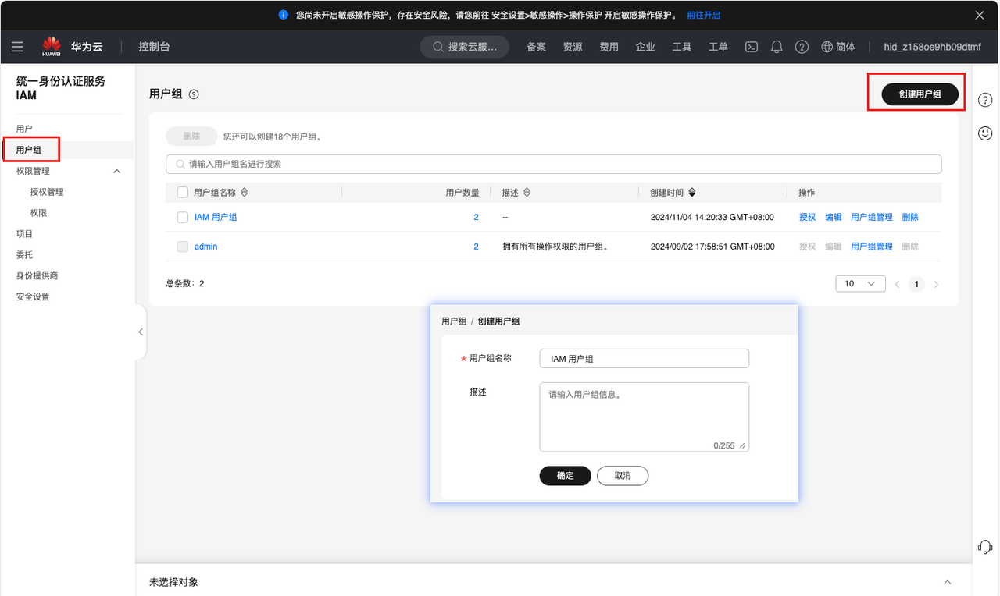
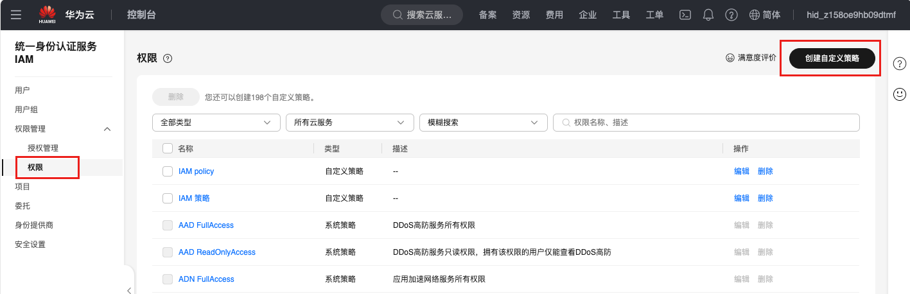
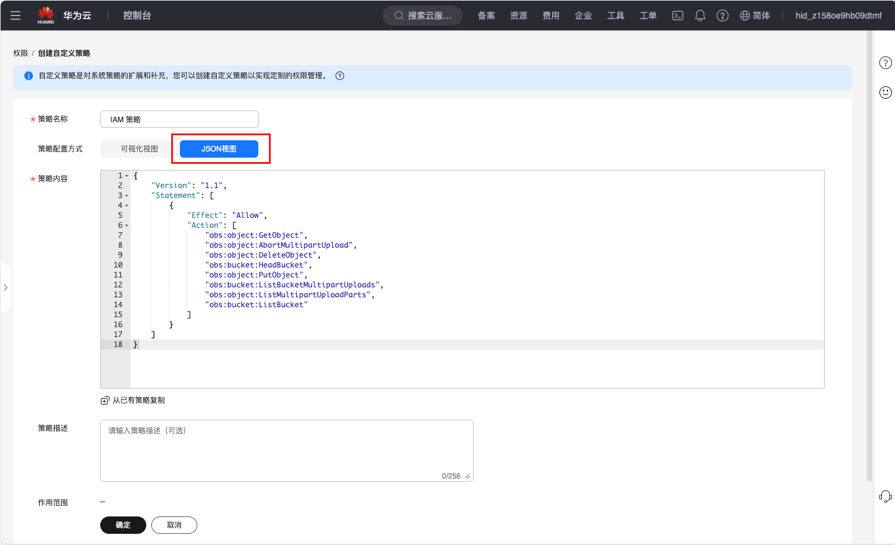
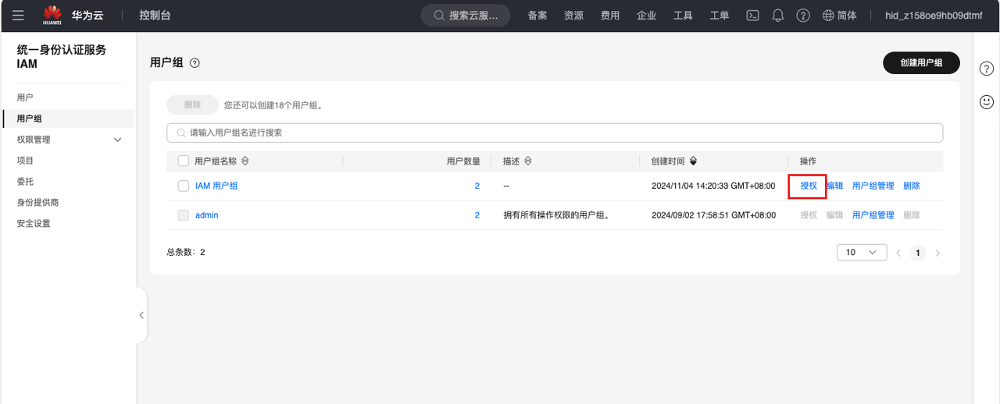
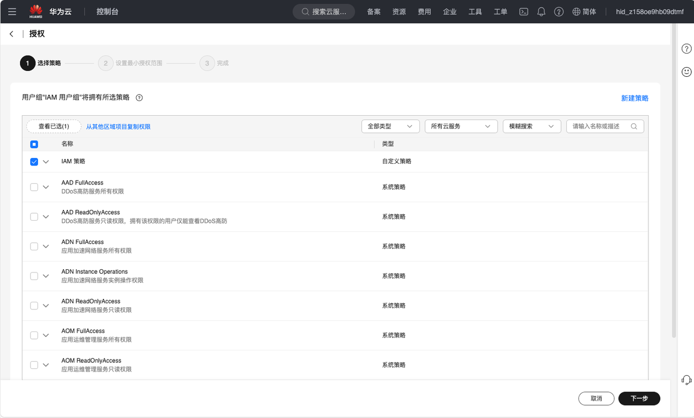
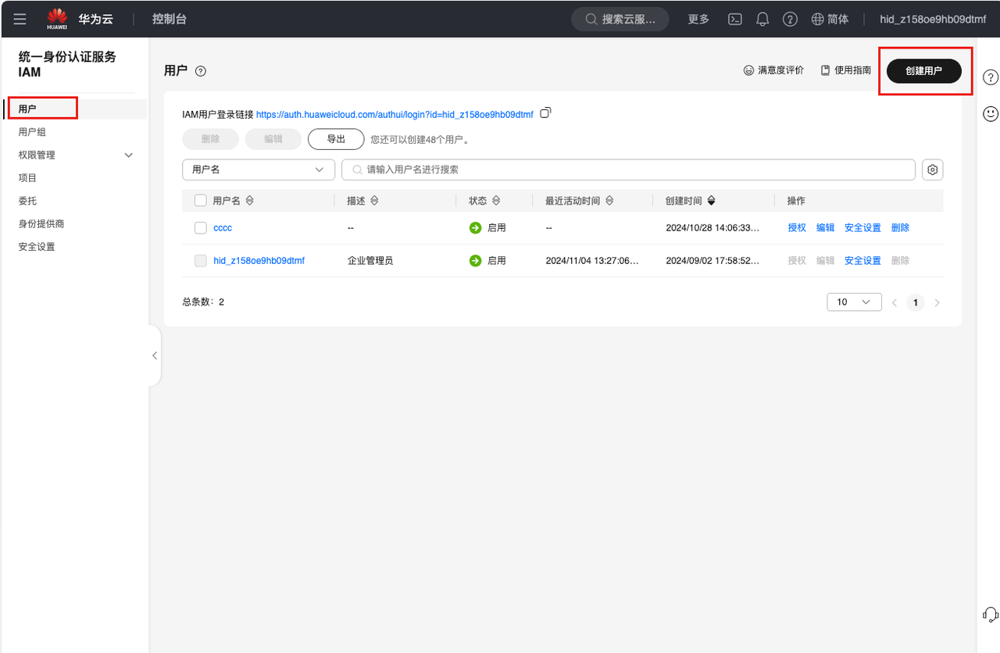
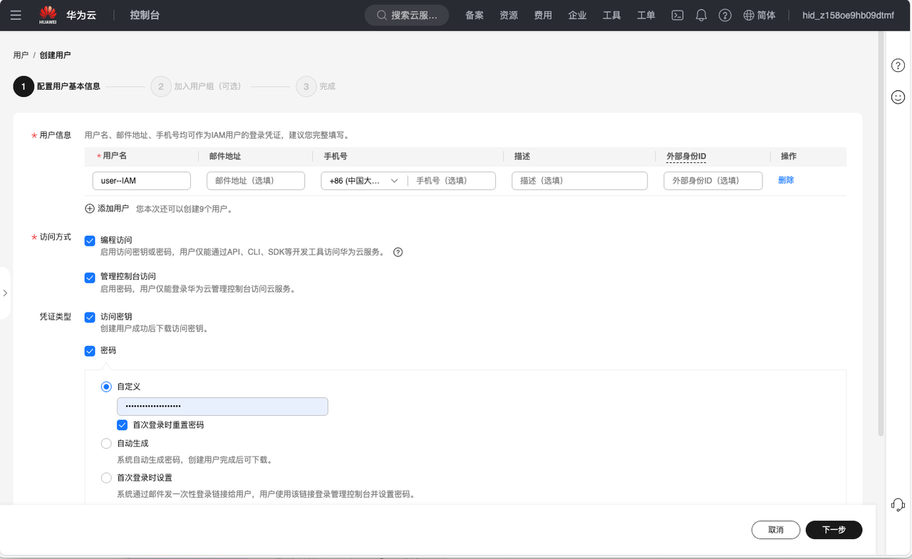
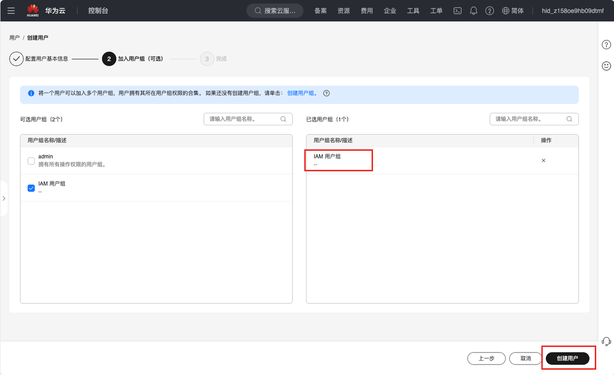
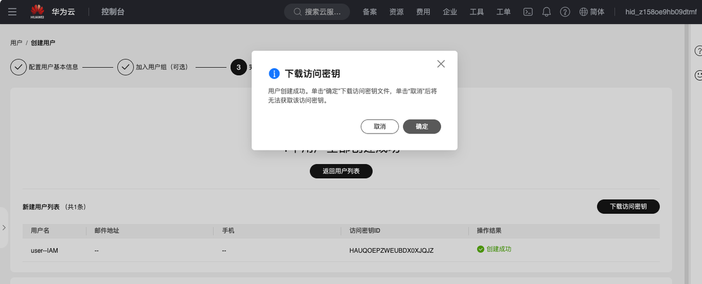

# 在华为云中配置观测云 IAM 策略

华为云的权限管理策略是以“用户组”为基本权限单元的，即：创建用户组，并给用户组关联权限集和账号，然后将用户加入用户组，使用户组下的全部用户获得相应的权限。


1、登陆控制台，鼠标悬浮右上角账号，点击“统一身份认证”。

在左侧菜单点击“用户组”并创建一个用户组。




2、创建自定义权限策略，在“权限管理>权限”处点击创建自定义策略。

并选择 JSON 视图配置方式，将此处提供的 JSON 内容粘贴上去。



```
{
    "Version": "1.1",
    "Statement": [
        {
            "Effect": "Allow",
            "Action": [
                "obs:object:GetObject",
                "obs:object:AbortMultipartUpload",
                "obs:object:DeleteObject",
                "obs:bucket:HeadBucket",
                "obs:object:PutObject",
                "obs:bucket:ListBucketMultipartUploads",
                "obs:object:ListMultipartUploadParts",
                "obs:bucket:ListBucket"
            ]
        }
    ]
}
```





3、为用户组进行授权，选择第二步创建的自定义权限策略。

**注意**：授权后需等待 15-30 分钟才可生效。






4、创建用户，并将此用户加入到对应权限的用户组中。





4.1 填写用户名称及其他必填字段（须勾选“访问密钥”）



4.2 加入第一步创建的用户组

**注意**：若一个用户同时关联了多个用户组，则此用户的权限为所有用户组权限策略的并集。



4.3 用户创建成功后，可在弹出框中下载访问密钥。

**注意**：此密钥仅能下载一次，若点击取消，后续将无法查看/下载此密钥。您可另外在“用户 > 安全设置”处设置最多2个访问密钥。

