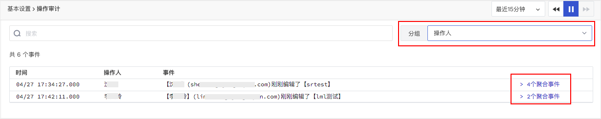

# 操作审计
---

观测云支持查看工作空间用户行为产生的操作审计事件，实时记录工作空间内的项目使用情况、用户行为操作和资源变更，主要包括：

- 工作空间管理的事件：如基本设置的修改，成员权限的修改，删除通知对象，Lisence 过期等；  
- 功能和服务使用的事件：如新建/修改/删除视图，新建应用检测，禁用某个检测库，设置主机沉默，生成指标等；        
- 计费项目事件：如项目的使用量已接近免费额度等。      

## 事件列表

在**管理 > 审计事件**可查看所有工作空间产生的用户操作行为事件。

在列表，您可以针对事件进行搜索、分组聚合等操作；通过页面上方的时间组件，您可以查看不同时间范围内的操作事件；点击设置，您还可以针对直接创建监控器或将当前审计事件列表导出为 CSV。

## 事件详情页

在操作事件列表中点击事件，您就可以侧滑出事件的详情页面，可查看事件的触发时间、标签属性、操作人、事件内容等。

您还可以使用以下字段进行自主查询分析：

| 字段名	      | 类型      | 是否必须	      | 说明      |
| ----------- | ---------------- | ----------- | ---------------- |
| `date`	      | Integrate      | 必须	      | 产⽣时间，Unix 时间戳，单位 ms      |
| `df_date_range`		      | Integrate      | 必须	      | 时间范围，单位 s     |
| `df_source`	      | String      | 必须	      | 数据来源，操作事件取值 audit      |
| `df_status`		      | String      | 必须	      | 状态，操作事件默认取 info      |
| `df_origin`	      | String      | 必须	      | 操作来源，用于记录当前操作是从哪个来源入口产生。参考值如下： <li>front: 前端用户操作  <li>openapi: 通过 OpenAPI 操作 <li>manage: 通过管理后台操作 <li>inner: 通过内部可信任系统操作      |
| `df_menu`	      | String      | 必须	      | 用户访问的菜单路径，例如：日志-查看器      |
| `df_event_id`		      | String      | 必须	      | 事件唯一 ID      |
| `df_title`		      | String      | 必须	      | 标题      |
| `df_message`	      | String      | 必须	      | 描述      |
| `df_user_id`		      | String      | 必须	      | 用户 ID      |
| `df_user_name`		      | String      | 必须	      | 用户姓名      |
| `df_user_email`	      | String      | 必须	      | 用户邮箱，对应【成员管理】的 id、name、email      |
| `df_user_team`		      | String      | 必须	      | 用户当下所属团队      |
| `df_role_scope`		      | String      | 必须	      | 用户当下所拥有的角色范围      |

## 分组聚合

通过分组功能，观测云支持快速依据分组标签聚合和统计相关事件。通过操作人分组聚合，即可查看时间范围内用户在观测云平台上的触发的所有聚合事件数量。

### 聚合详情页

点击**聚合事件**，您可以在详情页查看某一用户触发的所有事件列表。

## 事件数据存储策略

操作审计的数据按照事件的存储策略进行保存，您可以在**管理 > 设置 > 变更数据存储策略**查看和调整事件存储策略。

## 更多阅读

- [ :fontawesome-solid-arrow-right-long: &nbsp; **审计事件逻辑详解**](./audit-event.md)

