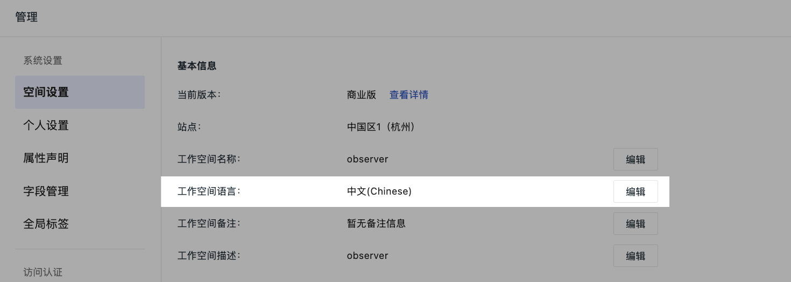
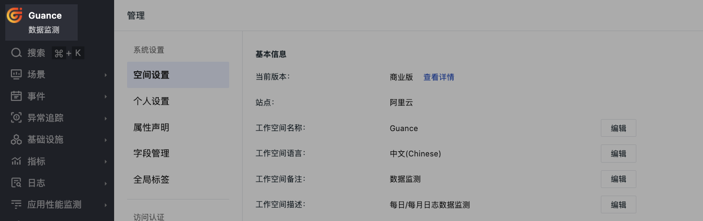
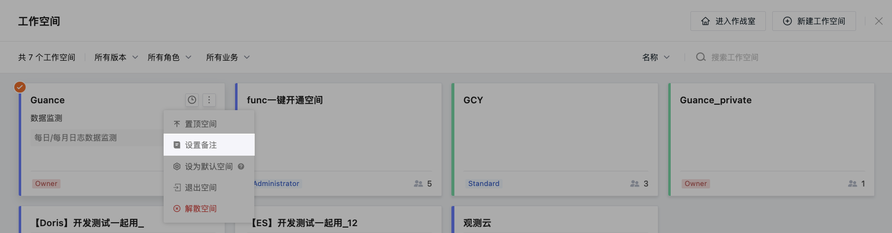

# 设置

加入到工作空间并被分配权限后，您可以看到一系列关于<u>当前工作空间</u>的设置。
 

## 基本信息

### 工作空间语言 {#language}

在工作空间，您可以修改工作空间语言，目前支持选择中文、英文两种：

该配置影响工作空间内事件、告警、短信等模板。切换后，上述模板将默认使用切换后的语言模板。

**注意**：

- 这里的工作空间语言与您空间页面的**显示语言**是不同的：观测云会根据您本地浏览器历史登录系统控制台的默认显示语言或本地浏览器语言，作为您登录工作空间的默认显示语言，如您浏览器使用的是中文，则登录工作空间控制台默认显示中文。
- 仅支持工作空间拥有者、管理员有权限修改工作空间语言。

### 备注 {#remark}

观测云支持为当前工作空间设置备注，帮助用户能更清晰的获取工作空间名称等信息。

在**管理 > 设置 > 基本信息**，设置需要查看的备注信息。

设置完成后，您可以在左上角工作空间查看备注信息。

点击工作空间名称，支持查看所有工作空间及其备注，点击备注**编辑**按钮即可添加或修改备注内容。

### 更换 Token {#token}

观测云支持当前空间拥有者和管理员复制/变更空间内的 Token，并自定义当前 Token 的失效时间。进入**管理 > 基本设置 > 更换 Token**，选择失效时间并确认**更换**后，观测云会自动生成新的 Token，旧的 Token 会在指定时间内失效。

???+ warning

    - 更换 Token 会触发 **[操作审计](../settings/operation-audit.md)** 和 **[通知](../system-notification.md)**；
    - 更换 Token 后，原有 Token 会在指定时间内失效。失效时间包括：立即失效、10分钟、6小时、12小时、24小时。立即失效一般用于 Token 泄露，选择立即失效后，原有 Token 将立刻停止数据上报，若设置了异常检测，则无法触发事件及告警通知，直至在 DataKit 采集器的 `datakit.conf` 中把原有 Token 修改成新生成的 Token。
    > 关于 `datakit.conf` 文件的存储目录，可参考 [DataKit 使用入门](../datakit/datakit-conf.md)。

### 配置迁移 {#export-import}

观测云支持拥有者和管理员一键导入、导出工作空间内的仪表板、自定义查看器、监控器的 JSON 配置文件，进入**管理 > 设置**，在**配置迁移**选择导出或导入操作。

在导入时，若当前工作空间存在重名的仪表板、查看器、监控器，提示导入文件存在重名，用户可以根据实际的需求来选择是否**跳过**、**仍然创建**和**取消**。

- 跳过：表示**仅创建非重名**的文件；  
- 仍然创建：根据导入的文件名创建对应仪表板、查看器、监控器；            
- 取消：取消此次文件导入操作，即无文件导入。       

**注意**：支持以压缩包的格式导入其他工作空间仪表板、查看器、监控器的 JSON 配置文件。

<!--

-->

### 高级设置

- [ :fontawesome-solid-arrow-up-right-from-square: &nbsp; 关键指标](../settings/key-metrics.md)

 

- [ :fontawesome-solid-arrow-up-right-from-square: &nbsp; 功能菜单](../settings/customized-menu.md)

 

- [ :fontawesome-solid-arrow-up-right-from-square: &nbsp; 工作空间时区](../index.md#workspace)

 

## 安全相关

### 邀请审批

开启开关后，在[邀请成员](../invite-member.md)通知发送后，需要当前工作空间拥有者及管理员权限成员审批通过后才可以加入该工作空间。若未开启，则被邀请成员可以直接进入工作空间。

### MFA 安全认证

开启后，所有工作空间的成员必须完成 [MFA 绑定和认证](../mfa-management.md)，否则将无法进入工作空间。

### IP 白名单 {#ip}

观测云支持为工作空间配置 IP 白名单来限制来访用户。开启 IP 白名单后，仅白名单中的 IP 来源可以正常登录，其他来源请求均会被拒绝访问。

IP 白名单仅支持管理员及拥有者可以设置，同时 **Owner** 不受 IP 白名单访问限制。

IP白名单书写规范如下：

- 多个 IP 需换行，每行只允许填写一个 IP 或网段，最多可添加 1000 个； 
- 指定 IP 地址：192.168.0.1，表示允许 192.168.0.1 的 IP 地址访问；             
- 指定 IP 段：192.168.0.0/24，表示允许 192.168.0.1 到 192.168.0.255 的 IP 地址访问；        
- 所有 IP 地址：0.0.0.0/0。

## 危险操作

### 变更数据存储策略

观测云支持拥有者变更空间内的数据存储策略，进入**管理 > 基本设置**，点击**变更**后，选择所需的数据存储时长，点击**确定**即可变更当前工作空间内的数据存储时长。

> 更多说明，可参考 [数据存储策略](../../billing/billing-method/data-storage.md)。

### 删除指标集

观测云支持拥有者和管理员删除空间内的指标集，进入**管理 > 基本设置**，点击**删除指标集**后，输入查询并选择指标集名称（支持模糊匹配），点击**确定**后进入删除队列等待删除。

**注意**：

- 只允许空间拥有者和管理员进行此操作；     

- 指标集一经删除，无法恢复，请谨慎操作；    

- 删除指标集时，会产生系统通知事件，如用户创建了删除指标集任务、删除指标集任务执行成功、删除指标集任务执行失败等。

### 删除自定义对象

观测云支持拥有者和管理员删除指定自定义对象分类以及所有自定义对象，进入**管理 > 基本设置**，点击**删除自定义对象**后，选择删除自定义对象的方式，即可删除对应的对象数据。

- 指定自定义对象分类：仅删除所选对象分类下的数据，不会删除索引；           
- 所有自定义对象：删除所有自定义对象数据及索引。   

