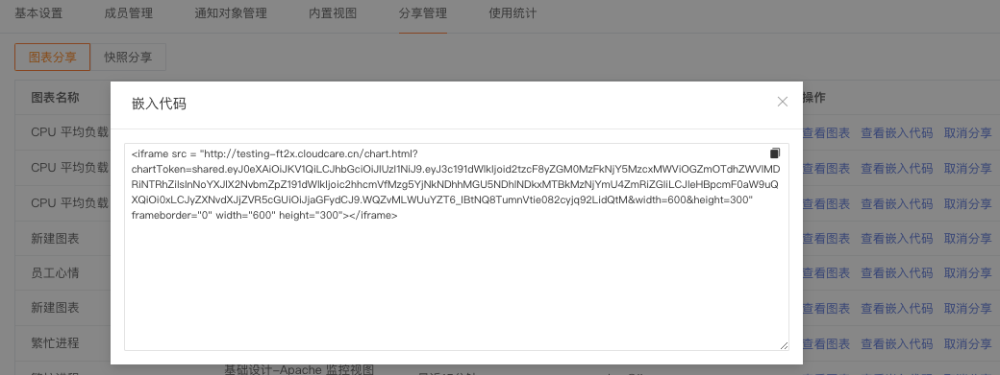
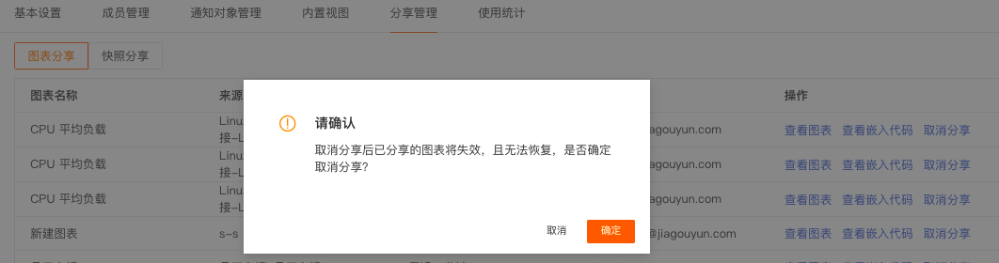
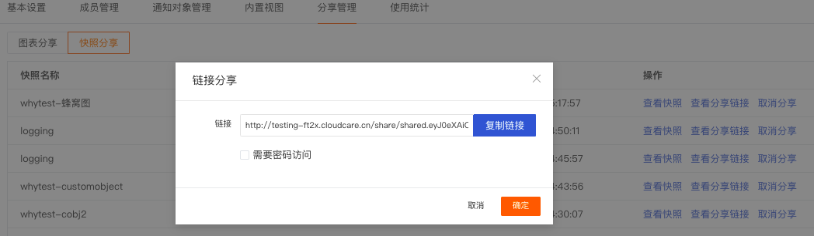

# 分享管理
---

观测云支持通过**管理 > 分享管理**，对当前空间内分享的图表和快照进行统一管理。

## 分享图表

观测云支持当前空间管理员和标准成员进行图表分享和管理。图表分享可用于在观测云以外的平台代码中插入图表进行可视化数据展示和分析。

> 更多详情，可参考 [图表分享](../scene/visual-chart/index.md#share)。

在**场景视图**中完成图表分享后，通过**管理 > 分享管理 > 分享图表**可以查看当前空间内的分享图表列表，并进行<u>批量操作、图表查看、查看嵌入代码和取消分享</u>。

- **图表查看**可以帮助您快速预览对应分享的图表；

- **查看嵌入代码**可以帮助您快速获取对应分享的图表的嵌入代码；

- **取消分享**将使已分享的图表失效，且无法恢复，<u>请仔细确认取消分享的内容</u>。您还可以点击图表名称旁的 :material-crop-square: ，即可选中特定图表批量取消分享。

## 分享快照

分享快照后，通过**管理 > 分享管理 > 快照分享**可以查看快照分享列表，包括快照名称、分享方式、分享人、有效期、时间范围、查看快照和查看分享链接。

| 字段      | 描述                          |
| ----------- | ------------------------------------ |
| 快照名称       | 创建快照时设定的名称，暂不支持修改。  |
| [分享方式](../getting-started/function-details/snapshot.md)      | 包括公开分享和加密分享两种，支持分享快给拥有链接的“任何人”，或者拥有分享链接和密钥的人。|
| 有效期    | 快照分享的有效期。观测云默认分享链接的有效时间为 48 小时，即产生分享链接后的48小时为有效时间。 |
| 时间范围      | 快照保存选择的相对/绝对时间范围。如相对时间范围最近 15 分钟。                          |
| 查看快照      | 对应快照，点击**查看快照**将跳转至新的页面查看对应的数据副本。                          |
| 查看分享链接      | 调整分享方式（例如：为公开分享添加密码），确认调整后即可生效。参考下图图一。                          |
| 取消分享      | 将使已分享的快照失效，且无法恢复，<u>请仔细确认取消分享的内容</u>。参考下图图二。 您还可以点击图表名称旁的 :material-crop-square: ，即可选中特定图表批量取消分享。                        |

*图一：*

*图二：*

