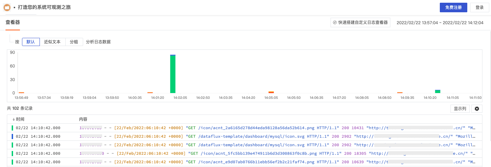
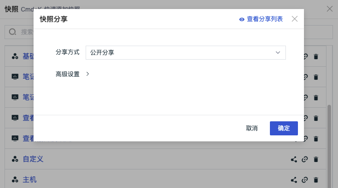
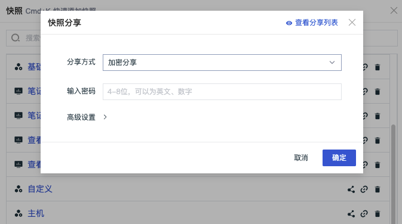
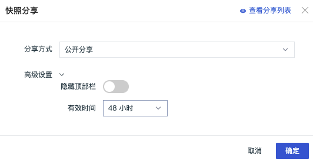
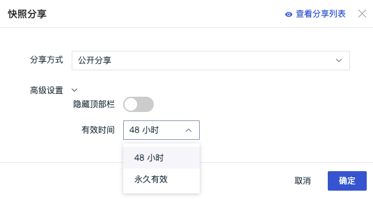

# 快照
---

## 简介

观测云快照支持为场景及内置视图，基础设施、指标、日志、事件、应用性能监测、用户访问监测、云拨测、安全巡检、CI 可视化等查看器创建可快捷访问的数据副本。通过快照功能，您可以快速复现即时拷贝的数据副本信息，将数据恢复到某一时间点和某一数据展示逻辑。

## 保存快照

观测云支持您通过页面功能按钮和快捷键（Windows: Ctrl+K / Mac OS: Cmd+K）快速保存快照，输入快照名称，选择「可见范围」，选择开启/关闭「时间筛选」，并点击「确定」即可创建新的快照。

- 可见范围：包括公开和仅自己可见，公开表示当前工作空间的用户都可以查看保存的快照；仅自己可见表示除当前用户外，其他用户都无法查看保存的快照
- 包括时间筛选：即保存当前所选的时间范围，分享出去的链接不支持切换时间控件；若关闭则跟随系统默认，分享出去的快照可以切换时间控件
- 锁定绝对时间：「包括时间筛选」为开启状态时才会显示，开启即选择保存当前所选的绝对时间

**注意**：当您的后台程序存在与快捷键（Ctrl+K / Cmd+K）冲突的其他快捷键时，您将无法使用「保存快照」的快捷键功能。

### 在查看器保存快照

在指标、日志、事件、应用性能监测、用户访问监测、云拨测、安全巡检等查看器，您可以对当前展示的数据进行标签、时间范围进行筛选，增加查看列等操作，然后点击查看器左上角的「快照」小图标，点击「保存快照」即可保存当前查看器所展示的数据内容，您可以直接使用快捷键（Windows: Ctrl+K / Mac OS: Cmd+K）保存快照。

### 在场景保存快照

在场景下的仪表板、笔记或内置视图，使用快捷键（Windows: Ctrl+K / Mac OS: Cmd+K）即可保存当前视图或笔记所展示的数据内容为快照。

## 查看快照

观测云支持在当前查看器或者快捷入口「快照」菜单查看保存的快照。

注意：保存的所有快照可在快捷入口「快照」菜单查看，当前查看器仅能查看当前查看器保持的快照，如在日志查看器保持的快照无法在链路查看器查看。

### 在查看器查看快照

基础设施、指标、日志、事件、应用性能监测、用户访问监测、云拨测、安全巡检、CI 可视化等查看器保存快照以后，点击左上角图标侧滑展开查看已经保存的快照。

- 支持快照名称关键字搜索，通过关键词模糊匹配相关快照名称
- 支持分享、复制链接和删除功能，点击「快照名称」即可在当前查看器打开对应的数据副本
- 若在保存快照时，「可见范围」选择“仅自己可见”，该快照名称后面显示「锁定」按钮，除当前用户以外，其他用户无法查看

- 在查看器快照列表，鼠标放在保存的历史快照上，可查看历史快照的时间范围、筛选条件，时间范围根据保存快照时的选择分成“绝对时间”、“相对时间”和“默认”三种

- 在查看器快照列表，选中保存的历史快照，出现「返回查看器」按钮，点击即可回到默认查看器

### 在快照菜单查看快照

快照保存以后，可通过点击左侧导航栏「快捷入口」-「快照」进行查看。

- 支持快照名称关键字搜索，通过关键词模糊匹配相关快照名称
- 点击「快照名称」即可在新窗口打开对应的数据副本，并复现该快照保存时的数据标签
- 每页最多可显示20个快照名称，通过跳转至下一页，您可以查看更多快照
- 若在保存快照时，「可见范围」选择“仅自己可见”，该快照名称后面显示「锁定」按钮，除当前用户以外，其他用户无法查看

## 删除快照

快照保存以后，可通过点击左侧导航栏「快捷入口」-「快照」，使用「删除」按钮，删除对应的「快照」。

## 分享快照

观测云支持两种快照分享方式：公开分享和加密分享，被分享的快照会自动生成分享链接。您可以分享快照链接给“任何人”，或者加密分享给拥有密钥的人。通过「[快照管理](../management/snapshot.md)」，您可以对当前空间内分享的全部快照进行统一管理，包括查看、取消分享等等。

注意：

- 若在保存快照的时候选择开启绝对时间，分享后则显示保存快照时的绝对时间。如保存快照时，选择最近15分钟，您在14：00点开快照链接，显示之前的绝对时间的数据；
- 若在保存快照的时候选择关闭绝对时间，分享后则显示保存快照时的相对时间。如保存快照时，选择最近15分钟，您在14：00点开快照链接，显示13：45 ~ 14：00的数据。

**注意**：您可以通过「快照管理」查看快照分享的有效期和快照分享的时间范围。详情可参考 [快照管理](../management/snapshot.md) 。

### 公开分享

公开分享支持持有分享链接的用户查看观测云工作空间被分享的数据。即仅需要分享链接，其他用户就可以看到您分享的快照。

### 私密分享

私密分享是对部分人分享的形式。在分享快照时，需要设置提取密码，且要求**4-8位数字和英文组合**的密码形式。其他用户只有在提供分享链接和密码的情况下，才可以访问该快照。

### 高级设置

#### 隐藏顶部栏

快照分享支持隐藏分享页面的顶部栏，在快照列表，点击分享按钮，即可在弹出对话框中进行高级设置“隐藏顶部栏”。

- 开启隐藏顶部栏分享的效果

- 关闭隐藏顶部栏分享的效果，可以看到顶部会有平台的介绍说明。

#### 设置有效时间

快照分享支持设置有效时间，支持选择 “48 小时”或者“永久有效”。在快照列表，点击分享按钮，即可在弹出对话框中进行高级设置“隐藏顶部栏”。

注意：永久有效分享容易存在数据安全风险，请谨慎使用。

### 快照分享管理

在快照分享页面，点击右上角的“查看分享列表”即可直接跳转到「管理」-「分享管理」-「快照分享」查看快照分享列表，包括快照名称、分享方式、分享人、有效期、查看快照和查看分享链接。更多详情参看[ 分享管理](../management/share-management.md)。

