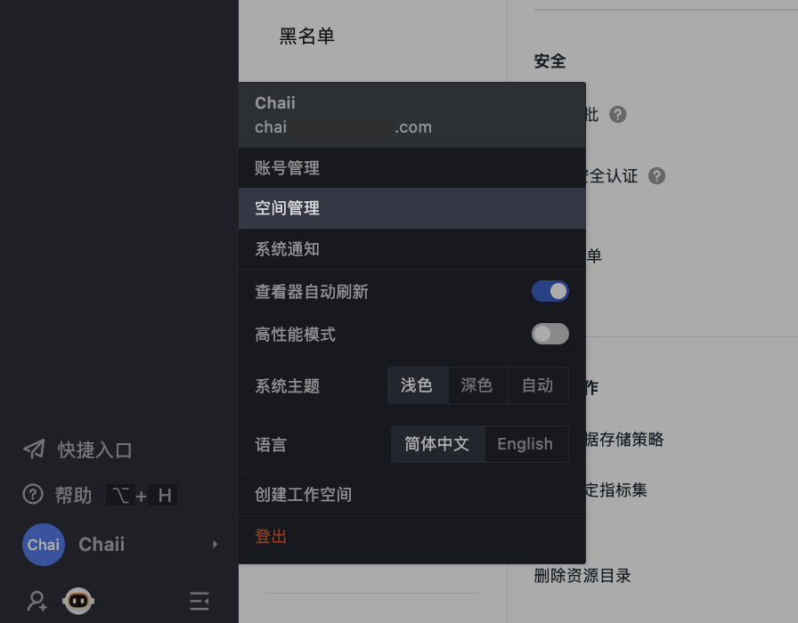

# 空间管理
---

观测云支持解散和退出工作空间。您可以通过点击左下角「账号」-「空间管理」进行操作。

## 解散当前工作空间

观测云支持解散工作空间，点击左下角「账号」-「空间管理」，选择想要解散的空间，点击右上角的「下拉选项」-「解散」即可。

> **注意：**只允许工作空间拥有者进行此操作，空间一经解散，数据将无法恢复，请谨慎操作。

## 退出当前工作空间

用户可主动退出工作空间，点击左侧「账号」-「空间管理」，选择想要退出的空间，点击右上角的「下拉选项」-「退出」即可。
