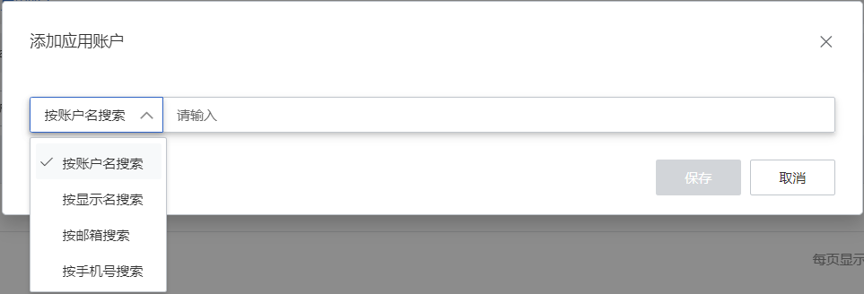
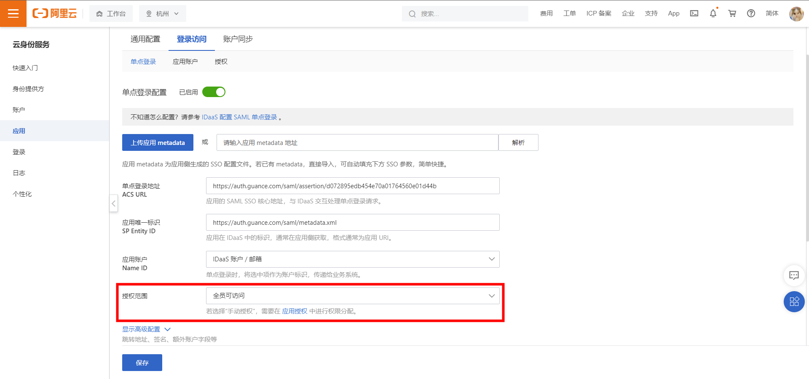
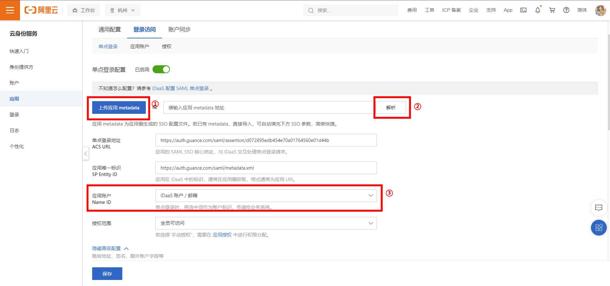
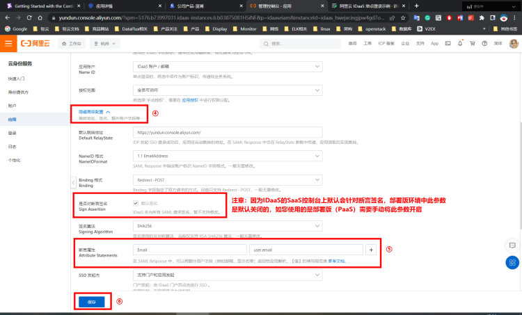
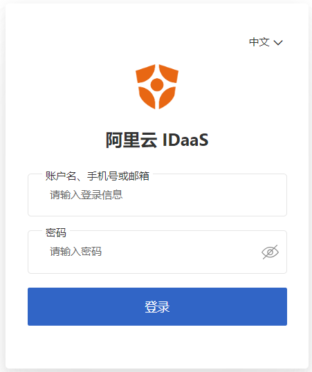

# 阿里云 IDaaS 单点登录示例
---

## 操作场景

阿里云 IDaaS（云盾） 是身份识别与访问管理解决方案提供商。{{{ custom_key.brand_name }}}支持基于 SAML 2.0（安全断言标记语言 2.0）的联合身份验证，SAML 2.0 是许多身份验证提供商（Identity Provider, IdP）使用的一种开放标准。您可以通过基于 SAML 2.0 联合身份验证将云盾与{{{ custom_key.brand_name }}}进行集成，从而实现云盾帐户自动登录（单一登录）{{{ custom_key.brand_name }}}平台访问对应工作空间资源，不必为企业/团队单独创建{{{ custom_key.brand_name }}}账号。

## 操作步骤 {#step1}

1、 阿里云 IDaaS 创建应用程序 

**注意**：在创建应用程序前，您需要先在 [IDaaS 平台(云盾)](https://yundun.console.aliyun.com/)注册账号并创建您的组织。

1）打开进入 IDaaS 控制台，进入**添加应用 > 标准协议**下选择创建 SAML2.0 的 SSO 应用。(此处以{{{ custom_key.brand_name }}}应用为例)

2）创建好应用后，点击**管理**进入应用配置界面，在配置单点登录之前，可以将应用账户和授权先配好。

① 添加应用账号

② 此次示例默认授权全员皆可访问，如需特殊授权，可以点击**授权**，更改权限配置。

1) 配置应用账号和授权后，点击进入**单点登录**页面，定位到**应用配置信息**模块，点击**下载**获取 IdP 元数据文件。

2、在{{{ custom_key.brand_name }}}启用SSO单点登录并在 IDaaS 平台更新配置

1）启用 SSO 单点登录，在{{{ custom_key.brand_name }}}工作空间**管理 > 成员管理 > SSO 管理**，点击**启用**即可。

> 可参考 [新建 SSO](../../management/sso/index.md)。

**注意**：基于账号安全考虑，{{{ custom_key.brand_name }}}支持工作空间仅配置一个 SSO，若您之前已经配置过 SAML 2.0，我们默认会将您最后一次更新的 SAML2.0 配置视为最终单点登录验证入口。

2）上传在[步骤 1](#step1)中下载的**元数据文档**，配置**域名（邮箱的后缀域名）**，选择**角色**，即可获取该身份提供商的**实体 ID** 和**断言地址**，下载服务提供商的 Metadata 数据（可通过浏览器访问链接信息后右键点击保存）。

**注意**：域名用于{{{ custom_key.brand_name }}}和身份提供商进行邮箱域名映射来实现单点登录，即用户邮箱的后缀域名需和{{{ custom_key.brand_name }}}中添加的域名保持一致。

1) 更新 IDaaS 侧应用的单点登录配置

① 导入步骤2 获得的服务提供商（SP）的 Metadata 文件

② 导入 Metadata 点击**解析**，即可将下方 ACS URL、Entity ID 参数一键导入

③ 将**应用账户**处配置更改为**IDaaS 账户 / 邮箱**

④ 点击展开 [高级配置]。（SaaS 环境中默认会开启对断言签名，部署版 (PaaS) 环境中该参数默认关闭，配置好应用信息后需要手动开启该参数。）

⑤ 新增【断言属性】，Key = “Email”, Value值 = “user.email”

⑥ 点击保存配置

3、获取单点登录地址

1）通过[**单点登录**](https://auth.guance.com/login/sso)访问{{{ custom_key.brand_name }}}，输入邮箱地址获取登录链接。如下图所示：

2）通过 SSO 登录配置详情页提供的**登录地址**，点击访问。如下图所示：

4、点击链接跳转到 IDaaS 输入用户名、密码，验证完成后即可登录{{{ custom_key.brand_name }}}。登录后，如下图所示：

1）IDaaS 平台输入用户名、密码登录。

2）登录成功后，{{{ custom_key.brand_name }}}页面显示。

**注意**：若多个工作空间同时配置了相同的身份提供商 SSO 点单登录，用户通过 SSO 单点登录到工作空间后，可以点击{{{ custom_key.brand_name }}}左上角的工作空间选项，切换不同的工作空间查看数据。

