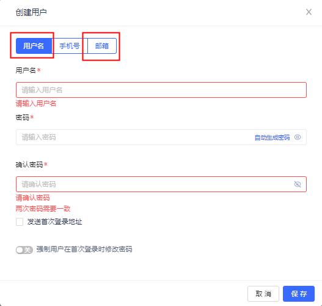
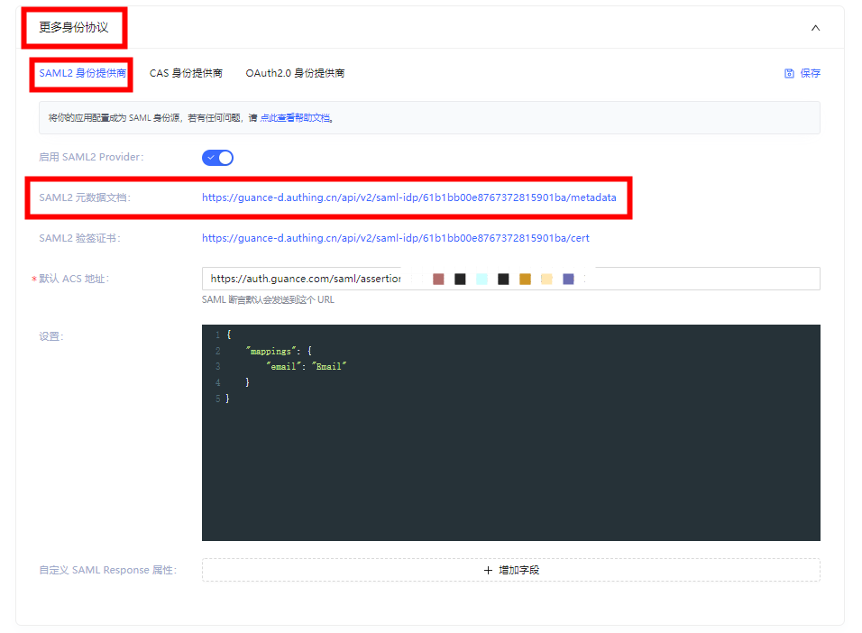
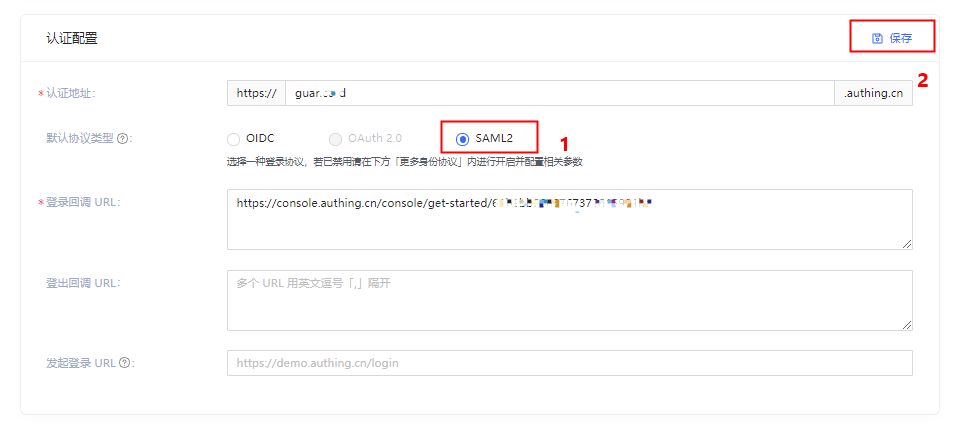
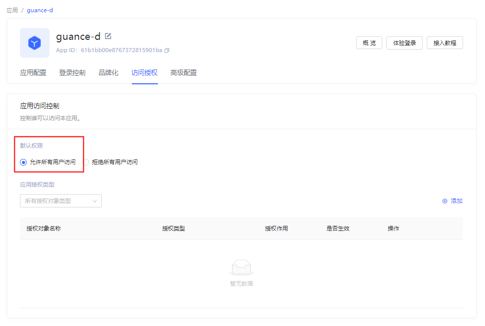

# Authing 单点登录示例
---


Authing 是身份识别与访问管理解决方案提供商。

## 操作步骤

### 1、Authing 账号注册 / 登录

您可以通过以下本步骤创建 [Authing 账号](https://www.authing.cn/) ，如您已经有正在使用中的账号，直接进行下一步配置。

**注意**：当前<<< custom_key.brand_name >>>仅支持邮箱账号 SSO 登录。


### 2、创建用户

在 **Authing 用户管理 > 用户列表**页面创建用户。如下图所示：

**注意**：用户名、邮箱两种创建方式皆可。使用用户名创建用户时，用户名必须为邮箱。如果使用用户名账号实现单点登录，后续在 SAML 协议配置处需要新增用户名与邮箱的映射关系。





### 3、创建 Authing 应用程序

创建用户后，进入 **Authing 应用页面**，点击**添加应用**，配置应用信息。如下图所示：

**注意**：如您已经有正在使用中的应用程序可忽略此步骤，直接进行下一步配置。此处应用名称、认证地址需要自定义配置。


### 4、配置 SAML2 身份提供商信息 {#step4}

进入应用配置页面，下拉到底部找到更多身份协议。配置 SAML2 身份提供商信息。如下图所示：

（1）填写默认 ACS 地址（断言地址），点击保存。（此次配置仅为获取下一步的元数据使用，后面在<<< custom_key.brand_name >>>中获取到正确的断言地址后可以重新替换。断言地址示例：[https://<<< custom_key.studio_main_site_auth >>>/saml/assertion](https://<<< custom_key.studio_main_site_auth >>>/saml/assertion/)；）

（2）下载 SAML2 元数据文档，该文档后续会在<<< custom_key.brand_name >>> SSO 身份提供商创建处上传使用；



### 5、选择认证协议类型

调整**认证配置**默认协议类型为 SAML2。



### 6、选择应用访问授权

调整**访问授权**，设置默认权限：允许所有用户访问。如下图所示：



### 7、[在<<< custom_key.brand_name >>>启用 SSO 单点登录](./azure-ad.md#step4)

### 8、更新 Authing ACS 地址和 Mapping

配置好<<< custom_key.brand_name >>> SSO 单点登录后获取断言地址，更新 Auhting SAML2 > **默认 ACS 地址**，新增字段 mapping 设置。如下图所示：


**mapping 映射**

```json
// Authing 邮箱映射邮箱配置，此行不用复制
{
    "mappings": {
        "email": "Email"
    }
}

// Authing 用户名映射邮箱配置，此行不用复制

{
    "mappings": {
        "username": "Email"
    }
}
```

### 9、[通过单点登录访问<<< custom_key.brand_name >>>](./azure-ad.md#step7)


