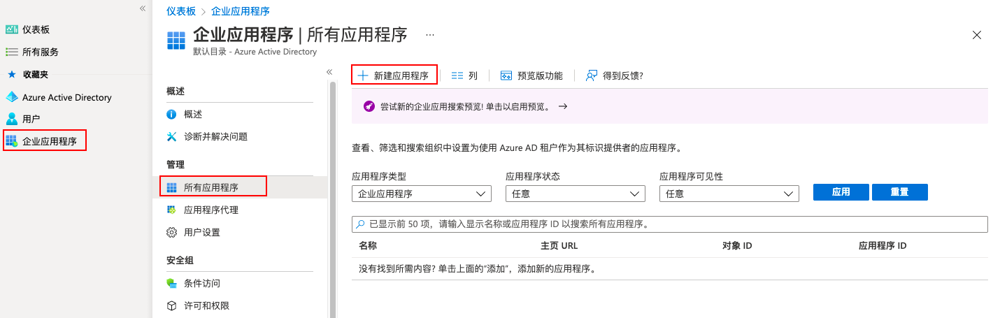
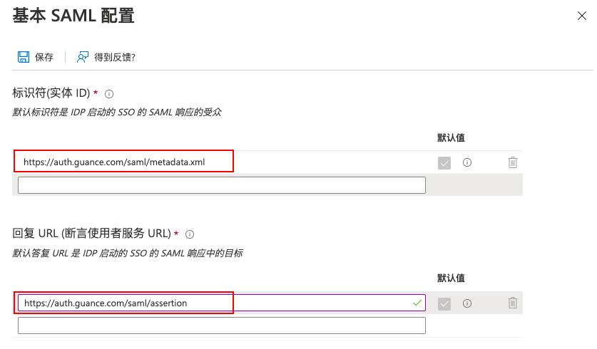
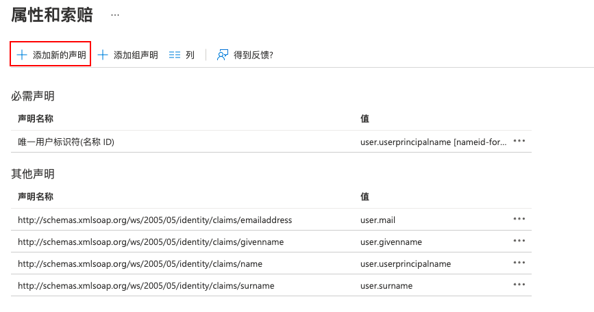
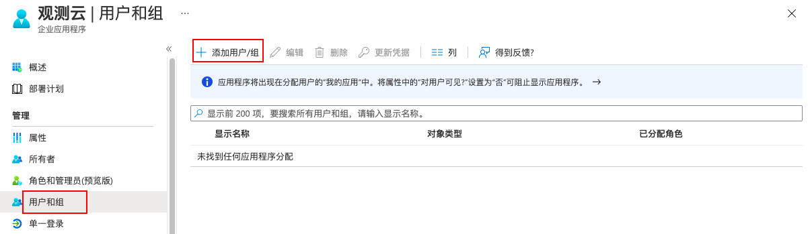
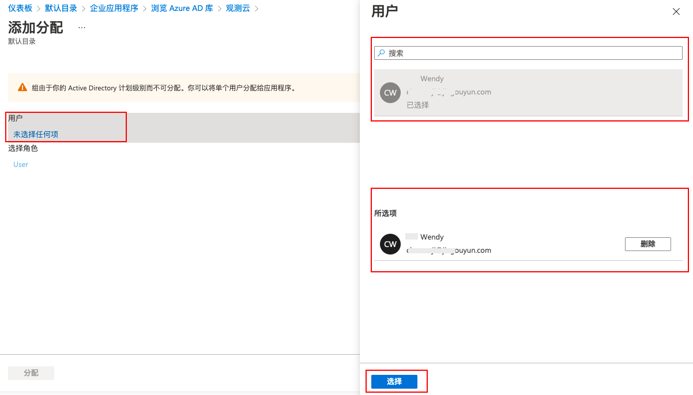
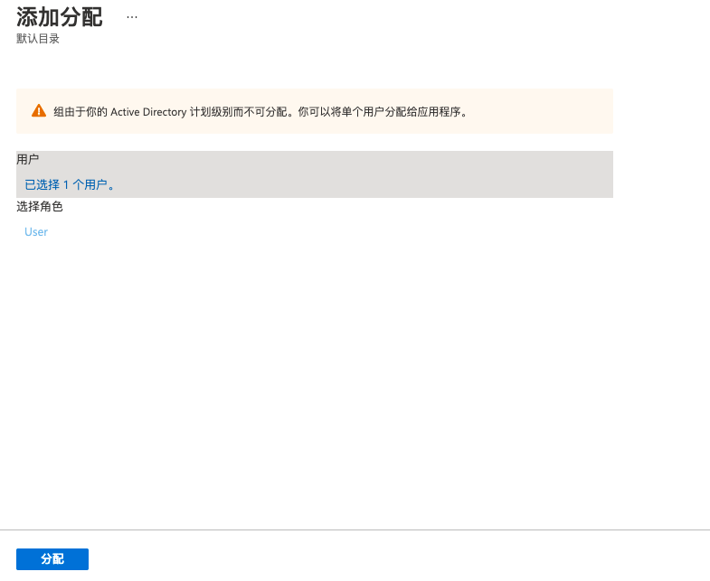
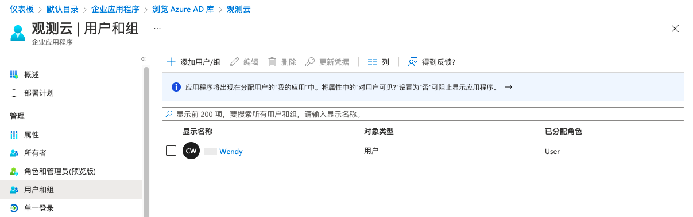
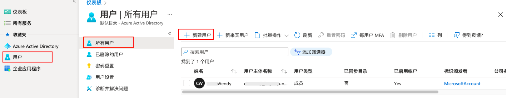

# AAD 单点登录示例
---

Azure Active Directory （AAD） 是 Microsoft 推出的基于云的标识和访问管理服务，可帮助企业管理内外部资源。

## 操作步骤

### 1、创建应用程序

1）登录进入 [Azure Active Directory 管理中心](https://aad.portal.azure.com/)，点击**企业应用程序 > 所有应用程序 > 新建应用程序**。

2）在**新建应用程序**页面，点击**创建你自己的应用程序**，在打开的页面输入**应用的名称**，并选择**非库应用程序**，点击**创建**，即可创建一个新的应用程序。

### 2、为应用程序配置 SAML {#step2}

**注意**：本步骤将 AAD 应用程序属性映射到<<< custom_key.brand_name >>>的属性，建立 AAD 和<<< custom_key.brand_name >>>之间的信任关系。

1）在新创建的应用程序，点击**单一登录**，选择 **SAML**。

2）在**设置 SAML 单一登录**的第一步**基本 SAML 配置**部分，点击**编辑**。

填入以下断言地址和实体 ID 示例。

- 标识符（实体 ID）：[https://<<< custom_key.studio_main_site_auth >>>/saml/metadata.xml](https://<<< custom_key.studio_main_site_auth >>>/saml/metadata.xml)
- 回复 URL（断言地址），临时使用：[https://<<< custom_key.studio_main_site_auth >>>/saml/assertion](https://<<< custom_key.studio_main_site_auth >>>/saml/assertion/)

**注意**：此次配置仅为获取下一步的元数据文档使用，需要在<<< custom_key.brand_name >>>中启用 SSO 单点登录后，获取到正确的**实体 ID** 和**断言地址**后重新替换。

3）在第二步**属性和索赔**部分，添加关联身份提供商用户邮箱的声明，点击**编辑**。

在属性和索赔编辑页面，点击**添加新的声明**。

在管理声明页面，输入**名称**和**源属性**，并保存：

- 名称：必需填入 **Email**，此部分内容为必填项，如果不填，单点登录时将提示无法登录；  
- 源属性：根据身份提供商实际邮箱选择“user.mail”。

**注意**：<<< custom_key.brand_name >>>定义了一个字段，必须填入 **Email** 用于关联身份提供商的用户邮箱（即身份提供商将登录用户的邮箱映射到 Email）。

### 3、获取 AAD 元数据文档 {#step3}

**注意**：本步骤可获取在<<< custom_key.brand_name >>>创建身份提供商的元数据文档。

1）在第三步 **SAML 签名证书**部分，点击下载**联合元数据 XML**。

### 4、在<<< custom_key.brand_name >>>启用单点登录 {#step4}

1）在<<< custom_key.brand_name >>>工作空间**管理 > 成员管理 > SSO 管理**，[新建 SSO](../../management/sso/index.md)。

2）上传在[步骤 3](#step3)中下载的元数据文档，配置**域名（邮箱的后缀域名）**，选择**角色**，即可获取该身份提供商的**实体 ID**和**断言地址**，支持直接复制**登录地址**进行登录。

**注意**：域名用于<<< custom_key.brand_name >>>和身份提供商进行邮箱域名映射来实现单点登录，即用户邮箱的后缀域名需和<<< custom_key.brand_name >>>中添加的域名保持一致。

### 5、在 AAD 替换 SAML 断言地址

1）返回 AAD，更新[步骤 2](#step2)中的**实体 ID** 和**断言地址**。

**注意**：在<<< custom_key.brand_name >>>配置单点登录时，身份提供商 SAML 中配置的断言地址必须和<<< custom_key.brand_name >>>中的保持一致，才能实现单点登录。

### 6、配置 AAD 用户

**注意**：本步骤配置在<<< custom_key.brand_name >>>创建身份提供商的授权用户邮箱账号，通过配置的 AAD 用户邮箱账号可单点登录到<<< custom_key.brand_name >>>平台。

1）在新创建的应用程序，点击**用户和组**，点击**添加用户/组**。

2）点击**未选择任何项**，在弹出的页面搜索并选择用户，点击**选择**。

3）选择完用户以后，返回到**添加分配**，点击**添加分配**。

4）添加完用户以后，可以在**用户和组**查看分配的 SSO 授权登录用户列表。

**注意**：若无用户，可在**用户**菜单下新建用户。

### 7、使用 AAD 账号单点登录<<< custom_key.brand_name >>> {#step7}

1）SSO 配置完成后，通过 [<<< custom_key.brand_name >>>官网](https://www.dataflux.cn/) 或者 [<<< custom_key.brand_name >>>控制台](https://auth.dataflux.cn/loginpsw) 登录，在登录页面选择**单点登录**。

2）输入在创建 SSO 的邮箱地址，点击**获取登录地址**。

3）点击**链接**打开企业账号登录页面。

4）输入企业通用邮箱（在 AAD 和<<< custom_key.brand_name >>> SSO 管理中配置的企业邮箱地址）和密码。

5）登录到<<< custom_key.brand_name >>>对应的工作空间。

