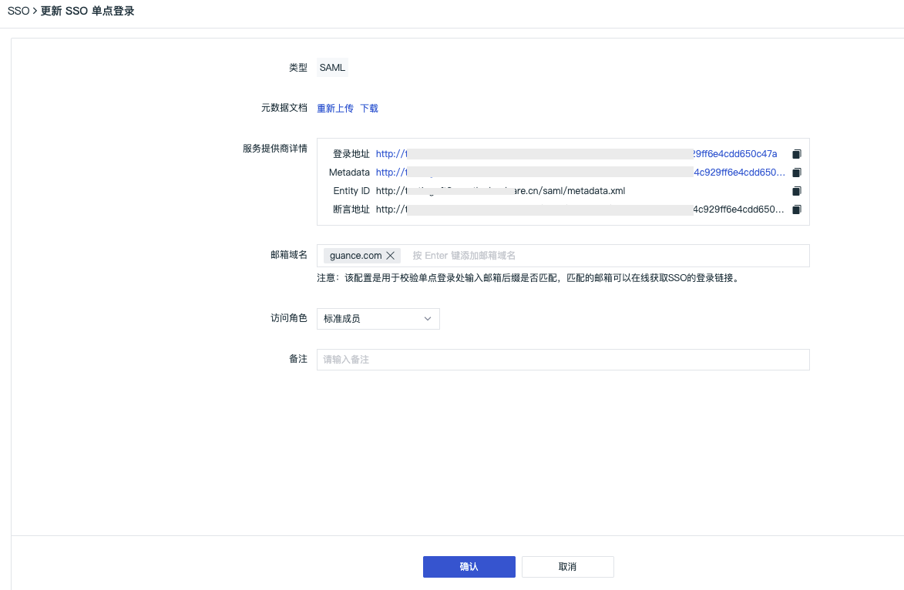
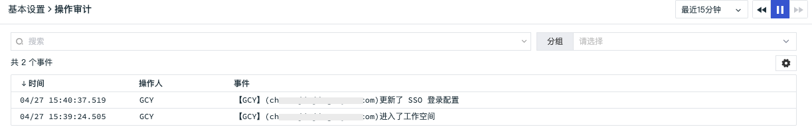

# SSO管理
---

观测云支持基于 SAML 协议的 SSO 管理，支持企业在本地 IdP（身份提供商） 中管理员工信息，无需进行观测云和企业 IdP 之间的用户同步，企业员工即可通过指定的角色登录访问观测云。

**观测云 SSO 单点登录逻辑流程图说明：**

**观测云 SSO 单点登录流程图说明：**

**观测云 SSO 单点登录操作步骤说明：**

1. 在观测云配置 SSO 登录：包括企业 IdP 的元数据文档、域名、角色、登录保持时间
2. 在观测云获取 SSO 登录生成的 Entity ID 和断言地址
3. 在观测云配置 SAML 映射：包括属性字段、属性值、角色
4. 在企业 IdP 配置 SAML 映射：包括更新观测云提供的 Entity ID 和断言地址，邮箱、字段属性映射
5. 使用企业 IdP 账号登录观测云

## SSO 登录

观测云支持基于企业域名为员工设置单点登录，只要符合企业统一身份认证的员工都可以通过和企业域名相同后缀的邮箱单点登录到观测云。

### 启用 SSO 登录

在观测云工作空间「管理」-「成员管理」-「SSO管理」-「SSO 登录」，点击「启用」，即可为员工设置SSO单点登录。

???+ attention

    - 基于账号安全考虑，观测云支持工作空间仅配置一个 SSO，若您之前已经配置过 SAML2.0 ，我们默认会将您最后一次更新的 SAML2.0 配置视为最终单点登录验证入口。
    - 若多个工作空间同时配置了相同的身份提供商 SSO 点单登录，用户通过 SSO 单点登录到工作空间后，可以点击观测云左上角的工作空间选项，切换不同的工作空间查看数据。

- 类型：默认 [SAML](sso/configuration-faq.md#saml)
- 元数据文档：IdP(身份提供商)提供的 XML 文档。
- 域名：用于校验单点登录时输入的邮箱后缀是否和域名匹配，匹配的邮箱可以在线获取单点登录链接，用户可以在首次登录时动态创建观测云成员账号，无需提前在工作空间内创建。
- 角色：选择用于设置新的 SSO 成员首次登录时被授予的角色，现有成员不受影响，包括只读成员和标准成员；若工作空间内启用 [SAML 映射](#saml-mapping)功能，成员登录时会优先分配映射规则中的角色。关于角色权限可参考文档 [角色管理](../role-management.md) 。
- [登录保持时间](#login-hold-time)：用于设置单点登录成员无操作登录会话保持时间和登录会话最大保持时间，设置以后，超时登录会话会失效。
- 备注：用户针对身份提供商可以自定义添加的描述信息。

#### 获取 Entity ID 和 断言地址

完成以上信息填写后，点击「确认」，即可获取“Entity ID”和“断言地址”，根据身份提供商的要求在对应的 SAML 配置完成后即可。

- 登录地址：基于用户上传的元数据文档生成的观测云 SSO 的登录地址，一个登录地址有且只能访问一个工作空间。
- Metadata：基于用户上传的元数据文档生成的观测云 SSO 的元数据文档。
- Entity ID：基于用户上传的元数据文档生成的观测云 SSO 登录的响应实体ID，用于在身份提供商标识服务提供商（SP），如观测云。
- 断言地址：基于用户上传的元数据文档生成的观测云 SSO 登录的响应目标地址，用于在身份提供商调用进行单点登录。

获取“Entity ID”和“断言地址”后，点击「确认」或「取消」返回 SSO 管理。

#### 设置登录会话保持时间 {#login-hold-time}

观测云支持为通过 SSO 单点登录的成员，统一设置登录会话保持时间，包括无操作登录会话保持时间和登录会话最大保持时间，设置以后，超时登录会话会失效。

- 无操作登录会话保持时间：支持设置范围 30 ～ 1440 分钟，默认为 30 分钟；
- 登录会话最大保持时间：支持设置范围 0 ～ 7 天，其中 0 表示永不超时，默认为 7 天。

???+ attention

    - 通过 SSO 单点登录的成员将按照当前 SSO 管理中设置的登录会话保持时间，一旦超时登录会话会失效。如无操作会话过期时间设置为 30 分钟，若该 SSO 成员登录到工作空间 30 分无任何操作，登录会话失效，自动退出当前工作空间；
    - 若管理员更新了 SSO 管理中的登录会话保持时间，在此之前登录的 SSO 成员登录会话过期时间不变，在此之后登录的 SSO 成员按照最新的设置时间。如无操作会话过期时间从 30 分钟更新为 60 分钟，之前的 SSO 成员还是 30 分钟登录会话过期，在此之后的 SSO 成员 60 分钟无任何操作，登录会话失效，自动退出当前工作空间；
    - 若已登录的 SSO 成员需要更改登录会话保持时间，可在左下角「账号」-「账号管理」中修改。

### 更新/删除 SSO

启用 SSO 以后，支持更新和删除 SSO 配置，一旦更新或者删除将影响现有的 SSO 成员登录，请谨慎操作。

### 查看 SSO 成员

启用 SSO 以后，若企业成员通过 SSO 单点登录到观测云，即可在「SSO 登录」查看所有登录过的成员数量，点击「成员」的「数字」，可查看具体被授权单点登录成员名单。

## SAML 映射 {#saml-mapping}

观测云支持基于配置 SAML 映射关系，为企业提供更精细的单点登录方案，开启 SAML 映射后，支持为企业员工动态的分配访问权限，员工可根据被分配的角色权限来访问观测云。

### 启用 SAML 映射

在观测云工作空间「管理」-「成员管理」-「SSO管理」-「SSO 登录」，启用 「SAML 映射」即可。

???+ attention

    - 启用后，使用 SAML 登录到您的观测云账号的用户将被剥夺其当前角色，并根据您的身份提供商传递的 SAML 断言中的详细信息以及列出的映射重新分配新的角色。使用 SAML 登录没有映射到观测云角色用户将被剥夺所有角色，并且不允许登录到观测云控制台。
    - 禁用后，用户使用 SAML 登录将继续拥有当前分配给他们的角色，即使默认授予的成员角色在您的身份提供商处发生了更改。

### 配置 SAML 映射角色

观测云四种默认成员角色“拥有者”、“管理员”、“标准成员”和“只读成员”，您也可以在「[角色管理](role-management.md)」创建新的角色，并为角色赋予权限范围，满足不同用户的权限需要。

在观测云工作空间「管理」-「成员管理」-「SSO管理」-「SAML 映射」，点击「添加映射」，即可创建一个新的映射关系。

在新建映射的对话框中，输入需要映射的“属性字段”及其“属性值”，选择“角色”，点击「保存」。

> 在 SAML 映射配置的属性字段及属性值，必须和 IdP 的账号上配置的属性字段及属性值保持一致，SAML 映射才能验证成功，验证成功后，会在 IdP 账号登录时为账号赋予 SAML 映射对应的角色权限。

### 搜索/编辑/删除映射角色

- 搜索：支持通过角色、属性字段、属性值对配置的映射角色进行筛选查看；
- 编辑：支持点击「编辑」按钮重新修改已配置的映射角色，此时使用 SAML 登录没有映射到观测云角色的用户将被剥夺所有角色，并且不允许登录到观测云控制台；
- 删除：支持点击「删除」按钮删除已配置的映射角色，此时使用 SAML 登录没有映射到观测云角色的用户将被剥夺所有角色，并且不允许登录到观测云控制台。

## 登录观测云控制台

SSO 配置完成后，通过 [观测云官网](https://www.guance.com/) 登录，在登录页面选择「单点登录」。

输入在创建SSO的邮箱地址，点击「获取登录地址」。

点击「链接」打开企业账号登录页面。

输入企业通用邮箱和密码可直接登录到观测云对应的工作空间，若多个工作空间同时配置了相同的身份提供商 SSO 点单登录，可在观测云左上角切换查看不同的工作空间的数据。

## 邮件通知

启用、配置、删除 SSO，对应工作空间的拥有者和管理员会收到相关邮件通知。

## 审计事件

启用、配置、删除 SSO 都会产生审计事件。

在观测云工作空间，点击「管理」-「基本设置」-「安全-操作审计」，点击“查看”，即可查看当前工作空间所有的审计事件。

