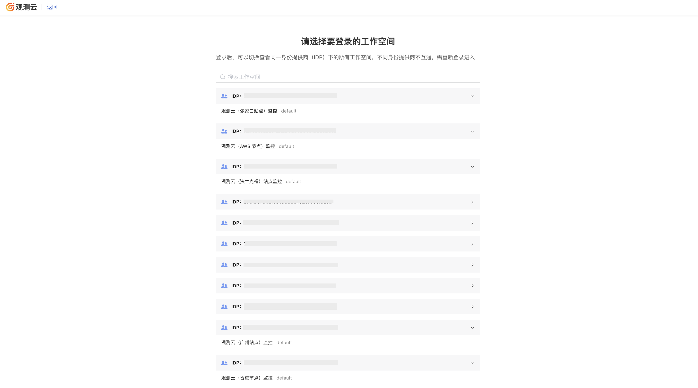

# SSO 管理
---

<<< custom_key.brand_name >>>支持基于 SAML、OIDC/Oauth2.0 协议的 SSO 管理，企业可在本地 IdP（身份提供商）中管理员工信息，无需在<<< custom_key.brand_name >>>和企业 IdP 间同步用户，员工通过指定角色登录访问<<< custom_key.brand_name >>>。

在 SSO 管理，您可以：

- [基于企业域名配置单点登录](#corporate)
- [基于企业域名，开启角色映射，实现更精细的单点登录](./role_mapping.md)

## 用户 SSO {#corporate}

员工邮箱符合企业统一身份认证的域名后缀，即可通过该邮箱登录<<< custom_key.brand_name >>>，并根据配置的权限访问系统。

1. 进入**管理 > 成员管理 > SSO 管理 > 用户 SSO**；
2. 按需选择 [SAML](#saml) 或 [OIDC](#oidc)；
3. 开始配置。

???+ warning "注意"

    - 可创建多个 SSO 的 IDP 配置，每个工作空间 SSO 配置最多不超过 10 个；
    - 多个工作空间配置相同身份提供商 SSO 单点登录时，用户通过 SSO 单点登录到工作空间后，可点击左上角的工作空间选项，切换不同的工作空间查看数据。

### 访问类型

:material-numeric-1-circle: [SAML](./saml.md)   
:material-numeric-2-circle: [OIDC](./oidc.md)    

## SSO 列表

### 角色映射

- 启用角色映射：   
    
    - SSO 登录用户依据身份提供商的 `属性字段` 和 `属性值` 匹配角色映射规则，动态分配角色；   
    - 未匹配到映射规则的用户将被移除所有角色，无法登录访问工作空间。

- 禁用角色映射：单点登录用户保留之前分配的角色，不受身份提供商侧断言更改的影响。

### 启用/更新/删除/导入/导出

添加身份提供商后，您可以按需启用或禁用当前 SSO 配置。启用后，支持以下操作：

- 更新 SSO 配置：此操作会影响现有 SSO 成员的登录体验，需谨慎操作；    
- 删除 SSO 配置：此操作将移除当前单点登录配置，相关成员无法通过该配置登录，需谨慎操作；
- 导入/导出身份提供商：支持导入和导出身份提供商配置，便于快速复制到多个工作空间。

???+ warning "注意"

    - 导出文件时，文件名不能与当前工作空间中已存在的身份提供商同名。
    - 导出文件需符合 JSON 格式规范。

### 查看 SSO 成员

- 成员数量：显示所有通过 SSO 登录的成员总数。  
- 成员名单：点击成员数量，可查看具体已授权的 SSO 成员名单。

### 邮件通知

启用、配置、删除 SSO 时，工作空间的 Owner 和 Administrator 会收到相关邮件通知。

## 登录验证 {#login}

1. 邮箱登录进入<<< custom_key.brand_name >>> SSO 页面：https://<<< custom_key.studio_main_site_auth >>>/login/sso；
2. 输入创建 SSO 时配置的邮箱地址，即可进入该身份提供商授权的所有工作空间；
3. 登录地址；
4. 输入用户名、密码等信息；
5. 登录成功。

???+ warning "注意"

    - 如果工作空间启用了[角色映射](./role_mapping.md)，但当前用户未匹配到角色或角色映射被禁用，将提示“无访问权限”；   
    - 工作空间删除身份提供商后，用户选择 SSO 登录时，将看不到未授权的工作空间。

