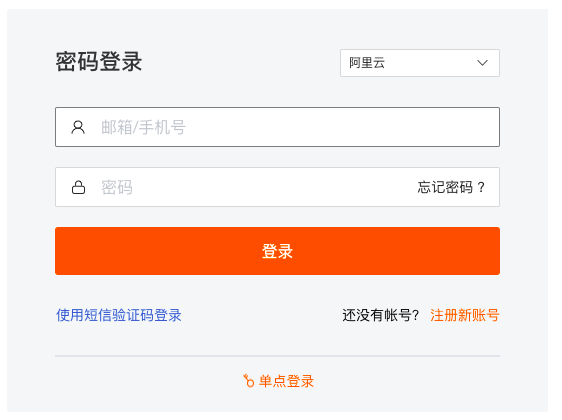

# SSO 管理
---

观测云支持基于 SAML、OIDC/ Oauth2.0 协议的 SSO 管理，支持企业在本地 IdP（身份提供商） 中管理员工信息，无需进行观测云和企业 IdP 之间的用户同步，企业员工即可通过指定的角色登录访问观测云。

在 SSO 管理，您可以：

- [基于配置企业域名为员工设置单点登录](#corporate)
- [基于配置企业域名，并开启角色映射关系，为企业提供更精细的单点登录方案](#saml-mapping)

## 用户 SSO {#corporate}

观测云支持基于企业域名为员工设置单点登录，只要符合企业统一身份认证的员工都可以通过和企业域名相同后缀的邮箱单点登录到观测云，访问权限可选择只读成员或标准成员。

在观测云工作空间**管理 > 成员管理 > SSO 管理 > 用户 SSO**，按需选择 [SAML](configuration-faq.md#saml) 或 [OIDC](#oidc)，即可开始为员工设置 SSO 单点登录。

- 观测云支持工作空间创建多个 SSO 的 IDP 配置，每个工作空间 SSO 配置最多不超过 10 个；
- 若多个工作空间同时配置了相同的身份提供商 SSO 点单登录，用户通过 SSO 单点登录到工作空间后，可以点击观测云左上角的工作空间选项，切换不同的工作空间查看数据。

### SAML {#saml}

| 字段      | 描述                          |
| ----------- | ------------------------------------ |
| 类型       | 可选择 [SAML](configuration-faq.md#saml)。  |
| 身份提供商      | 用于提供身份管理服务的实体平台。                          |
| 元数据文档       | IdP (身份提供商)提供的 XML 文档。 |
| 备注       | 用户针对身份提供商可以自定义添加的描述信息。  |
| 访问限制    | 用于校验单点登录时输入的邮箱后缀是否和域名匹配，相同域名后缀的邮箱才有权限获取此身份提供商单点登录访问链接。用户可以在首次登录时动态创建观测云成员账号，无需提前在工作空间内创建。 |
| 角色授权       | 为首次登录的 SSO 账号授予角色，非首次登录的成员账号不受影响。 :warning: 若工作空间内启用 [SAML 映射](#saml-mapping)功能，成员登录时会优先分配映射规则中的角色。 关于角色权限，可参考 [角色管理](../role-management.md)。  |
| [会话保持](#login-hold-time)       | 用于设置单点登录成员无操作登录会话保持时间和登录会话最大保持时间，设置以后，超时登录会话会失效。  |

#### 获取 Entity ID 和 断言地址 {#obtain}

完成以上信息填写后，点击**确认**，即可获取 **Entity ID** 和**断言地址**，根据身份提供商的要求在对应的 SAML 配置完成后即可。

| 字段      | 描述                  |
| ----------- | ------------------- |
| 登录地址       | 基于用户上传的元数据文档生成的观测云 SSO 的登录地址，一个登录地址有且只能访问一个工作空间。  |
| Metadata      | 基于用户上传的元数据文档生成的观测云 SSO 的元数据文档。                  |
| Entity ID      | 基于用户上传的元数据文档生成的观测云 SSO 登录的响应实体 ID，用于在身份提供商标识服务提供商（SP），如观测云。                  |
| 断言地址      | 基于用户上传的元数据文档生成的观测云 SSO 登录的响应目标地址，用于在身份提供商调用进行单点登录。                  |

获取 **Entity ID** 和**断言地址**后，点击**确认**或**取消**返回 SSO 管理。

#### 会话保持 {#login-hold-time}

在配置 SSO 单点登录时，您可以为通过 SSO 单点登录的企业成员设置统一的登录保持时间，包括无操作登录会话保持时间和登录会话最大保持时间。

- 无操作登录会话保持时间：支持设置范围 180 ～ 1440 分钟，默认为 180 分钟；
- 登录会话最大保持时间：支持设置范围 0 ～ 7 天，其中 0 表示永不超时，默认为 7 天。

???+ abstract "举例说明"

    配置 SSO 单点登录后，若更新了 SSO 的登录保持时间，在此之前登录的 SSO 成员账号登录会话过期时间不变，在此之后登录的 SSO 成员账号按照最新设置的登录保持时间。
    
    例如：

    - 配置 SSO 单点登录时，无操作会话过期时间为 30 分钟，成员 A 此时登录了观测云，即其 SSO 登录账号无操作会话过期时间为 30 分钟；
    - 此后，管理员更新无操作会话过期时间为 60 分钟，成员 A 的 SSO 的登录账号无操作会话过期时间还是为 30 分钟；若在此之后有成员 B 登录观测云，则其 SSO 登录账号无操作会话过期时间为 60 分钟，以此类推。

### OIDC {#oidc}

点击进入**管理 > 成员管理 > SSO 管理 > OIDC > 新建身份提供商**，默认进入**标准的 OIDC 配置**。如果您不是标准的 OIDC 配置，您可[切换页面进行配置](#non-standard)。

:material-numeric-1-circle: 连接配置：

| 字段      | 描述                          |
| ----------- | ------------------------------------ |
| 类型       | 选择 [OIDC](configuration-faq.md#saml)。  |
| 身份提供商名称      | 用于提供身份管理服务的实体平台。                          |
| 备注       | 用户针对身份提供商可以自定义添加的描述信息。  |
| 身份提供商 URL       | 身份提供商完整的 URL，也是服务发现地址，例如 https://guance.example.com。 |
| 客户端 ID    | 由认证服务提供的客户端 ID。 |
| 客户端密钥       | 客户端密钥与客户端 ID 联合使用，对客户端应用程序进行身份验证。  |
| 授权请求 Scope      | 授权请求的范围，除默认 scope 外，可手动添加以获取更多声明；默认选中 `openid`、`profile` 和 `email`，您可按需额外添加 `adress` 和 `phone` 两个声明。|

:material-numeric-2-circle: 映射配置：

要实现 SSO 登录，需将身份提供商的账号信息与观测云账号信息进行字段映射，此处信息主要包含如下字段：

- 用户名：必填；身份提供商的 “用户名” 字段，例如 `referred_username`；
- 邮件：必填；身份提供商的 “邮箱” 字段，例如 `email`；
- 手机号：非必填；身份提供商的 “手机号” 字段，例如 `phone`。

:material-numeric-3-circle: 登录配置：

| 字段      | 描述                          |
| ----------- | -------------------------- |
| 访问限制    | 用于校验单点登录时输入的邮箱后缀是否和域名匹配，相同域名后缀的邮箱才有权限获取此身份提供商单点登录访问链接。用户可以在首次登录时动态创建观测云成员账号，无需提前在工作空间内创建。 |
| 角色授权       | 为首次登录的 SSO 账号授予角色，非首次登录的成员账号不受影响。 :warning: 若工作空间内启用[角色映射](#saml-mapping)功能，成员登录时会优先分配映射规则中的角色。 关于角色权限，可参考 [角色管理](../role-management.md)。  |
| [会话保持](#login-hold-time)       | 用于设置单点登录成员无操作登录会话保持时间和登录会话最大保持时间，设置以后，超时登录会话会失效。  |

???- abstract "用户侧配置 OIDC 相关注意事项"

    1. 授权模式：观测云只支持 `authorization_code` 授权模式； 其返回类型必须是 `code`；
    2. `id_token` 的签名算法：目前只支持 `HS256`；
    3. `code` 换取 `token` 身份验证方式：

        - 默认支持：`client_secret_basic`

        - 自定义方式支持: `client_secret_post`、`client_secret_basic`、`none`

    4. `scope` 范围：默认为：openid profile email phone

        - 自定义方式：必须有 `openid`，其他可自定义

    **注意**：虽然可以自定义，但返回结果中一定要包含 `email` 信息，可选返回 `phone_number` 信息。

#### 非 OIDC 标准配置 {#non-standard}

???- abstract "如何理解 OIDC 非标准配置？"

    非标准配置情况的发生一般是由于客户侧使用的 Oauth2 进行身份认证，然而 Oauth2 协议并没有约定**获取账号信息的接口**，这导致获取用户信息这一步存在千差万别，毕竟信息是成功建立映射关系的关键；另外，由于各个客户侧接口设计的规则不同，可能导致协议中约定的**参数大小写风格不一致**，此种情况下也是非标准。

进入**管理 > 成员管理 > SSO 管理 > OIDC > 新建身份提供商**，点击右上角即可切换进入标准的 OIDC 配置页面：

:material-numeric-1-circle: 连接配置：

| 字段      | 描述                          |
| ----------- | ------------------------------------ |
| 身份提供商名称      | 用于提供身份管理服务的实体平台。                          |
| 配置文件上传      | 您可点击下载模板，补充相关信息后再上传即可。                          |
| 备注       | 用户针对身份提供商可以自定义添加的描述信息。  |

:material-numeric-2-circle: 登录配置：

| 字段      | 描述                          |
| ----------- | -------------------------- |
| 访问限制    | 用于校验单点登录时输入的邮箱后缀是否和域名匹配，相同域名后缀的邮箱才有权限获取此身份提供商单点登录访问链接。用户可以在首次登录时动态创建观测云成员账号，无需提前在工作空间内创建。 |
| 角色授权       | 为首次登录的 SSO 账号授予角色，非首次登录的成员账号不受影响。 :warning: 若工作空间内启用[角色映射](#saml-mapping)功能，成员登录时会优先分配映射规则中的角色。 关于角色权限，可参考 [角色管理](../role-management.md)。  |
| [会话保持](#login-hold-time)       | 用于设置单点登录成员无操作登录会话保持时间和登录会话最大保持时间，设置以后，超时登录会话会失效。  |

#### 获取相关 URL

当您保存身份提供商信息后，可获取**回调 URL** 和**发起登录 URL**。

| 字段      | 描述                  |
| ----------- | ------------------- |
| 回调 URL      | OIDC 协议中约定的、账号认证服务认证通过之后的回调地址。                  |
| 发起登录 URL      | 用于从观测云端进入 OIDC 协议流程，是提供商发起登录的 URL。                 |

获取两个 URL 后，需将其发给身份提供商，后续也可以在配置详情页回看。

### 启用角色映射

您可针对单个 IDP 配置采用启用、禁用操作：

- 启用后，SSO 登录的用户账号将被剥夺其当前所在工作空间中的角色，并根据身份提供商提供的**属性字段**和**属性值**，匹配角色映射规则动态分配角色。若未匹配到角色映射规则，则用户账号将被剥夺所有角色，且不允许登录访问观测云工作空间。；
- 禁用后，SSO 登录用户将继续拥有之前分配给他们账号的角色，该角色不受身份提供商侧断言更改影响。

### 启用/更新/删除/导入/导出 SSO

添加完身份提供商后，您可按需启用或禁用当前 SSO 配置。

启用 SSO 以后，支持更新和删除 SSO 配置，一旦更新或者删除将影响现有的 SSO 成员登录，请谨慎操作。

您还可导入/导出身份提供商，从而快速配置多个工作空间单点登录配置。

当进行导出动作时，需注意不可与当前工作空间中已存在的身份提供商同名，并且文件要符合 JSON 格式规范。

### 查看 SSO 成员

启用 SSO 以后，若企业成员通过 SSO 单点登录到观测云，即可在 **SSO 登录**查看所有登录过的成员数量，点击成员数字，可查看具体被授权单点登录成员名单。

|              :fontawesome-regular-circle-down: &nbsp;**配置示例**                         |                                                              |                                                              |
| :----------------------------------------------------------: | :----------------------------------------------------------: | :----------------------------------------------------------: |
| [Azure AD](azure-ad.md){ .md-button .md-button--primary } | [Authing](authing.md){ .md-button .md-button--primary } | [Okta](okta.md){ .md-button .md-button--primary } |
| [阿里云 IDaaS](aliyun-idaas.md){ .md-button .md-button--primary } | [Keycloak](keycloak.md){ .md-button .md-button--primary } |  |

## 角色映射 {#saml-mapping}

观测云支持基于配置角色映射关系，为企业提供更精细的单点登录方案，开启角色映射后，支持为企业员工动态的分配访问权限，员工可根据被分配的角色权限来访问观测云。

### 配置角色映射

在观测云工作空间**管理 > 成员管理 > SSO 管理 > 角色映射**，点击**添加映射**，即可创建一个新的映射关系。

- 身份提供商：可选当前工作空间内所有身份提供商；仅可单选；
- 属性字段/属性值：在角色映射配置的属性字段及属性值，必须和 IdP 的账号上配置的属性字段及属性值保持一致，角色映射才能验证成功，验证成功后，会在 IdP 账号登录时为账号赋予角色映射对应的角色权限；
- 角色授权：观测云支持四种默认成员角色 Owner、Administrator、Standard 和 Read-only；或在[角色管理](../role-management.md)创建的自定义角色。

### 搜索/编辑/删除映射

- 搜索 & 筛选：支持通过角色、属性字段、属性值对配置的映射角色进行搜索；您还可以通过选择特定的身份提供商进行对应筛选；
- 编辑：支持重新修改已配置的映射角色，此时使用 SAML 登录没有映射到观测云角色的用户将被剥夺所有角色，并且不允许登录到观测云控制台；
- 删除：支持直接删除或选择批量删除已配置的映射角色，此时使用 SAML 登录没有映射到观测云角色的用户将被剥夺所有角色，并且不允许登录到观测云控制台。

## 登录观测云控制台 {#login}

SSO 配置完成后，在[观测云官网](https://www.guance.com/)登录页面选择**单点登录**。

输入创建 SSO 的邮箱地址，即可进入该身份提供商 ID 所有授权的工作空间。您还可以直接在搜索栏输入关键词进行精准定位。

点击行即可进入登录页面：

**注意**：

1. 若工作空间的身份提供商启用了[角色映射](#mapping)，但当前用户未配置角色映射规则或角色映射禁用登录时，提示您当前无访问权限；
    
2. 若工作空间删除了身份提供商，则用户选择 SSO 登录时，无法看到未授权的工作空间。

输入企业通用邮箱和密码可直接登录到观测云对应的工作空间：

### SSO 账号管理 {#account}

SSO 账号进入工作空间后，点击左侧**账号 > 账号管理**，可对 SSO 账号进行修改。

- 支持修改头像、用户名；
- 支持修改登录保持时间。

**注意**：通过 SSO 登录的账号，默认使用 SSO 配置的登录保持时间，在账号管理修改后，使用修改后的登录保持时间。更多详情，可参考 [账号登录保持时间](../account-management.md#login-hold-time)。

## 邮件通知

启用、配置、删除 SSO，对应工作空间的 Owner 和 Administrator 会收到相关邮件通知。

## 审计事件

启用、配置、删除 SSO 都会产生审计事件。

在观测云工作空间，点击**管理 > 设置 > 安全 > 操作审计**，点击**查看**，即可查看当前工作空间所有的审计事件。

<!-- 

-->