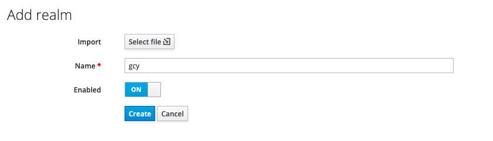
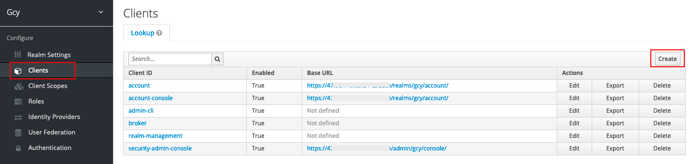
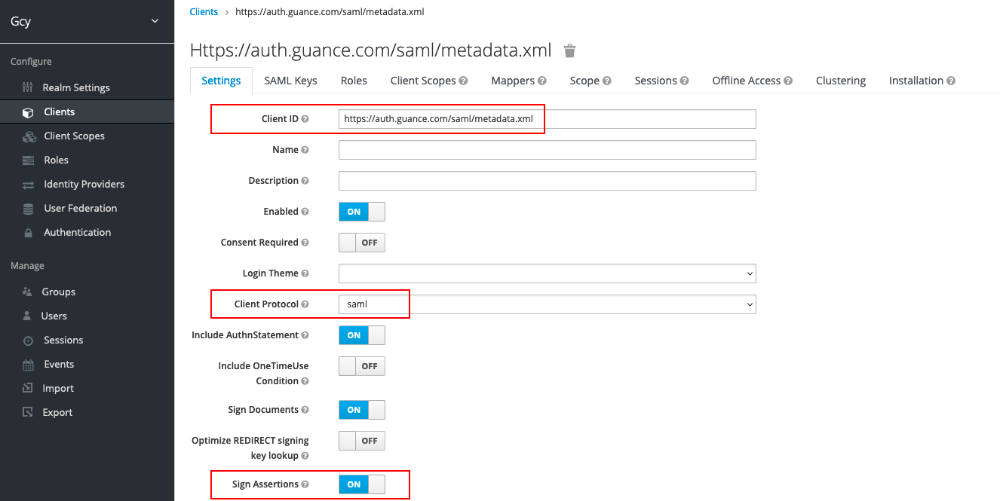
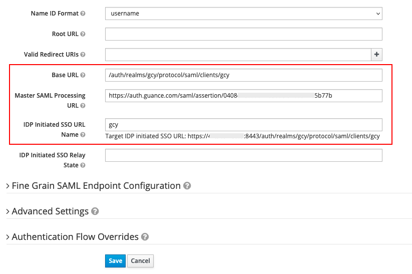
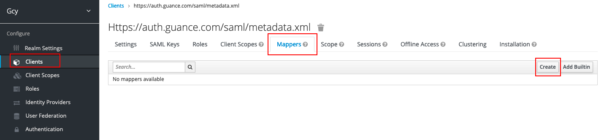
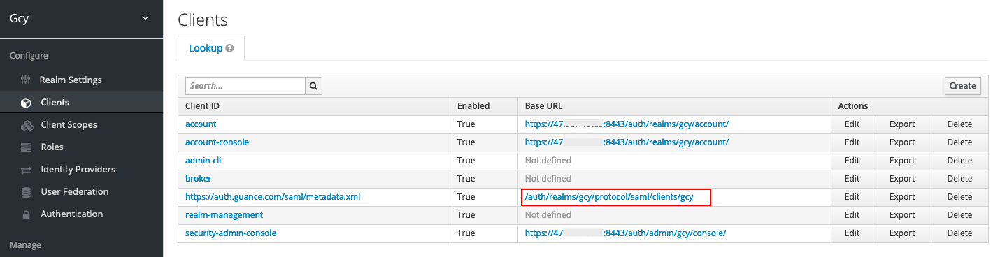
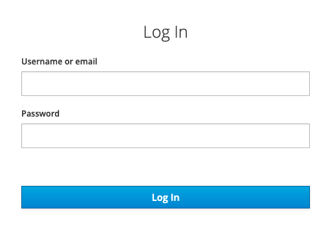

# Keycloak 单点登录示例
---


Keycloak 是一个开源的、面向现代应用和分布式服务的身份认证和访问控制的解决方案。

本文使用搭建的 Keycloak 服务器，演示如何使用 SAML 2.0 协议实现 Keycloak 用户 SSO 登录到<<< custom_key.brand_name >>>管理控制台。

> 关于使用 OpenID Connect 协议实现 Keycloak 用户 SSO 登录到<<< custom_key.brand_name >>>管理控制台，可参考 [Keycloak 单点登录（部署版）](../../deployment/keycloak-sso.md)。

## 前置条件

已搭建 Keycloak 服务器，并能登录到 Keycloak 服务器进行配置。

若无 Keycloak 环境，参考以下步骤搭建：

```
sudo yum update         #更新

sudo yum install -y java-1.8.0-openjdk java-1.8.0-openjdk-devel      #安装JDK

wget https://downloads.jboss.org/keycloak/11.0.2/keycloak-11.0.2.zip   #下载Keycloak

yum install unzip       #安装解压缩包

unzip keycloak-11.0.2.zip       #解压下载的Keycloak

cd keycloak-11.0.2/bin         #进入 bin 目录

./add-user-keycloak.sh -r master -u admin -p admin     #创建服务器管理员登录账号和密码

nohup bin/standalone.sh -b 0.0.0.0 &     #返回 bin 目录，并在后台挂在 Keycloak 启动服务
```

Keycloak 环境搭建完成后，在浏览器输入`https://IP地址:8443/auth`，点击“Administration Console”，打开 Keycloak 管理控制台。


## 概念先解

下面是 KeyCloak 配置过程中的基本概念解释：

| 字段      | 描述                          |
| ----------- | ------------------------------------ |
| Realm      | 领域，类似工作空间，用于管理用户、凭证、角色和用户组，领域之间相互隔离。                          |
| Clients | 客户端是可以请求 Keycloak 对用户进行认证的应用或者服务。 |
| Users      | 能够登录到系统的用户账号，需要配置登录邮箱以及 Credentials。                          |
| Credentials | 验证用户身份的凭证，可用于设置用户账号的登录密码。 |
| Authentication      | 识别和验证用户的过程。                          |
| Authorization | 授予用户访问权限的过程。 |
| Roles      | 用于识别用户的身份类型，如管理员、普通用户等。                          |
| User role mapping | 用户与角色之间的映射关系，一个用户可关联多个角色。 |
| Groups | 管理用户组，支持将角色映射到组。 |

## 操作步骤

### 1、创建 Keycloak realm

**注意**：Keycloak 本身有一个主域（Master），我们需要创建一个新的领域（类似工作空间）。

1）在 Keycloak 管理控制台，点击 **Master > Add realm**。


2）在 **Add realm** 页面，在 **Name** 处输入领域名称，如“gcy”，点击 **Create**，即可创建一个新的领域。




### 2、创建 Client 并配置 SAML {#step2}

**注意**：本步骤将创建 Keycloak 客户端并配置 SAML ，建立 Keycloak 和<<< custom_key.brand_name >>>之间的信任关系使之相互信任。

1）在新创建的“gcy”领域下，点击 **Client**，在右侧点击 **Create** 。



2）在 **Add Client** 按照以下内容填写完成后，点击 **Save**。

- Client ID（实体 ID）：[https://auth.guance.com/saml/metadata.xml](https://auth.guance.com/saml/metadata.xml)；  
- Client Protocol：选择**SAML**；   
- Client SAML Endpoint（断言地址），临时使用：[https://auth.guance.com/saml/assertion](https://auth.guance.com/saml/assertion/)。   

**注意**：此次配置仅为获取下一步的元数据文档使用，需要在<<< custom_key.brand_name >>>中启用SSO单点登录后，获取到正确的**实体ID**和**断言地址**后重新替换。


Client 创建后，在**Settings**可以看到上一步填写的实体ID、协议和断言地址。设置如下参数后保存。

- Sign Assertions：ON（用于防止 IdP 传输的数据被篡改，保证从 IdP 传输到 SP 的数据安全。）



- IDP Initiated SSO URL Name：可任填，如“gcy”，填完以后会生成 SSO 单点登录地址，见下图；  
- Base URL：填入上一个参数生成的 SSO 单点登录地址，如`/auth/realms/gcy/protocol/saml/clients/gcy`，这个主要用于在 Keycloak Clients 生成访问链接直接单点登录到<<< custom_key.brand_name >>>。



3）在**Clients**的**Mappers**，点击 **Create**，创建邮箱映射，此部分内容为必填项，如果不填，无法实现 SSO 单点登录。



在 **Create Protocol Mapper** 页面，输入以下内容后，并保存。

- Name：可任填，如“mail mapper”；  
- Mapper Type：选择“User Property”；  
- Property：按照身份提供商的支持的规则填入 **Email**；  
- SAML Attribute Name：必需填入 **Email**。

**注意**：<<< custom_key.brand_name >>>定义了一个映射字段，必须填入 **Email** 用于关联身份提供商的用户邮箱（即身份提供商将登录用户的邮箱映射到Email）。


### 3、获取 KeyCloak 元数据文档 {#step3}

**注意**：本步骤可获取在<<< custom_key.brand_name >>>创建身份提供商的元数据文档。

1）在 **Clients** 的 **Installation**，选择 **Mod Auth Mellon files**，点击 **Download** 下载元数据文档。


2） 在下载的文件夹中，选择 **idp-metadata.xml**。


3）由于 Keycloak 的云数据文档是**域**级别的，需要在元数据文档 **idp-metadata.xml** 中的访问地址增加客户端的参数`/clients/<IDP Initiated SSO URL Name>`，此文档中由于设置了`IDP Initiated SSO URL Name：gcy`，故在xml文件中填入`/clients/gcy`，见下图。添加完成后保存xml文件。


### 4.在<<< custom_key.brand_name >>>启用SSO单点登录

1）启用 SSO 单点登录，在<<< custom_key.brand_name >>>工作空间**管理 > 成员管理 > SSO 管理**，点击**启用**即可。

> 可参考文档 [新建SSO](../../management/sso/index.md)。

**注意**：基于账号安全考虑，<<< custom_key.brand_name >>>支持工作空间仅配置一个 SSO，若您之前已经配置过 SAML 2.0，我们默认会将您最后一次更新的 SAML2.0 配置视为最终单点登录验证入口。


2）上传在[步骤3](#step3)中下载的**元数据文档**，配置**域名（邮箱的后缀域名）**，选择**角色**，即可获取该身份提供商的**实体ID**和**断言地址**，支持直接复制**登录地址**进行登录。

**注意**：域名用于<<< custom_key.brand_name >>>和身份提供商进行邮箱域名映射来实现单点登录，即用户邮箱的后缀域名需和<<< custom_key.brand_name >>>中添加的域名保持一致。


### 5、在 KeyCloak 替换 SAML 断言地址

1）返回 Keycloak，更新[步骤2](#step2)中的**实体 ID** 和**断言地址**。

**注意**：在<<< custom_key.brand_name >>>配置单点登录时，身份提供商SAML中配置的断言地址必须和<<< custom_key.brand_name >>>中的保持一致，才能实现单点登录。


### 6、配置 Keycloak 用户

**注意**：本步骤配置在<<< custom_key.brand_name >>>创建身份提供商的授权用户邮箱账号，通过配置的 Keycloak 用户邮箱账号可单点登录到<<< custom_key.brand_name >>>平台。

1）在创建的gcy域，点击 **User**，点击 **Add user**。


2）输入 **Usernam** 和 **Email**，Email 为必填项，且需要和<<< custom_key.brand_name >>>身份提供商配置的用户百名单邮箱保持一致，用于匹配邮箱映射登录到<<< custom_key.brand_name >>>。


3）创建用户后，在 **Credentials** 中为用户设置密码。


### 7、使用 Keycloak 账号单点登录<<< custom_key.brand_name >>>

所有配置完成后，可以有两种方式单点登录到<<< custom_key.brand_name >>>。

#### 方法一：在 Keycloak 登录到<<< custom_key.brand_name >>>

1）在 Keycloak 的 Clients，点击右侧的**Base URL**。



2）输入配置的用户邮箱和密码。



3）登录到<<< custom_key.brand_name >>>对应的工作空间。

**注意**：若多个工作空间同时配置了相同的身份提供商 SSO 点单登录，用户通过 SSO 单点登录到工作空间后，可以点击<<< custom_key.brand_name >>>左上角的工作空间选项，切换不同的工作空间查看数据。


#### 方法二：在<<< custom_key.brand_name >>>用 Keycloak 账号单点登录

1）SSO 配置完成后，通过 [<<< custom_key.brand_name >>>官网](https://www.dataflux.cn/) 或者 [<<< custom_key.brand_name >>>控制台](https://auth.dataflux.cn/loginpsw) 登录，在登录页面选择**单点登录**。


2）输入在创建SSO的邮箱地址，点击**获取登录地址**。


3）点击**链接**打开企业账号登录页面。


4）输入企业通用邮箱（在 Keycloak 和<<< custom_key.brand_name >>>SSO管理中配置的企业邮箱地址）和密码。


5）登录到<<< custom_key.brand_name >>>对应的工作空间。

**注意**：若多个工作空间同时配置了相同的身份提供商 SSO 点单登录，用户通过 SSO 单点登录到工作空间后，可以点击<<< custom_key.brand_name >>>左上角的工作空间选项，切换不同的工作空间查看数据。


