# Okta 单点登录示例
---

Okta 是身份识别与访问管理解决方案提供商。

## 操作步骤

### 1、创建 Okta 应用程序

**注意**：在创建应用程序前，您需要先在 [Okta 网站](https://www.okta.com/) 注册账号并创建您的组织。

1）打开 Okta 网站并登录，点击右上角的用户，在下拉列表选择**Your Org**。

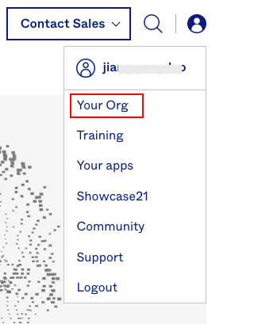

2）在 Okta 组织页面，在右侧菜单点击**Application**，在打开的页面点击**Create App Integration**。

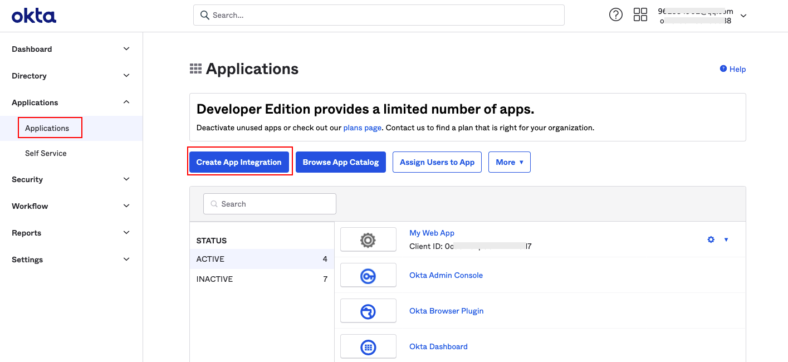

3）选择 **SAML 2.0**，创建一个新的应用程序。

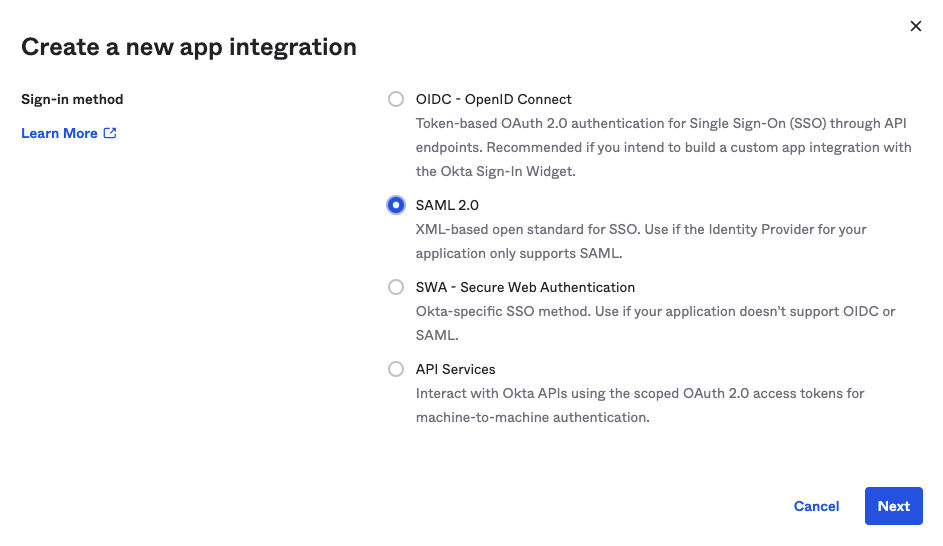

### 2、为 Okta 应用程序配置 SAML {#step2}

**注意**：本步骤将 Okta 应用程序属性映射到<<< custom_key.brand_name >>>的属性，建立 Okta 和<<< custom_key.brand_name >>>之间的信任关系使之相互信任。

1）在新创建应用程序的 **General Settings**，输入应用名称，如“okta”，然后点击**下一步**。

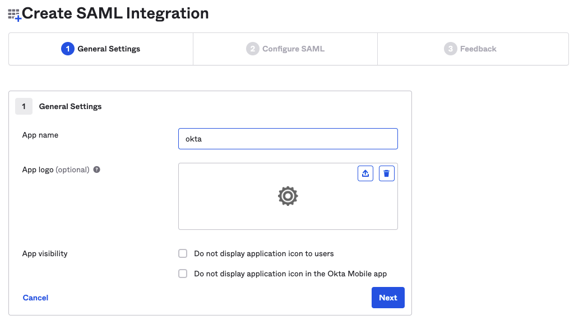

2）在 **Configure SAML** 的 **SAML Settings**部分，填入断言地址和 Entity ID。

- Single sign on URL：断言地址，示例：[https://<<< custom_key.studio_main_site_auth >>>/saml/assertion](https://<<< custom_key.studio_main_site_auth >>>/saml/assertion/)；  
- Audience URI（SP Entity ID）：Entity ID，示例：[https://<<< custom_key.studio_main_site_auth >>>/saml/metadata.xml](https://<<< custom_key.studio_main_site_auth >>>/saml/metadata.xml)。 

**注意**：此次配置仅为获取下一步的元数据文档使用，需要在<<< custom_key.brand_name >>>中启用SSO单点登录后，获取到正确的**实体 ID**和**断言地址**后重新替换。

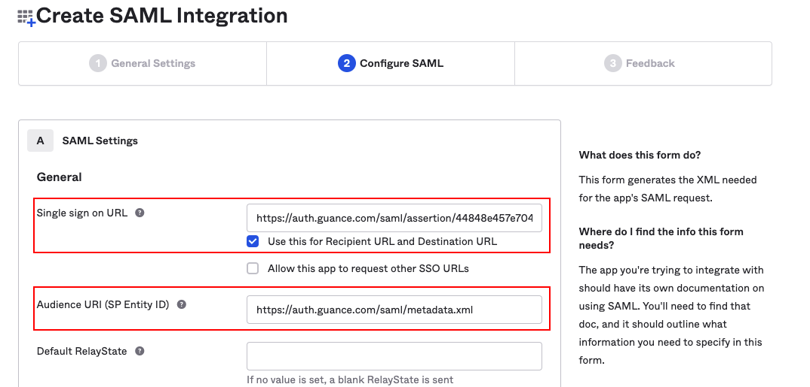

3）在 **Configure SAML** 的 **Attribute Statements(optional)** 部分，填入 Name 和 Value。

- Name：<<< custom_key.brand_name >>>定义的字段，需填入 **Email** ，用于关联身份提供商的用户邮箱（即身份提供商将登录用户的邮箱映射到Email）；
- Value：根据身份提供商实际邮箱格式填写，此处 Okta 可填入 **user.email**。

**注意**：此部分内容为必填项，如果不填，SSO 单点登录时将提示无法登录。

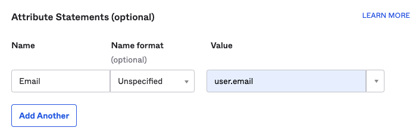

4）在 **Feedback**，选择以下选项，点击**Finish**，完成 SAML 配置。

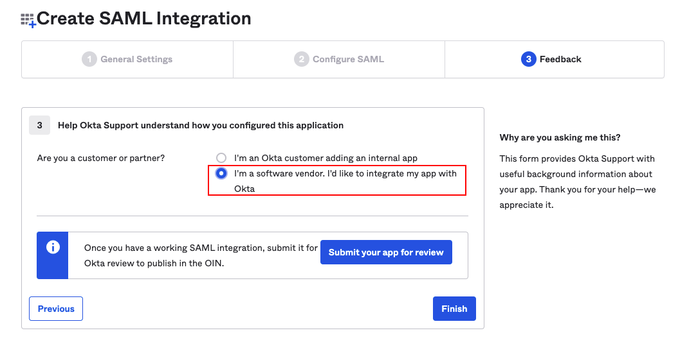

### 3、获取 Okta 元数据文档 {#step3}

**注意**：本步骤可获取在<<< custom_key.brand_name >>>创建身份提供商的元数据文档。

1）在**Sign On**，单击 **Identity Provider metadata** 查看身份提供商元数据。

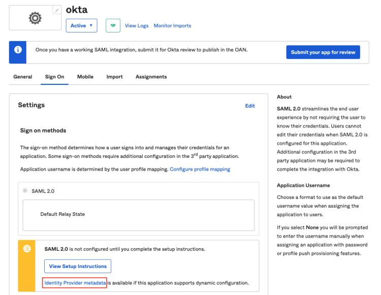

2）在查看页面右键保存至本地。

**注意**：元数据文档为 xml 文件，如 “metadata.xml”。 

### 4、在<<< custom_key.brand_name >>>启用SSO单点登录

1）启用 SSO 单点登录，在<<< custom_key.brand_name >>>工作空间**管理 > 成员管理 > SSO 管理**，点击**启用**即可。

> 可参考文档 [新建SSO](../../management/sso/index.md)。

**注意**：基于账号安全考虑，<<< custom_key.brand_name >>>支持工作空间仅配置一个 SSO，若您之前已经配置过 SAML 2.0，我们默认会将您最后一次更新的 SAML2.0 配置视为最终单点登录验证入口。

2）上传在[步骤3](#step3)中下载的**元数据文档**，配置**域名（邮箱的后缀域名）**，选择**角色**，即可获取该身份提供商的**实体 ID** 和**断言地址**，支持直接复制**登录地址**进行登录。

**注意**：域名用于<<< custom_key.brand_name >>>和身份提供商进行邮箱域名映射来实现单点登录，即用户邮箱的后缀域名需和<<< custom_key.brand_name >>>中添加的域名保持一致。

### 5、在 Okta 替换 SAML 断言地址

1）返回 Okta，更新[步骤2](#step2)中的**实体 ID** 和**断言地址**。

**注意**：在<<< custom_key.brand_name >>>配置单点登录时，身份提供商SAML中配置的断言地址必须和<<< custom_key.brand_name >>>中的保持一致，才能实现单点登录。

### 6.配置 Okta 用户

**注意**：本步骤配置在<<< custom_key.brand_name >>>创建身份提供商的授权用户邮箱账号，通过配置的 Okta 用户邮箱账号可单点登录到<<< custom_key.brand_name >>>平台。

1）在**Assignments > Assign**，选择**Assign to People**。

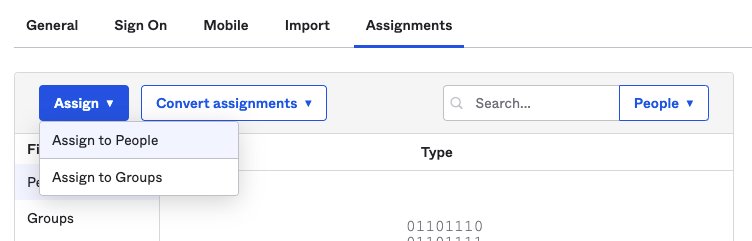

2）选择需要单点登录到<<< custom_key.brand_name >>>的用户，如“jd@qq.com”，点击 **Assign**。

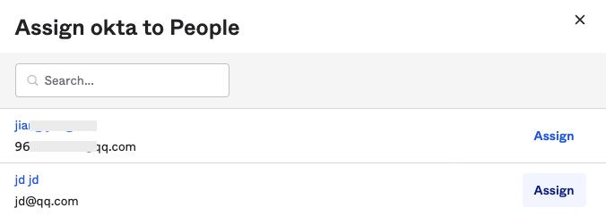

3）点击 **Save and Go Back**，完成用户配置。

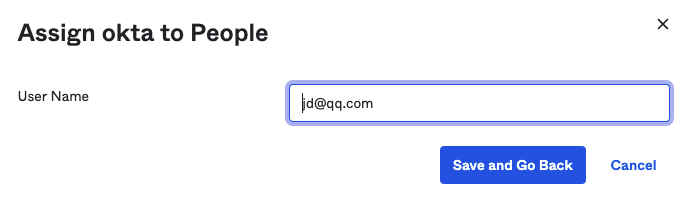

4）返回**Assignments**，可查看配置授权的 Okta 用户。

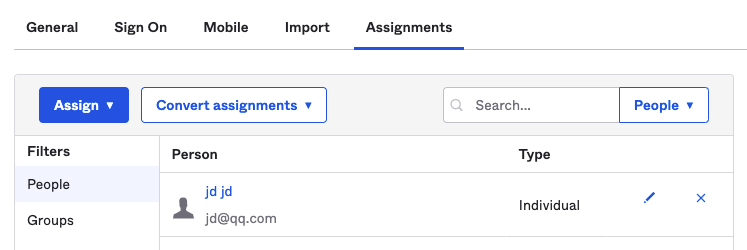

### 7、使用 Okta 账号单点登录<<< custom_key.brand_name >>>

1）SSO配置完成后，通过 [<<< custom_key.brand_name >>>官网](https://www.dataflux.cn/) 或者 [<<< custom_key.brand_name >>>控制台](https://auth.dataflux.cn/loginpsw) 登录，在登录页面选择**单点登录**。

2）输入在创建 SSO 的邮箱地址，点击**获取登录地址**。

3）点击**链接**打开企业账号登录页面。

4）输入企业通用邮箱和密码。

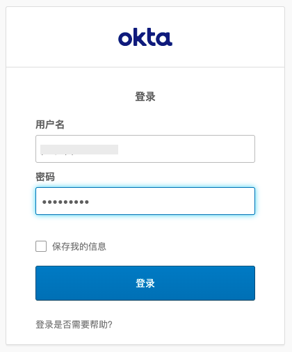

5）登录到<<< custom_key.brand_name >>>对应的工作空间。

**注意**：若多个工作空间同时配置了相同的身份提供商 SSO 点单登录，用户通过 SSO 单点登录到工作空间后，可以点击<<< custom_key.brand_name >>>左上角的工作空间选项，切换不同的工作空间查看数据。

