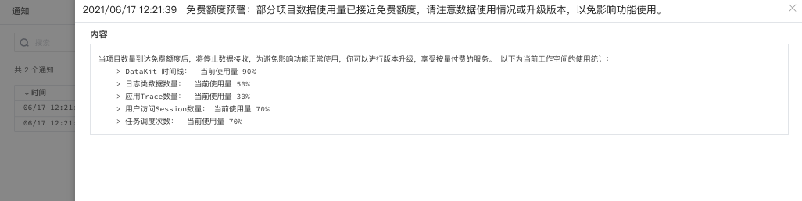
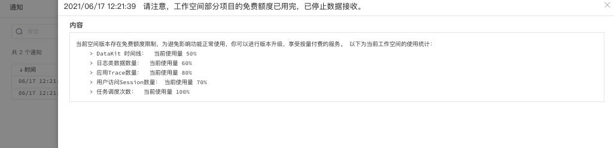
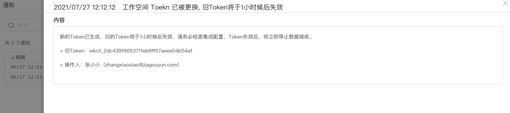

# 系统通知
---

系统通知功能适用于接收工作空间内的各种通知，包括系统发布通知和系统告警通知（如：系统免费额度用量预警）。

## 访问通知

登入观测云工作台后，您可以通过点击左下角用户账号进入**系统通知**，查看所在工作空间内的全部通知。若要查看通知的完整信息，请单击通知栏查看更详细的消息通知。

## 通知类型

观测云目前提供三种通知类型，包括额度预警通知、免费额度用尽通知、Token 变更通知。满足以下情况时，您将收到系统通知：

### 额度预警通知

在观测云体验版本的工作空间内，当部分功能的某个计费使用量已接近免费额度上限（85%）时，您将会收到额度预警通知。如：当前空间内的 “DataKit 时间线”的使用量为 90%，超过了免费额度上限 85%，将触发额度预警通知。

???+ warning

    为防止重复信息，预警通知信息在一天内仅会发送一次。

### 免费额度用尽通知

在观测云体验版本的工作空间内，当部分功能的某个计费使用量已用完时，您将会收到免费额度用尽通知。如：当前空间内的“任务调度数”的使用量为100%，已用尽一个计费使用量，将触发额度预警通知。

???+ warning

    为防止重复信息，免费额度信息在一天内仅会发送一次。

### Token 变更

在观测云的工作空间内，当空间管理员变更了当前空间的 Token 时，当前空间的全部成员将接收到 Token 失效的通知，包括 Token 已失效的通知和 Token 延时失效的通知。

- Token 已失效：

- Token 延时失效：

