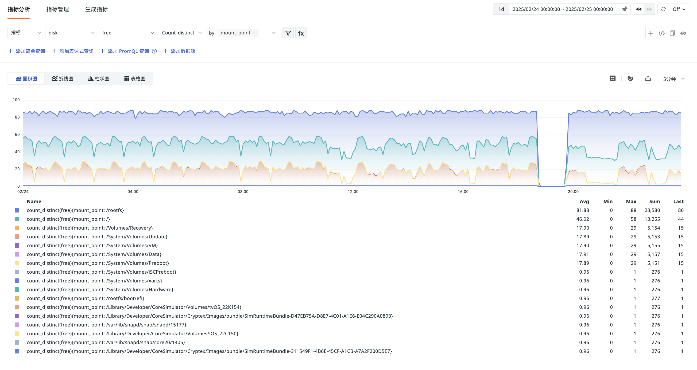

# 指标分析
---

                                            
数据采集上报到工作空间后，您可以在**指标 > 指标分析**页面对指标和其他数据类型（日志、基础对象、资源目录、事件、应用性能、用户访问、安全巡检、网络、Profiling 等）进行数据查询和分析。

## 查询方式 {#query}

可通过以下方式进行指标分析：简单查询、表达式查询、DQL 查询、PromQL 查询、添加数据源。

查询结果可通过面积图、折线图、柱状图或表格图四种可视化模式查看。

### 表格图 {#table}

表格图支持“时序模式”、“分组模式”，并提供“查询工具”以进行高效分析。查询工具的返回结果与“快捷入口 > 查询工具”中的结果保持一致。在时序模式下，您可以通过选择不同的[时间间隔](#interval)来展示查询数据。

- 三种模式下，查询结果默认最多返回 2,000 条记录。如需调整返回数量，可通过 `slimit` 参数指定，最大返回 10,000 条数据记录。

- 在“查询工具”模式下，如果您添加了多条查询且启用了状态，则默认返回第一条查询的结果；最多可导出 2,000 条记录。

> 更多数据查询说明，可参考 [图表查询](../scene/visual-chart/chart-query.md#query)和[查询工具](../dql/define.md)。

## 管理查询

### 时间间隔 {#interval}

时间间隔是指[时序图](../scene/visual-chart/timeseries-chart.md)中数据点与数据点之间的时间长度。您可以通过查看器右上角的[时间间隔](../scene/visual-chart/timeseries-chart.md#interval)，将时间间隔精确至 10 秒、20 秒、30 秒、1 分钟、5 分钟和 10 分钟。

**注意**：[时间控件](../getting-started/function-details/explorer-search.md#time)会影响指标分析的数据展示范围，因此可选的时间间隔会根据时间控件的范围自动调整。例如，如果您选择查看最近 15 分钟的指标数据，则无法选择 “1 小时”作为时间间隔。

### 图例

**图例**是图表的辅助元素，用于通过不同的颜色、点和形状区分数据。您可以通过查看器右上角的图例按钮 :fontawesome-solid-table-list:，隐藏图例或位置将其调整到底部或右侧。

### 颜色

为了更好地通过颜色区分不同指标的数据趋势，您可以在查看器右上角点击颜色设置按钮 :art:，对图例颜色进行自定义修改。

### 导出

在完成指标分析并获取查询结果后，您可以点击导出按钮 :material-export-variant: 选择将图表导出到仪表板、笔记，或复制到剪切板。

如果使用表格图进行可视化，除了上述导出选项外，您还可以选择将数据导出为 CSV 文件。

