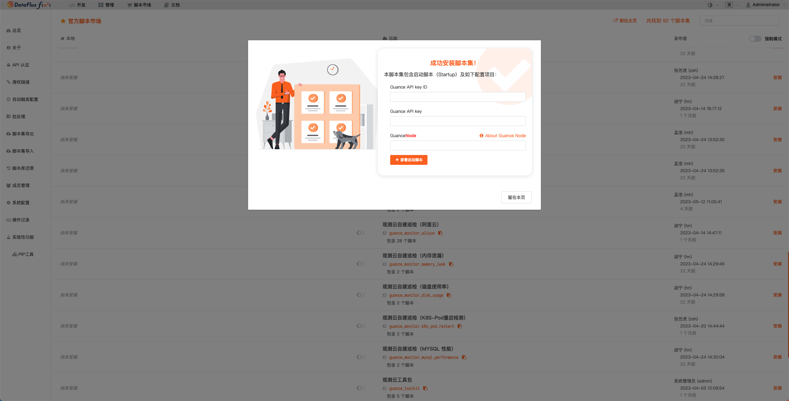
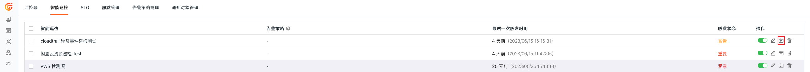
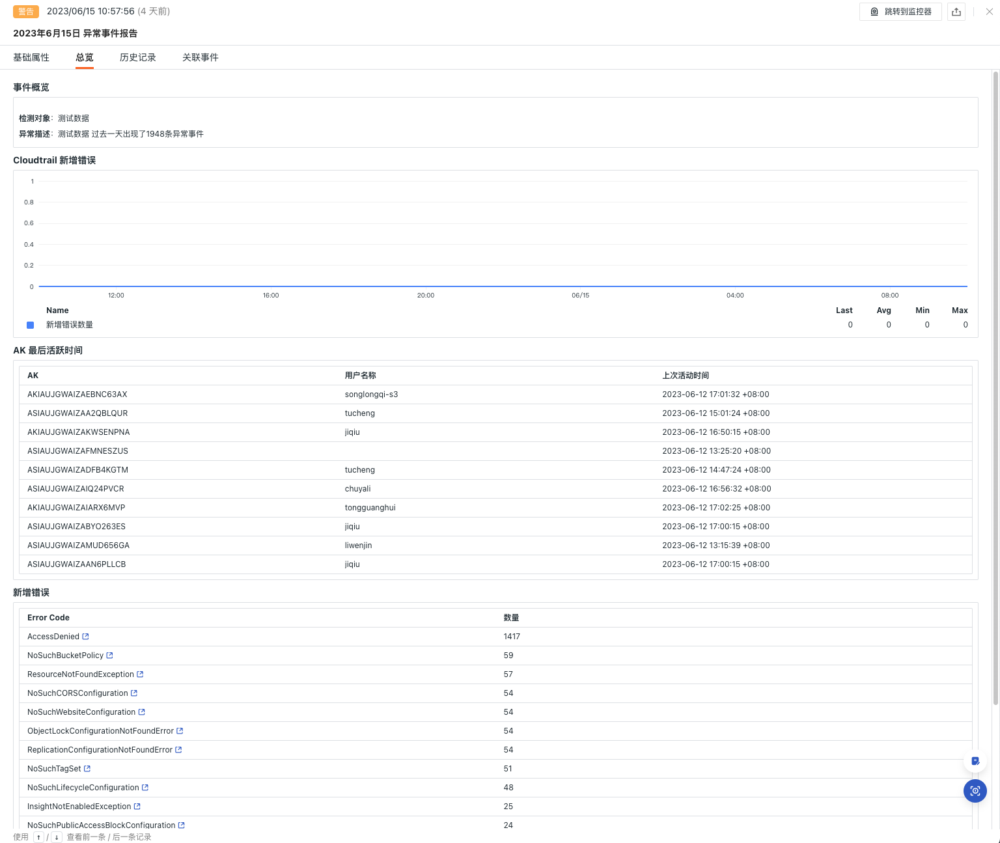
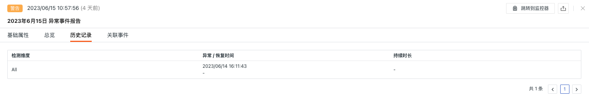

# AWS Cloudtrail 异常事件巡检

---

## 背景

AWS CloudTrail 是一项用于跟踪、日志记录和监控AWS账户活动的服务。它记录了AWS 账户中进行的操作，包括管理控制台访问、API 调用、资源变更等，我们可以通过监控 CloudTrail 的错误事件，及时发现潜在的安全问题。例如，非授权的API调用、访问被拒绝的资源、异常的身份验证尝试等。这有助于保护您的 AWS 账户和资源免受未经授权的访问和恶意活动；还可以了解到系统中发生的故障类型、频率和影响范围。这有助于您快速识别问题并采取适当的纠正措施，以减少服务中断时间和业务影响。

## 前置条件

1. 自建 [DataFlux Func <<< custom_key.brand_name >>>特别版](https://func.guance.com/#/) ，或者开通 [DataFlux Func 托管版](../../dataflux-func/index.md)
2. 在<<< custom_key.brand_name >>>「管理 / API Key 管理」中创建用于进行操作的 [API Key](../../management/api-key/open-api.md)

> **注意**：如果考虑采用云服务器来进行 DataFlux Func 离线部署的话，请考虑跟当前使用的<<< custom_key.brand_name >>> SaaS 部署在[同一运营商同一地域](../../../getting-started/necessary-for-beginners/select-site/)。

## 开启巡检

在自建的 DataFlux Func 中，通过「脚本市场」安装「 <<< custom_key.brand_name >>>自建巡检（AWS Cloudtrail 异常事件巡检）」并根据提示配置<<< custom_key.brand_name >>> API Key 完成开启。

在 DataFlux Func 脚本市场中选择需要开启的巡检场景点击安装，配置<<< custom_key.brand_name >>> API Key 和 [GuanceNode](https://func.guance.com/doc/script-market-guance-monitor-connect-to-other-guance-node/) 后选择部署启动脚本即可

> 注意：首先要在 AWS 上配置 CloudWatchLogs 的 CloudTrail  收集，然后在 Func 中开启 「 <<< custom_key.brand_name >>>集成（AWS-CloudWatchLogs ）」
>



启动脚本部署成功后，会自动创建启动脚本和自动触发配置，可以通过链接直接跳转查看对应配置。


## 配置巡检

在<<< custom_key.brand_name >>> studio 监控-智能巡检模块中或 DataFlux Func 自动创建的启动脚本中配置想要过滤的巡检条件即可，可以参考下面两种配置方式

### 在<<< custom_key.brand_name >>>中配置巡检

  


#### 启用/禁用

AWS Cloudtrail 异常事件巡检默认是「开启」状态，可手动「关闭」，开启后，将对配置好的云账户进行巡检。


#### 编辑

  智能巡检「 AWS Cloudtrail 异常事件巡检 」支持用户手动添加筛选条件，在智能巡检列表右侧的操作菜单下，点击**编辑**按钮，即可对巡检模版进行编辑。

  * 筛选条件：配置对应需要进行巡检的日志集名称（CloudWatchLogs 采集的日志组名称）
  * 告警通知：支持选择和编辑告警策略，包括需要通知的事件等级、通知对象、以及告警沉默周期等

  配置入口参数点击编辑后在参数配置中填写对应的检测对象点击保存开始巡检：

  

可以参考如下配置：

  ```json
   // 配置示例：
      configs 配置示例：
          source1
          source2
          source3
  ```


## 查看事件

  智能巡检基于<<< custom_key.brand_name >>>巡检算法，会查找AWS Cloudtrail 的异常事件。对于发现异常事件时，智能巡检会生成相应的事件，在智能巡检列表右侧的操作菜单下，点击**查看相关事件**按钮，即可查看对应异常事件。




### 事件详情页

  点击**事件**，可查看智能巡检事件的详情页，包括事件状态、异常发生的时间、异常名称、基础属性、事件详情、告警通知、历史记录和关联事件。

  * 点击详情页右上角的「查看监控器配置」小图标，支持查看和编辑当前智能巡检的配置详情


#### 基础属性

  * 检测维度：基于智能巡检配置的筛选条件，支持将检测维度 `key/value` 复制、添加到筛选、以及查看相关日志、容器、进程、安全巡检、链路、用户访问监测、可用性监测以及 CI 等数据
  * 扩展属性：选择扩展属性后支持以 `key/value` 的形式复制、正向/反向筛选

  


#### 事件详情

  * 事件概览：描述异常巡检事件的对象、内容等
  * Cloudtrail：当前云账户下的新增的错误事件数
  * AK 最后活跃时间：当前云账户下的 AK 最后活跃时间
  * 新增错误：当前云账户下新增的错误事件聚类，可以跳转到对应的事件详情




#### 历史记录

  支持查看检测对象、异常/恢复时间和持续时长。

 


#### 关联事件

  支持通过筛选字段和所选取的时间组件信息，查看关联事件。

  


## 常见问题

**1.AWS Cloudtrail 异常事件巡检的检测频率如何配置**

在自建的 DataFlux Func 中，编写自建巡检处理函数时在装饰器中添加`fixed_crontab='0 * * * *', timeout=900` ，后在「管理 / 自动触发配置」中配置。

**2.AWS Cloudtrail 异常事件巡检触发时可能会没有异常分析**

在出现巡检报告中没有异常分析时，请检查当前 Func 前置采集器是否有数据。

**3.在何种情况下会产生 AWS Cloudtrail 异常事件巡检事件**

当发现过去 1 小时内 出现新的异常事件

**4.在巡检过程中发现以前正常运行的脚本出现异常错误**

请在 DataFlux Func 的脚本市场中更新所引用的脚本集，可以通过[**变更日志**](https://func.guance.com/doc/script-market-guance-changelog/)来查看脚本市场的更新记录方便即时更新脚本。

**5.在升级巡检脚本过程中发现 Startup 中对应的脚本集无变化**

请先删除对应的脚本集后，再点击升级按钮配置对应<<< custom_key.brand_name >>> API key 完成升级。

**6.开启巡检后如何判断巡检是否生效**

在「管理 / 自动触发配置」中查看对应巡检状态，首先状态应为已启用，其次可以通过点击执行来验证巡检脚本是否有问题，如果出现 xxx 分钟前执行成功字样则巡检正常运行生效。

  

  
