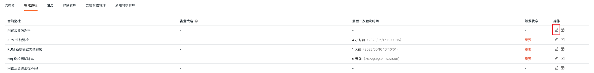
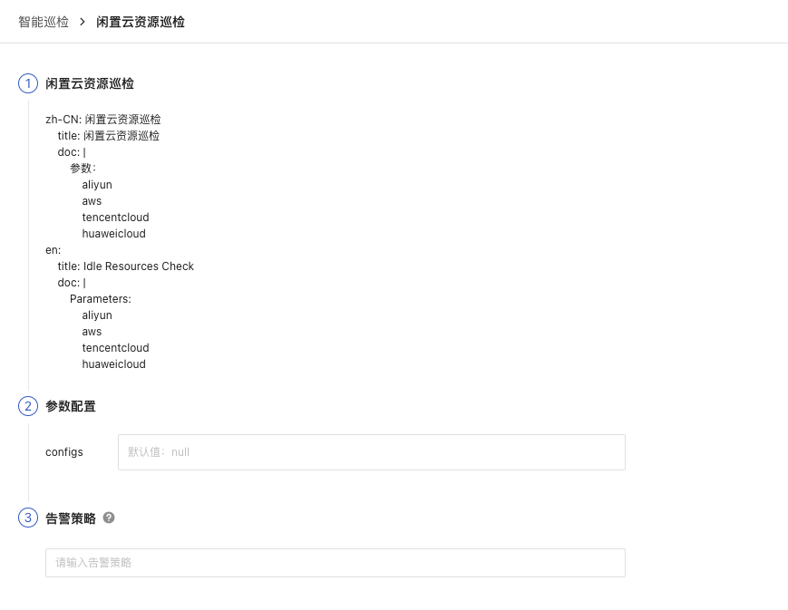
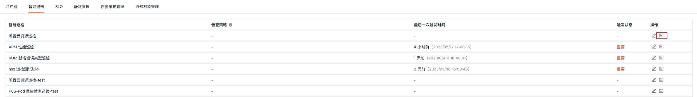
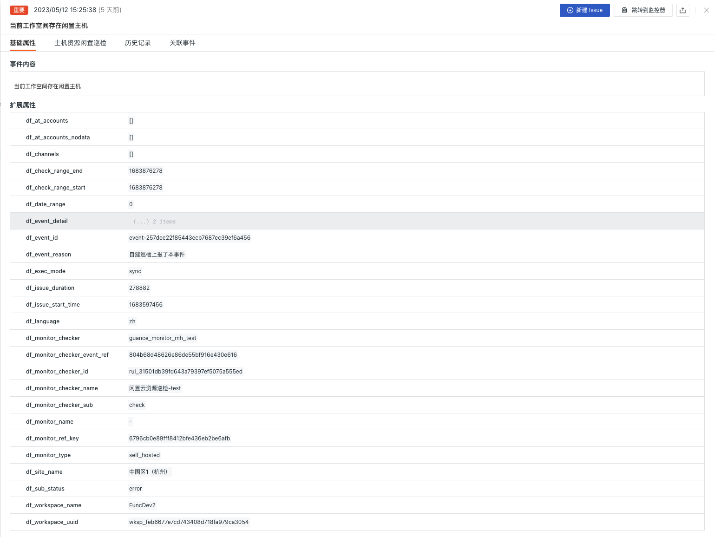
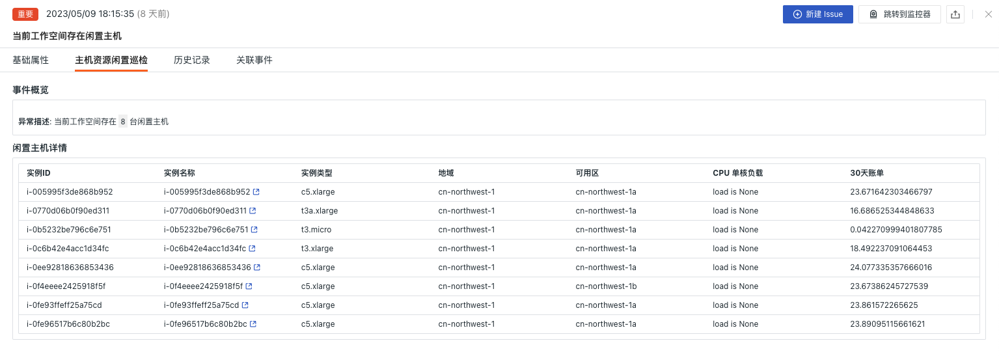
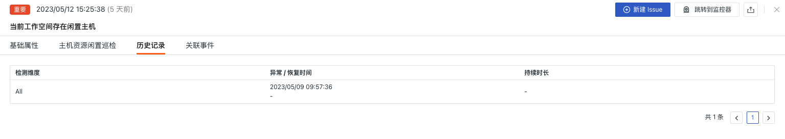
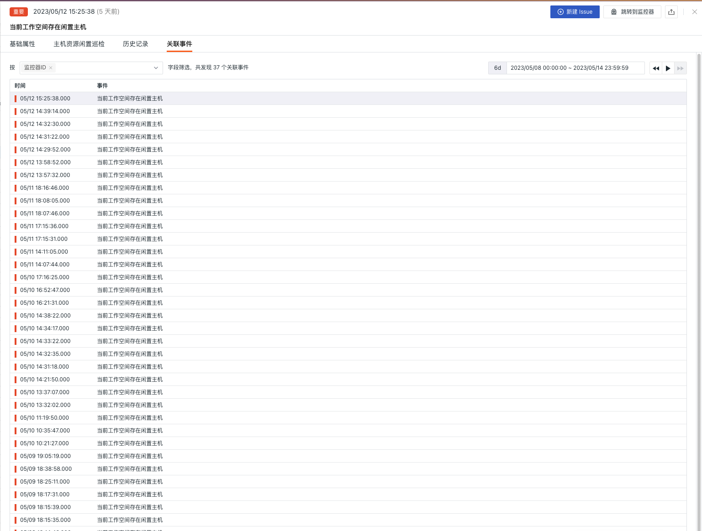

# 闲置云资源巡检

---

## 背景

云计算作为一种全新的IT服务方式发展迅猛，为企业和个人提供了方便、快捷、弹性的IT基础设施和应用服务，并带来极高的效率和经济性。然而，随着云资源逐渐成为企业数据中心的主要组成部分之后，云上资源的巨大浪费问题也愈加显著。尤其是在企业范围内，因为需求波动和部门之间的隔离等原因，导致部分云上资源无法得到充分利用，形成了大量的闲置资源。这种情况会使企业的云服务成本直线上升、资源效率下降，还有可能降低安全和性能水平。为了更好地管理和优化云上闲置资源，以提升云计算的使用效益和资源利用率，进行云上闲置资源巡检是非常有必要的。通过巡检，可以发现当前云服务中的不必要资源，及时进行处理，避免长时间不必要的资源使用而带来的费用开销、数据泄露、性能不佳等问题。

## 前置条件

1. 自建 [DataFlux Func 观测云特别版](https://func.guance.com/#/) ，或者开通 [DataFlux Func 托管版](../../dataflux-func/index.md)
2. 在观测云「管理 / API Key 管理」中创建用于进行操作的 [API Key](../../management/api-key/open-api.md)

> **注意**：如果考虑采用云服务器来进行 DataFlux Func 离线部署的话，请考虑跟当前使用的观测云 SaaS 部署在[同一运营商同一地域](../../../getting-started/necessary-for-beginners/select-site/)。

## 开启巡检

在自建的 DataFlux Func 中，通过「脚本市场」安装「 观测云自建巡检（闲置云资源巡检）」并根据提示配置观测云 API Key 完成开启。

在 DataFlux Func 脚本市场中选择需要开启的巡检场景点击安装，配置观测云 API Key 和 [GuanceNode](https://func.guance.com/doc/script-market-guance-monitor-connect-to-other-guance-node/) 后选择部署启动脚本即可

> 注意：如果需要巡检不同云厂商的闲置资源需要额外开启不同的采集器
>
> AWS：观测云集成（AWS-EC2采集）、观测云集成（AWS-CloudWatch采集）- mem
>
> 华为：观测云集成（华为云-云监控采集）
>
> 腾讯：观测云集成（腾讯云-云监控采集）
>
> 阿里：观测云集成（阿里云-云监控采集）


启动脚本部署成功后，会自动创建启动脚本和自动触发配置，可以通过链接直接跳转查看对应配置。


## 配置巡检

在观测云 studio 监控-智能巡检模块中或 DataFlux Func 自动创建的启动脚本中配置想要过滤的巡检条件即可，可以参考下面两种配置方式

### 在观测云中配置巡检

  


#### 启用/禁用

闲置云资源巡检默认是「开启」状态，可手动「关闭」，开启后，将对配置好的云厂商进行巡检。


#### 编辑

  智能巡检「 闲置云资源巡检 」支持用户手动添加筛选条件，在智能巡检列表右侧的操作菜单下，点击**编辑**按钮，即可对巡检模版进行编辑。

  * 筛选条件：配置对应需要进行巡检的云厂商信息（建议不同云厂商单独配置）
  * 告警通知：支持选择和编辑告警策略，包括需要通知的事件等级、通知对象、以及告警沉默周期等

  配置入口参数点击编辑后在参数配置中填写对应的检测对象点击保存开始巡检：

  

可以参考如下配置多

  ```json
   // 配置示例：
       config 参数：
              aliyun
              aws
              tencentcloud
              huaweicloud
  ```


## 查看事件

  智能巡检基于观测云巡检算法，会查找对应云厂商的闲置云资源。对于异常的资源闲置情况，智能巡检会生成相应的事件，在智能巡检列表右侧的操作菜单下，点击**查看相关事件**按钮，即可查看对应异常事件。




### 事件详情页

  点击**事件**，可查看智能巡检事件的详情页，包括事件状态、异常发生的时间、异常名称、基础属性、事件详情、告警通知、历史记录和关联事件。

  * 点击详情页右上角的「查看监控器配置」小图标，支持查看和编辑当前智能巡检的配置详情


#### 基础属性

  * 检测维度：基于智能巡检配置的筛选条件，支持将检测维度 `key/value` 复制、添加到筛选、以及查看相关日志、容器、进程、安全巡检、链路、用户访问监测、可用性监测以及 CI 等数据
  * 扩展属性：选择扩展属性后支持以 `key/value` 的形式复制、正向/反向筛选

  


#### 事件详情

  * 事件概览：描述异常巡检事件的对象、内容等
  * 闲置主机详情：可查看当前云账户下的闲置主机情况以及消费情况

> 注意：当工作空间部分主机资源目录数据查询失败，无法获取主机详细信息, 请检查资源目录数据上报是否正确




#### 历史记录

  支持查看检测对象、异常/恢复时间和持续时长。

 


#### 关联事件

  支持通过筛选字段和所选取的时间组件信息，查看关联事件。

  


## 常见问题

**1.闲置云资源巡检的检测频率如何配置**

在自建的 DataFlux Func 中，编写自建巡检处理函数时在装饰器中添加`fixed_crontab='0 * * * *', timeout=900` ，后在「管理 / 自动触发配置」中配置。

**2.闲置云资源巡检触发时可能会没有异常分析**

在出现巡检报告中没有异常分析时，请检查当前 `datakit` 的数据采集状态。

**3.在何种情况下会产生闲置云资源巡检事件**

当发现过去 48 小时内 cpu 每小时的平均利用率 < 1% 且 48 小时内 mem 每小时平均使用率 < 10% 且 48 小时内每小时 tcp 流量 in/out 总和都低于 10M

**4.在巡检过程中发现以前正常运行的脚本出现异常错误**

请在 DataFlux Func 的脚本市场中更新所引用的脚本集，可以通过[**变更日志**](https://func.guance.com/doc/script-market-guance-changelog/)来查看脚本市场的更新记录方便即时更新脚本。

**5.在升级巡检脚本过程中发现 Startup 中对应的脚本集无变化**

请先删除对应的脚本集后，再点击升级按钮配置对应观测云 API key 完成升级。

**6.开启巡检后如何判断巡检是否生效**

在「管理 / 自动触发配置」中查看对应巡检状态，首先状态应为已启用，其次可以通过点击执行来验证巡检脚本是否有问题，如果出现 xxx 分钟前执行成功字样则巡检正常运行生效。

  

  
