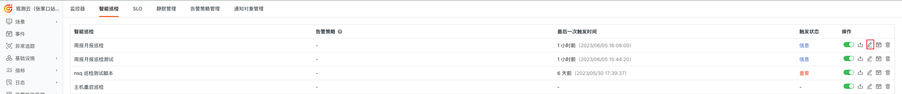
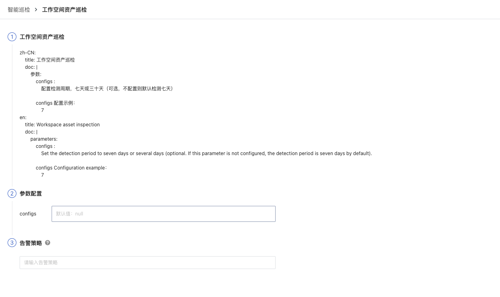
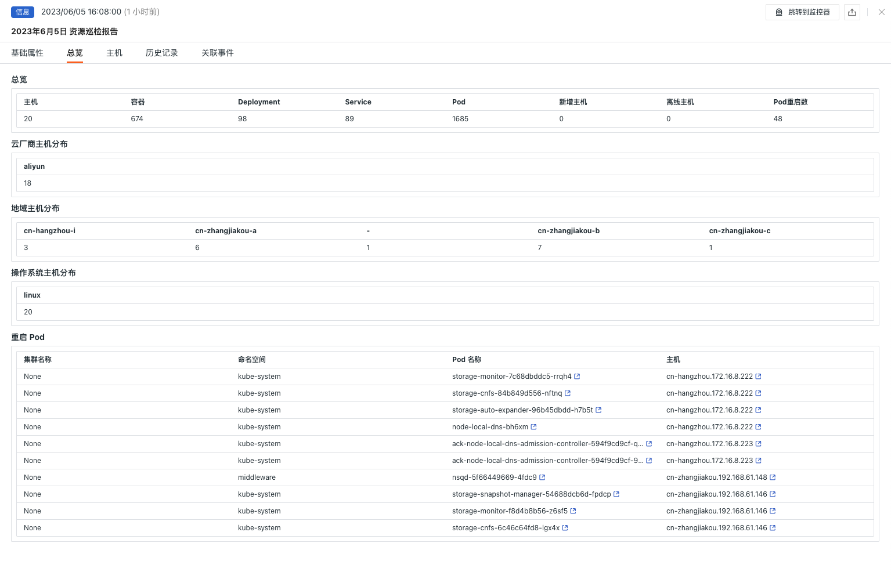
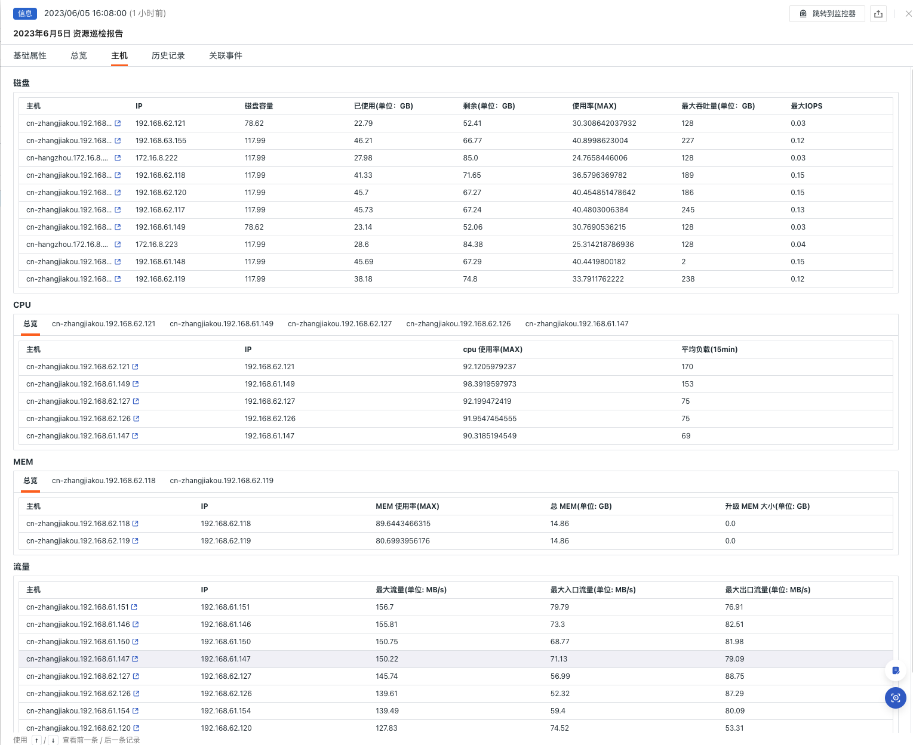
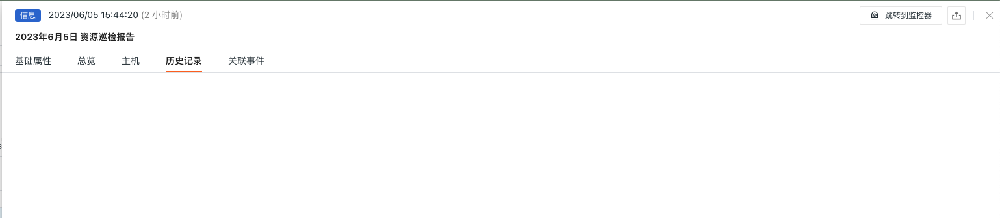
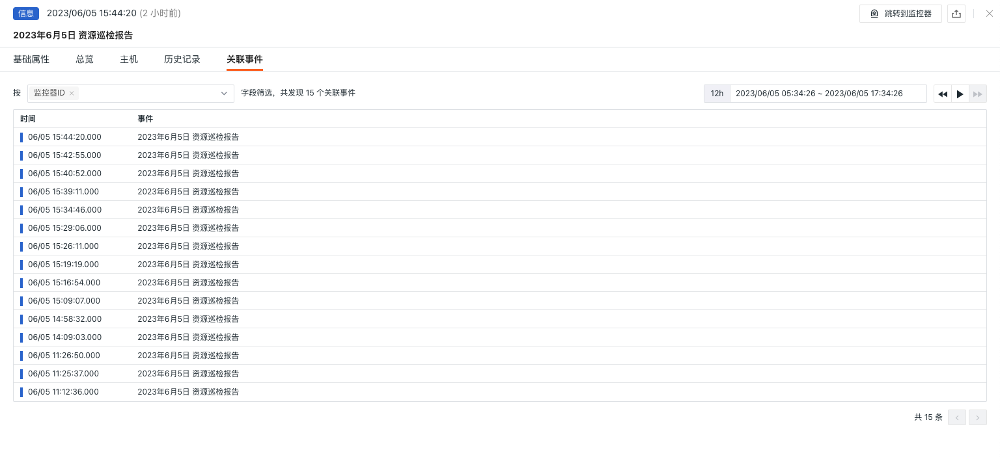

# 工作空间资产巡检

---

## 背景

针对于服务巡检应当确保服务正常运行，及时发现故障或异常，降低业务损失。其次，巡检有助于提高服务可用性和稳定性，发现并解决潜在问题。还可以巡检提高运维效率，加速问题诊断和解决，优化资源配置。保障业务安全。通过对主机、K8s、容器等服务的定期巡检，运维人员可以确保这些服务能够高效、稳定地支持业务，为企业提供持续可靠的运行环境。

## 前置条件

1. 自建 [DataFlux Func {{{ custom_key.brand_name }}}特别版](https://func.guance.com/#/) ，或者开通 [DataFlux Func 托管版](../../dataflux-func/index.md)
3. 在{{{ custom_key.brand_name }}}「管理 / API Key 管理」中创建用于进行操作的 [API Key](../../management/api-key/open-api.md)

> **注意**：如果考虑采用云服务器来进行 DataFlux Func 离线部署的话，请考虑跟当前使用的{{{ custom_key.brand_name }}} SaaS 部署在[同一运营商同一地域](../../../getting-started/necessary-for-beginners/select-site/)。

## 开启巡检

在自建的 DataFlux Func 中，通过「脚本市场」安装「 {{{ custom_key.brand_name }}}自建巡检（周报月报巡检）」并根据提示配置{{{ custom_key.brand_name }}} API Key 完成开启。

在 DataFlux Func 脚本市场中选择需要开启的巡检场景点击安装，配置{{{ custom_key.brand_name }}} API Key 和 [GuanceNode](https://func.guance.com/doc/script-market-guance-monitor-connect-to-other-guance-node/) 后选择部署启动脚本即可


启动脚本部署成功后，会自动创建启动脚本和自动触发配置，可以通过链接直接跳转查看对应配置。


## 配置巡检

在{{{ custom_key.brand_name }}} studio 监控-智能巡检模块中或 DataFlux Func 自动创建的启动脚本中配置想要过滤的巡检条件即可，可以参考下面两种配置方式

### 在{{{ custom_key.brand_name }}}中配置巡检



#### 启用/禁用

工作空间资产巡检使用率巡检默认是「开启」状态，可手动「关闭」，开启后，将对配置好主机列表进行巡检。

#### 编辑

智能巡检「 工作空间资产巡检 」支持用户手动添加筛选条件，在智能巡检列表右侧的操作菜单下，点击**编辑**按钮，即可对巡检模版进行编辑。

* 筛选条件：配置需要巡检的报告周期，目前只支持 7 天和 30 天两个选项
* 告警通知：支持选择和编辑告警策略，包括需要通知的事件等级、通知对象、以及告警沉默周期等

配置入口参数点击编辑后在参数配置中填写对应的检测对象点击保存开始巡检：



可以参考如下的配置：

```
configs 配置示例：
          7
```

>  **注意**：在自建的 DataFlux Func 中，编写自建巡检处理函数时也可以添加过滤条件（参考示例代码配置），要注意的是在{{{ custom_key.brand_name }}} studio 中配置的参数会覆盖掉编写自建巡检处理函数时配置的参数

### 在 DataFlux Func 中配置巡检

在 DataFlux Func 中在配置好巡检所需的过滤条件之后可以通过直接再页面中选择 `run()` 方法进行点击运行进行测试，在点击发布之后脚本就会正常执行了。也可以在{{{ custom_key.brand_name }}}「监控 / 智能巡检」中查看或更改配置。

```python
# Please fill in the following configuration according to the actual situation

# Guance API key
account = {
    "api_key_id" : "<Guance API key ID>",
    "api_key"    : "<Guance API key>",
    "guance_node": "<Guance Node [About Guance Node](https://func.guance.com/doc/script-market-guance-monitor-connect-to-other-guance-node/)>"
}

# The host does not need to be checked
# Example:
#         no_check_host = ['192.168.0.1', '192.168.0.1']
no_check_host = []

###### Do not modify the following content #####
from guance_monitor__register import self_hosted_monitor
from guance_monitor__runner import Runner
import guance_monitor_weekly_report__main as main


@self_hosted_monitor(account['api_key_id'], account['api_key'], account['guance_node'])
@DFF.API('工作空间资产巡检', fixed_crontab='* * */7 * *', timeout=900)
# @DFF.API('工作空间资产巡检', fixed_crontab='* * */30 * *', timeout=900)
def run(configs=None):
    '''
    zh-CN:
        title: 工作空间资产巡检
        doc: |
            参数:
                configs :
                    配置检测周期，七天或三十天（可选，不配置则默认检测七天）

                configs 配置示例：
                    7
    en:
        title: Workspace asset inspection
        doc: |
            parameters:
                configs :
                    Set the detection period to seven days or several days (optional. If this parameter is not configured, the detection period is seven days by default).

                configs Configuration example：
                    7
    '''

    checkers = [
        main.WeeklyreportEventStruct(configs=configs, no_check_host=no_check_host),
    ]

    Runner(checkers).run()
```

## 查看事件

本巡检会扫描最近 7 天或 30 天的工作空间内的资产信息，智能巡检会汇总 7 天或 30 天的资产报告，在智能巡检列表右侧的操作菜单下，点击**查看相关事件**按钮，即可查看对应事件。


### 事件详情页

点击**事件**，可查看智能巡检事件的详情页，包括事件状态、异常发生的时间、异常名称、基础属性、事件详情、告警通知、历史记录和关联事件。

* 点击详情页右上角的「查看监控器配置」小图标，支持查看和编辑当前智能巡检的配置详情

#### 基础属性

* 检测维度：基于智能巡检配置的筛选条件，支持将检测维度 `key/value` 复制、添加到筛选、以及查看相关日志、容器、进程、安全巡检、链路、用户访问监测、可用性监测以及 CI 等数据
* 扩展属性：选择扩展属性后支持以 `key/value` 的形式复制、正向/反向筛选


#### 事件详情

##### 总览

* 总览：展示当前工作空间的资源总览，包括总主机数、容器数等信息
* 云厂商主机分布：可查看当前工作空间资产的云厂商分布情况
* 地域主机分布：可查看当前工作空间资产的地域分布情况
* 操作系统主机分布：可查看当前工作空间资产的操作系统分布情况
* 重启 Pod：可查看当前工作空间异常重启的 Pod 的情况并可以跳转到相应的日志详情，做进一步的排查



##### 主机

* 磁盘：展示当前工作空间的资源的磁盘详情
* CPU：展示当前工作空间的资源的 CPU 使用详情，并展示 Top 主机的进程详情
* MEM：展示当前工作空间的资源的 MEM 使用详情，并展示 Top 主机的进程详情
* 流量：展示当前工作空间的资源的流量详情



#### 历史记录

支持查看检测对象、异常/恢复时间和持续时长。



#### 关联事件

支持通过筛选字段和所选取的时间组件信息，查看关联事件。



## 常见问题

**1.工作空间资产巡检的检测频率如何配置**

当需要开启月巡检时在自动创建的巡检处理函数中在装饰器中参数更改为 `fixed_crontab='* * */30 * *', timeout=900` ，后在「管理 / 自动触发配置」中配置。

**2.工作空间资产巡检触发时可能会没有异常分析**

在出现巡检报告中没有异常分析时，请检查当前 `datakit` 的数据采集状态。

**3.在巡检过程中发现以前正常运行的脚本出现异常错误**

请在 DataFlux Func 的脚本市场中更新所引用的脚本集，可以通过[**变更日志**](https://func.guance.com/doc/script-market-guance-changelog/)来查看脚本市场的更新记录方便即时更新脚本。

**4.在升级巡检脚本过程中发现 Startup 中对应的脚本集无变化**

请先删除对应的脚本集后，再点击升级按钮配置对应{{{ custom_key.brand_name }}} API key 完成升级。

**5.开启巡检后如何判断巡检是否生效**

在「管理 / 自动触发配置」中查看对应巡检状态，首先状态应为已启用，其次可以通过点击执行来验证巡检脚本是否有问题，如果出现 xxx 分钟前执行成功字样则巡检正常运行生效。

