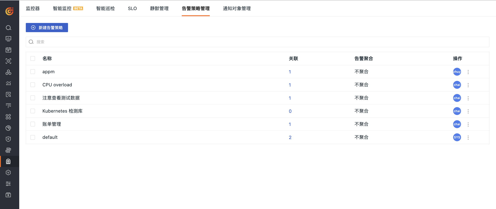

# 策略列表
---

在当前工作空间内，所有[创建](./alert-setting.md#create)的告警策略都会在当前列表中显示。您可以查看每个策略关联的监控器、告警聚合方式，还可以通过搜索、编辑等操作来管理告警策略列表。

1. 查询：可输入告警策略名称快速搜索定位。  
2. 批量操作：可批量删除特定告警策略。  
3. 关联：展示告警策略下关联的监控器个数，点击个数可以跳转到监控器查看告警策略下的监控器详情。  
4. 告警聚合：即显示当前告警策略的聚合方式。  
5. 编辑：点击即可修改当前告警策略。  
6. 操作审计：点击即可查看当前告警策略的操作事件记录。  
7. 删除：即删除当前告警策略。当告警策略被删除，被关联的监控器将**自动归类到默认**下。

## 更多阅读

- [ :fontawesome-solid-arrow-right-long: &nbsp; **新建告警策略**](./alert-setting.md)

- [ :fontawesome-solid-arrow-right-long: &nbsp; **告警策略：更精细化的通知对象配置**](./alert-strategy.md)

