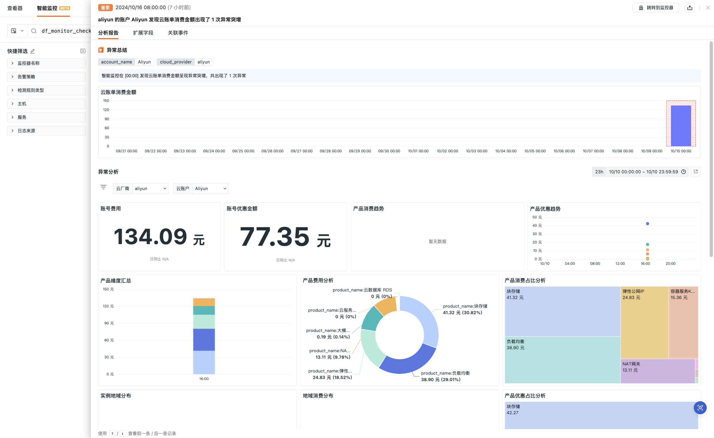

# 云账单智能监控
---

云账户账单智能监控是一款专为您设计的高效云成本管理工具。在企业和个人对云服务依赖性不断增强的背景下，合理使用并控制云服务成本已成为一个关键议题。该工具通过智能监控账单，能够实时追踪云服务的消费动态，及时发现并预警潜在的异常费用，从而帮助您避免不必要的开支。

此外，云账户账单智能监控还提供了多维度的可视化分析功能。您可以从多个角度深入分析和理解云资源的消费模式，这些视角包括但不限于资源使用量、服务类型、成本分布等。这些详尽的可视化报告不仅使您能够全面掌握当前的费用状况，而且为未来的预算规划提供了有力的数据支持。

通过这些功能，您可以更加精确地调整和优化云资源配置，确保每一笔投资都能发挥最大价值。这种精细化的成本管理方式，使得您在享受云服务带来的便利的同时，也能有效地控制和降低成本，实现资源的最优利用。

## 开启前提

在开始使用云账单分析功能前，并最终实现采集数据进行上报，需先前往 DataFlux Func [开启采集器](../../cloud-billing/index.md#precondition)。

## 检测配置 {#config}

1. 定义监控器名称；

2. 选择检测范围：基于云厂商、账户名称和产品名称对检测指标的数据进行筛选，限定检测的数据范围，可添加一个或多个标签筛选。若此处不添加筛选条件，观测云将检测所有云账单数据。

## 查看事件

监控器会获取一段时间内的云账单消费金额统计，识别出现异常情况时，会生成相应的事件，在**事件 > 智能监控**列表可查看对应异常事件。

:material-numeric-1-circle-outline: 异常分析：基于云厂商和云账户可视化展示账号费用、账号优惠金额、产品消费趋势、产品优惠趋势等信息。

:material-numeric-2-circle-outline: [扩展字段](../../events/event-explorer/event-details.md#extension)

:material-numeric-3-circle-outline: [告警通知](../../events/event-explorer/event-details.md#alarm)

:material-numeric-4-circle-outline: [历史记录](../../events/event-explorer/event-details.md#history)

:material-numeric-5-circle-outline: [关联事件](../../events/event-explorer/event-details.md#relevance)
