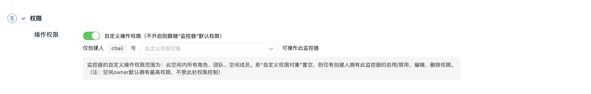

# 日志智能检测
---


**日志智能检测**基于智能检测算法，监控工作空间内采集器产生的日志数据。智能识别日志数量的突增 / 突降、错误日志的突增的异常数据，及时发现不符合预期的异常状态。

## 应用场景

多适用于 IT 监控场景下的代码异常或任务调度检测等。例如监控日志的错误数突增。

## 新建

点击**智能监控器 > 新建智能监控 > 日志智能检测**，进入日志智能检测配置页面。

### 步骤一：检测配置


1）**监控器名称**：支持编辑监控器名称。

2）**检测维度**：支持**基于 Source（By Source）**或**基于 Service (By Service)**检测，自动匹配用户选择的检测维度。

3）**检测范围**：基于指标的标签对检测指标的数据进行筛选，限定检测的数据范围，支持添加一个或多个标签筛选。若不添加筛选，检测所有日志的数据。

### 步骤二：事件通知


1）**事件内容**：提供预置的事件通知模版，满足触发条件时发送事件通知内容，同时，支持输入 Markdown 格式文本信息补充事件描述，支持预览效果，支持使用预置的 关联链接和[模板变量](../event-template.md)。

**注意**：不同告警通知对象支持的 Markdown 语法不同，例如：企业微信不支持无序列表。

2）**关联异常追踪**：开启关联后，若该监控器下产生了异常事件，将同步创建 Issue。选择 Issue 的等级以及需要投递的目标频道，产生的 Issue 可以前往[异常追踪](../../exception/index.md) > 您选定的[频道](../../exception/channel.md)进行查看。

在事件恢复后，可以同步关闭 Issue。


#### 事件内容自定义高级配置 {#advanced-settings}

观测云支持在事件内容中通过高级配置添加关联日志或错误堆栈，以便查看异常情况发生时的上下文数据情况：


- 添加关联日志：

查询：

如：获取一条索引为 `default` 的日志 `message`：

```

```

关联日志：


```
{{ dql_data.message | limit_lines(10) }}
```

- 添加关联错误堆栈
  
查询：

```

```

关联错误堆栈：

```
{{ dql_data.error_message | limit_lines(10) }}

{{ dql_data.error_stack | limit_lines(10) }}
```


### 步骤三：告警配置


**告警策略**：监控满足触发条件后，立即发送告警消息给指定的通知对象。

**注意**：智能监控触发的事件等级为【重要】。


### 步骤四：权限

设置监控器的操作权限后，您当前工作空间的角色、团队成员以及空间用户将根据分配的权限，对监控器执行相应的操作。这确保了不同用户根据其角色和权限级别进行符合配置的操作。
 



- 不开启该配置：跟随【监控器配置管理】的[默认权限](../management/role-list.md)；
- 开启该配置并选定自定义权限对象：此刻仅创建人和被赋予权限的对象可对该监控器设置的规则进行启用/禁用、编辑、删除操作；
- 开启该配置，但并未选定自定义权限对象：则仅创建人拥有此监控器的启用/禁用、编辑、删除权限。

**注意**：当前工作空间的 Owner 角色不受此处操作权限配置影响。

<!--
## 监控器列表

创建智能监控检测后，可在**智能监控**列表查看及管理检测规则。


### 列表操作

<div class="grid cards" markdown>

- [<font color="coral"> :fontawesome-solid-arrow-up-right-from-square: &nbsp; 监控器列表操作</font>](../monitor/index.md#list)


</div>
-->

## 查看事件

监控器会获取最近 10 分钟的检测日志指标，识别出现日志数量的突增 / 突降、错误日志的突增情况时，会生成对应的事件，在**事件 > 智能监控**列表可查看异常事件。


### 事件详情页

点击**事件**，可查看智能监控事件的详情页，包括事件状态、异常发生时间、异常名称、分析报告、告警通知、历史记录和关联事件。

* 点击右上角的**跳转到监控器**，可查看调整[智能监控器配置](index.md)；

* 点击右上角的**导出**按钮，支持选择**导出 JSON 文件**与**导出 PDF 文件**，从而获取当前事件所对应的所有关键数据。

:material-numeric-1-circle-outline: 分析报告


* 异常总结：可查看当前异常日志标签、异常分析报告详情、及错误请求数分布情况

* 错误分析：可查看错误日志的聚类信息

**注意**：存在多个区间异常时，**异常总结 > 异常值分布图**及**异常分析**仪表板默认展示第一段异常区间的异常情况分析，可以点击【异常值分布图】进行切换，切换后异常分析仪表板同步联动。

:material-numeric-2-circle-outline: [扩展字段](../../events/event-explorer/event-details.md#extension)

:material-numeric-3-circle-outline: [告警通知](../../events/event-explorer/event-details.md#alarm)

:material-numeric-4-circle-outline: [历史记录](../../events/event-explorer/event-details.md#history)

:material-numeric-5-circle-outline: [关联事件](../../events/event-explorer/event-details.md#relevance)