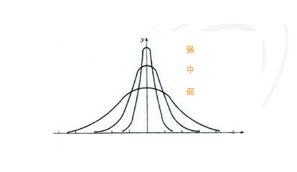

# 水位检测
---

## 概述

**水位检测**基于历史数据对指标的持续反常表现进行异常检测，可避免突发检测的毛刺告警。

## 应用场景

## 规则说明

在**监控器**中，点击 **+新建监控器** ，选择**水位检测**，进入水位检测规则配置页面。

### 步骤一：检测配置

1）**检测频率**：检测规则的执行频率，包含1m/5m/15/30m/1h/6h（默认选中5m）。

2）**检测区间**：每次执行任务时，检测指标查询的时间范围。受检测频率影响，可选检测区间会有不同。

| 检测频率 | 检测区间（下拉可选项） |
| --- | --- |
| 1m | 1m/5m/15m/30m/1h/3h |
| 5m | 5m/15m/30m/1h/3h |
| 15m | 15m/30m/1h/3h/6h |
| 30m | 30m/1h/3h/6h |
| 1h | 1h/3h/6h/12h/24h |
| 6h | 6h/12h/24h |
| 12h | 12h/24h |
| 24h | 24h |

3）**检测指标**：监控的指标数据，每次只允许检测一个指标。

| 字段 | 说明 |
| --- | --- |
| 检测指标 | 当前检测的指标，即**Result**，支持检测指标数据。 |
| 指标集 | 当前检测指标所在的指标集。 |
| 指标 | 当前检测所针对的指标。 |
| 聚合周期 | 当前检测指标的数据聚合周期，默认为 1 分钟。 |
| 聚合算法 | 包含Avg by（取平均值）、Min by（取最小值）、Max by（取最大值）、Sum by（求和）、Last（取最后一个值）、First by（取第一个值）、、Count by（取数据点数）、Count_distinct by（取非重复的数据点数）、p50(取中位数值)、p75（取处于75%位置的值）、p90（取处于90%位置的值）、p99(取处于99%位置的值)。 |
| 检测维度 | 检测维度决定着检测规则基于哪个维度触发，即触发对象。观测云支持添加多个检测维度，任意一个检测维度的指标满足告警条件则触发告警，不支持 int 型字段为检测维度，且最多支持选择三个字段。 |
| 筛选条件 | 基于指标的标签对检测指标的数据进行筛选，限定检测的数据范围，支持添加一个或多个标签筛选，支持模糊匹配和模糊不匹配的筛选条件。 |
| 查询方式 | 支持简单查询和表达式查询，详情参考 [查询](../../scene/visual-chart/chart-query.md)。 |

4）**触发条件**：设置告警级别的触发条件。

配置触发条件及严重程度，当查询结果为多个值时，任一值满足触发条件则产生事件。

> 事件等级详情参考 [事件等级说明](event-level-description.md)。   

**1、告警级别紧急（红色）、重要（橙色）、警告（黄色）基于周期范围、突变次数、突变方向以及突变强度，说明如下：**

- 周期范围：设置统计几个聚合周期的数据情况，一个聚合周期相当于折线图中的一个数据点；   
- 突变方向：包含向上（数据升高）、向下（数据下降）、向上或向下三种检测标准；   
- 突变强度：根据向上或向下的数据突破程度分为强、中、弱三个等级（如图所示）。   

**2、告警级别无数据（灰色）、正常（绿色）、信息（蓝色）基于配置检测次数，说明如下：**

- 每执行一次检测任务即为 1 次检测，如【检测频率 = 5 分钟】，则 1 次检测= 5 分钟；  
- 可以自定义检测次数，如【检测频率 = 5 分钟】，则 3 次检测 = 15 分钟。  

**a. 无数据（灰色）**：无数据状态支持**触发无数据事件**、**触发恢复事件**、**不触发事件**三种配置策略。

**b. 正常（绿色）**：检测规则生效后，产生紧急、重要、警告异常事件后，在配置的自定义检测周期内，数据检测结果恢复正常，则产生恢复告警事件。

**注意：**恢复告警事件不受[告警沉默](../alert-setting.md)限制。若未设置恢复告警事件检测周期，则告警事件不会恢复，且一直会出现在**事件 > 未恢复事件列表**中。

**c. 信息（蓝色）**：正常检测结果也产生事件。

### 步骤二：事件通知

5）**事件标题**：设置告警触发条件的事件名称，支持使用预置的[模板变量](../event-template.md)。

**注意：** 最新版本中**监控器名称**将由**事件标题**输入后同步生成。旧的监控器中可能存在**监控器名称**和**事件标题**不一致的情况，为了给您更好的使用体验，请尽快同步至最新。支持一键替换为事件标题。

6）**事件内容**：满足触发条件时发送的事件通知内容，支持输入 Markdown 格式文本信息，支持预览效果，支持使用预置的 [关联链接](link-description.md) ，支持使用预置的 [模板变量](../event-template.md)。

**注意：**不同告警通知对象支持的 Markdown 语法不同，例如：企业微信不支持无序列表。

**无数据通知配置**：支持自定义无数据通知内容，若没有配置，则自动使用官方默认的通知模版。

7）**告警策略**：监控满足触发条件后，立即发送告警消息给指定的通知对象。[告警策略](../alert-setting.md)中包含需要通知的事件等级、通知对象、以及告警沉默周期。

### 步骤三：关联

8）**关联仪表板**：每一个监控器都支持关联一个仪表板，即能够自定义快速跳转的仪表板（监控器关联的仪表板，支持快速跳转查看监控视图）。