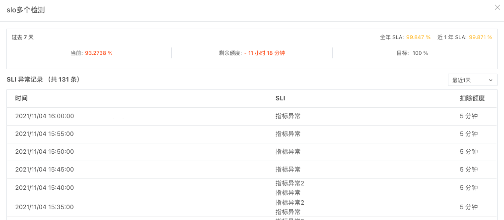

# SLO
---


在云时代背景下，各大服务商均发布相关服务水平协议（SLA），保障所提供服务的质量并明确权责。观测云 SLO 监控是围绕 DevOps 各类指标，测试系统服务可用性是否满足目标需要，不仅可以帮助使用者监控服务商提供的服务质量，还可以保护服务商免受 SLA 违规的影响。


## 概念先解

| 名词      | 描述                          |
| :--------- | :---------------------------------- |
| SLA       | 即 Service-Level Agreement，服务等级协议，指系统服务提供者（Provider）对客户（Customer）的服务承诺。您可以对服务商的服务质量 SLA 评分，实时监测服务的达标率。  |
| SLI       | 即 Service Level Indicator，测量指标，指选择用于衡量系统稳定性的指标。观测云 SLI 支持基于监控器设定一个或多个测量指标。 |
| SLO   | 即 Service Level Objective，观测云进行 SLA 评分处理的最小单元，是一个时间窗口内 SLI 累积成功数的目标。而我们又经常把 SLO 转化为错误预算，用于计算可容忍的错误数，在每一个检测周期内出现异常事件的时间将在可容错时长中扣除。（如下图：假设 SLO 检测周期为 5 分钟，根据叠加后，异常事件覆盖时间为 3 分钟，扣除额度 3 分钟）。 |


## 新建 SLO 

进入**监控器 > SLO**，自定义创建 SLO 任务。


1. 名称：SLO 任务名称。最多支持 64 个字符输入。 
2. 检测频率：SLO 检测频率，即以一定时间范围为周期，监测 SLO 任务中监控器是否出现异常事件。目前支持 5 分钟、10 分钟。
3. SLI：监控器的正常运行时间将作为衡量系统稳定性的指标。由此，您可自定义添加一个或多个监控器作为测量指标。
4. 达标率：即 SLO 目标百分比（0-100%），以 7 天为一个时间参考维度。
    - 目标：当**最低目标百分比 >= 达标率 < 目标百分比**，被认定为 SLA 不健康，将生成**警告**事件；
    - 最低目标：当**达标率 < 最低目标百分比**时，被认定为 SLA 不达标，将生成**紧急**事件。 
5. 告警策略：选定关联[告警策略](alert-setting.md)后，一旦检测到异常即可发送对应的告警通知。
6. 描述：描述性信息，最多支持 256 个字符。 

**注意**：SLO 配置一旦保存，SLO 名称、目标、检测周期将不可更改。

当您新建或编辑 SLO 任务时，您还可在左上角为当前任务添加[标签](../management/global-label.md)，通过全局标签实现当前工作空间的数据联动。


## SLO 列表

在工作空间的**监控器 > SLO** 中，您可以查看当前工作空间下所有 SLO 监控任务的各项指标数据，包含关联监控器、目标、故障时间、达标率、错误预算等，还可以对任务进行启用、禁用、编辑、查看相关事件、导出仪表板等操作。


### 列表字段

| <div style="width: 110px">字段</div> | 说明 |
| --- | --- |
| 监控器 | SLI 关联的监控器数量，即测量服务性能的指标。 |
| 目标 | 创建 SLO 任务时设定的服务可用性的目标百分比。 |
| 达标率（7天） | 在给定考核周期内满足系统无异常时间占总时长的百分比（达标率=系统无异常时间/考核周期 * 100%）：<br><li>当最低目标百分比 =< 百分比 < 目标百分比时，被认定为 SLA **不健康**，显示为橙色达标率；<br><li>当百分比 < 最低目标百分比时，被认定为 SLA **不达标**，显示为红色达标率。 |
| 故障时间（7天） | 即监控器异常的时间/已用额度。 |
| 错误预算（7天） | 当前 SLO 还剩余的可容错时长（假设目标 SLO 设定为 95%，即存在 5% 的容错率，默认最近 7 天为周期，即默认：错误预算=7天 *5% = 21分钟），显示为：<br><li>绿色：剩余的可容错时长 >= 0；<br><li>红色：剩余的可容错时长 < 0。 |


### 操作说明

- 搜索栏：在 SLO 列表，可基于 SLO 名称进行搜索定位。 
- 批量操作：可针对特定 SLO 批量**启用**、**禁用**、**删除**。 
- 启用/禁用：新建的 SLO 默认启动，您可以选择禁用 SLO，或重新启动被禁用的 SLO。 
- 编辑：支持重新编辑已有的 SLO 任务；但不支持修改 SLO 名称、目标、检测频率。 

- 删除：支持删除已有的 SLO 任务。
    - **注意**：一旦删除 SLO 任务，可能会导致其关联的仪表板 SLO 数据失效。 

- 查看相关事件：由 SLO 任务触发的告警事件将统一存储在对应任务下，点击可直接跳转由该 SLO 任务触发的全部未恢复事件。 

- 导出到仪表板：支持导出 SLO 监测任务为视图至**仪表板**，以便在仪表板同步进行 SLO 监控。
    - **注意**：仪表板中的 SLO 视图的时间范围默认与仪表板保持一致，而 SLO 列表默认计算最近 7 天 SLO 达标率。 


## SLO 详情

观测云支持通过点击 SLO 任务查看 SLO 详情，包括 SLO 达标率和 SLI 异常记录。



| 字段 | 说明 |
| --- | --- |
| 过去 7 天 SLA | 根据当前访问的时间获取近 7 天的达标率。 |
| 全年 SLA | 根据当前访问的时间获取今年（自然年）的达标率。 |
| 近一年 SLA | 根据当前访问的时间获取最近 1 年（自然年）的达标率。 |
| SLI 异常记录 | 基于当前 SLO 任务下的监控器所触发的异常事件。 |

???+ abstract "通过 DQL 表达式获取 SLO"

    异常时间参考如下查询：

    `df_slo_cost` 表示**扣除分钟数**，将值相加即为**异常时间**，`df_slo_id` 对应替换即可：

    ```
    E::`slo`:(sum(`df_slo_costslo_cost`)) { `df_slo_id` = 'monitor_c36bb56f274b4242866fe7259f1859c0' }
    ```

    若查询 7 天的 SLO 值，DQL 表达式如下：

    ```
    eval((10080-A)/10080 *100, A="E::`slo`:(sum(`df_slo_cost`)) { `df_slo_id` = 'monitor_c36bb56f274b4242866fe7259f1859c0'}")
    ```

    <u>示例：</u>

    下图中 SLO 任务过去 7 天的异常时间 SLO 值为 `80.496%`。

    

    前往**快捷入口 > 查询工具**，选择 **DQL 查询**，输入 7 天 SLO 值的查询语句，查询结果与上图的值一致。

    

    :warning: 在应用**查询工具 > DQL 查询**时，需保证右上角时间范围与获取 SLO 值的时间范围一致；`slo_id` 可前往**事件 > 事件详情页**内查看：

    


