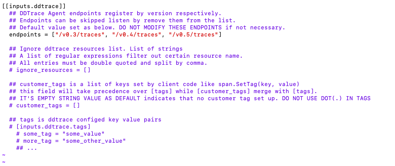
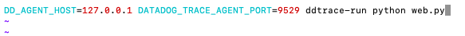
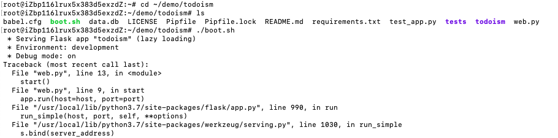
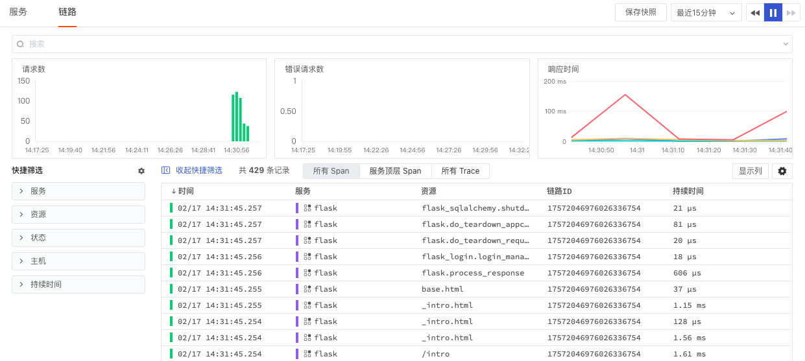
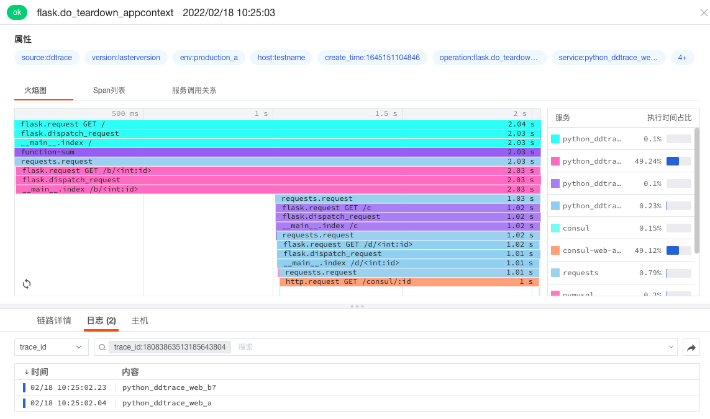
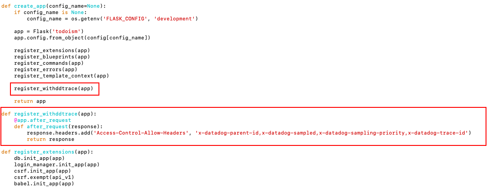
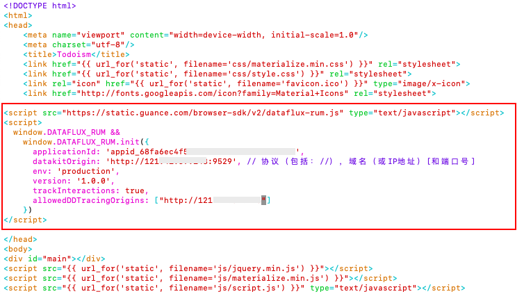
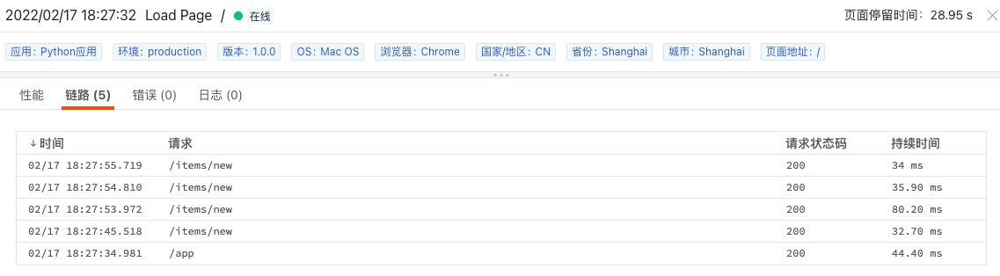

# 如何开启应用性能监测
---

应用性能监测（APM），主要用于查看系统整体的运行状态、健康程度、外部API、数据库调用以及自身代码及其调用资源的消耗或者异常问题，帮助企业从根源上快速定位问题，保障应用的性能及系统稳定性。

<<< custom_key.brand_name >>>的应用性能监测，支持所有基于 Opentracing 协议的 APM 工具，如 ddtrace、Skywalking、Zipkin、Jaege 等。通过在 DataKit 中开启对应的采集器，并在需要监控的应用代码中加入相关监控文件，配置完成后即可在<<< custom_key.brand_name >>>工作空间查看上报的链路数据，同时可与基础设施、日志、RUM进行关联分析，快速定位并解决故障，提高用户体验。

本文档将使用 Python 应用，介绍如何通过 ddtrace 实现 APM 可观测。
## 前置条件

您需要先创建一个[<<< custom_key.brand_name >>>账号](https://www.guance.com/)，并在您的主机上[安装 DataKit](../datakit/datakit-install.md)。

## 方法/步骤

### Step1: 开启并配置 ddtrace.conf 采集器

进入 DataKit 安装目录下的 `conf.d/ddtrace` 目录，复制 `ddtrace.conf.sample` 并命名为 `ddtrace.conf`，打开`ddtrace.conf`，`inputs`默认开启，无需修改。

```
## 进入ddtrace目录
cd /usr/local/datakit/conf.d/ddtrace/

## 复制ddtrace配置文件
cp ddtrace.conf.sample ddtrace.conf

## 打开并编辑ddtrace配置文件
vim ddtrace.conf 

# 配置完成后，重启datakit，使配置生效 
datakit --restart  或者  service datakit restart  或者 systemctl restart datakit
```



注意：`endpoints` 默认开启，不要修改。

<<< custom_key.brand_name >>>支持为应用性能监测自定义标签来做关联查询，可通过命令行注入环境变量或者在`ddtrace.conf`中开启`inputs.ddtrace.tags`并添加`tag`的方式，详细配置可参考文档 [ddtrace 环境变量设置](../integrations/ddtrace.md)。

### Step2: 安装 ddtrace

通过 ddtrace 采集链路数据需要根据当前需要监测的应用对应的语言，本文以 Python 应用为例，Java 或者其他语言应用可参考文档 [分布式链路追踪(APM)最佳实践](../best-practices/monitoring/apm.md)。

在终端执行命令`pip install ddtrace`安装 ddtrace。


### Step3: 配置应用启动脚本

#### 方法一：在应用的初始化配置文件中配置 DataKit 服务地址

1）配置 DataKit 服务地址。您需要进入应用的初始化配置文件，添加以下配置内容：

```
tracer.configure(
    hostname = "localhost",  # 视具体 DataKit 地址而定
    port     = "9529",
)
```


2）配置应用服务启动脚本文件。您需要添加启动脚本文件的命令，如：

```
ddtrace-run python your_app.py
```

详见文档 [Python 示例](../integrations/ddtrace-python.md)。

#### 方法二：直接在启动脚本文件中配置 DataKit 服务地址

<<< custom_key.brand_name >>>支持通过直接启动脚本文件来配置 DataKit 服务地址，无需改动您的应用代码。本示例中已创建了一个“todoism”的 Python 应用，进入该应用的脚本文件目录，执行其脚本文件，实际按照您自己的应用为准。

1）在启动脚本文件中配置执行命令（注入环境变量）

```
DD_AGENT_HOST=localhost DATADOG_TRACE_AGENT_PORT=9529 ddtrace-run python your_app.py
```

示意图如：



2）进入启动脚本文件目录，执行启动脚本文件`./boot.sh`，启动 Python 应用。示意图如：



**注意：**出于安全考虑，DataKit 的 HTTP 服务默认绑定在 `localhost:9529` 上，如果希望开放外网访问，可编辑 `conf.d/datakit.conf`，将 `listen` 改为 `0.0.0.0:9529`（端口可选）。此时 ddtrace 的访问地址就是 `http://<datakit-ip>:9529`。如果 trace 数据来源就是 DataKit 本机，可不用修改 `listen` 配置，直接使用 `http://localhost:9529` 即可。


### Step4: 在<<< custom_key.brand_name >>>查看器数据分析

脚本文件启动以后，可以尝试访问 Python 应用，然后就可以在<<< custom_key.brand_name >>>工作空间的“应用性能监测”查看链路数据并进行分析。

1）在「应用性能监测」-「服务」，可以查看到采集上来的两个服务。包括服务类型、请求书、响应时间等。


2）在「应用性能监测」-「链路」，可以查看到服务flask的链路创建时间、状态、持续时间等。



3）点击链路可查看链路详情，包括火焰图、Span 列表、服务调用关系，以及关联日志、主机等，可以帮助您快速定位问题，保障系统稳定性，提高用户体验。


链路相关名词解释如下。更多链路介绍可参考文档 [链路分析](../application-performance-monitoring/explorer/explorer-analysis.md)。

| 关键词 | 释义 |
| --- | --- |
| 服务 | 即 service_name，可在添加 Trace 监控时进行自定义 |
| 资源 | 资源指 Application 中处理一次独立访问请求时的请求入口 |
| 持续时间 | 即响应时间，完整的请求过程为从 Application 接收请求开始，到 Application 返回响应结束 |
| 状态 | 状态分为 OK 以及 ERROR，错误包含错误率及错误数 |
| Span | 单一操作方法调用全流程即为 Trace 链路，Trace 由多个 Span 单元组成 |

## 进阶参考

### 配置关联日志

1）进入主机 DataKit 安装目录`/usr/local/datakit`下的`conf.d/log`目录，复制`logging.conf.sample`并命名为`logging.conf`。编辑`logging.conf`文件，在`logfiles`填入您应用的服务日志存储路径，在`source`填入日志来源名，保存后重启 DataKit 。更多日志采集器详情和日志 pipeline 切割可参考文档 [日志](../integrations/logging.md)。

```
## 进入log目录
cd /usr/local/datakit/conf.d/log/

## 复制ddtrace配置文件
cp logging.conf.sample logging.conf

## 打开并编辑ddtrace配置文件
vim logging.conf 

# 配置完成后，重启datakit，使配置生效 
datakit --restart  或者  service datakit restart  或者 systemctl restart datakit
```

2）在启动脚本文件中配置执行命令（注入环境变量关联链路日志），更多详情配置可参考文档 [应用性能监测关联日志](../application-performance-monitoring/collection/connect-log/index.md)。

```
DD_LOGS_INJECTION="true" DD_AGENT_HOST=localhost DATADOG_TRACE_AGENT_PORT=9529 ddtrace-run python your_app.py
```

示意图如：


3）启动脚本文件，尝试访问 Python 应用，然后就可以在<<< custom_key.brand_name >>>工作空间的日志详情查看链路火焰图和 span 列表，并在应用性能监测详情查看相关的日志，帮助您快速做数据关联分析。示意图如下：

- 日志详情


- 应用性能详情



### 配置关联web应用（用户访问监测）

用户性能监测通过`ddtrace`、`RUM`采集器能够跟踪一个web端应用程序完整的前端到后端的请求数据，使用来自前端的用户访问数据，以及注入到后端的`trace_id`，可以快速的定位调用堆栈，提高排障效率。

1）在 Python 应用的初始化文件中，增加以下配置，设置对目标服务器允许跟踪的前端请求响应头header白名单。更多详情可参考文档 [关联Web应用访问](../application-performance-monitoring/collection/connect-web-app.md)。

```
@app.after_request
def after_request(response):
 ...
 response.headers.add('Access-Control-Allow-Headers', 'x-datadog-parent-id,x-datadog-sampled,x-datadog-sampling-priority,x-datadog-trace-id')
 ....
 return response
 ....
```

示意图如：



2）在前端页面 index.html 的 head 中增加以下用户访问可观测配置（在<<< custom_key.brand_name >>>工作空间用户访问监测创建应用获取）。

```
<script src="https://static.<<< custom_key.brand_main_domain >>>/browser-sdk/v2/dataflux-rum.js" type="text/javascript"></script>
<script>
  window.DATAFLUX_RUM &&
    window.DATAFLUX_RUM.init({
      applicationId: 'appid_68fa6ec4f56f4b78xxxxxxxxxxxxxxxx',
      datakitOrigin: '<DATAKIT ORIGIN>', // 协议（包括：//），域名（或IP地址）[和端口号]
      env: 'production',
      version: '1.0.0',
      trackInteractions: true,
      allowedTracingOrigins: ["https://api.example.com", /https:\/\/.*\.my-api-domain\.com/]
    })
</script>
```

其中`allowedTracingOrigins`是用于前后端（ rum 与 apm ）打通的配置项，可按需进行设置，需在此处填写与前端页面有交互关系的后端服务器所对应的域名或 IP，其他配置项是用于采集用户访问数据，更多用户访问监测配置可参考文档 [web应用监控（RUM）最佳实践](../best-practices/monitoring/web.md)。

示意图如：



3）配置完成后，启动脚本文件，尝试访问 Python 应用，然后就可以在<<< custom_key.brand_name >>>工作空间的用户访问监测查看器详情关联链路，帮助您快速做数据关联分析。示意图如下：



### 配置采样

<<< custom_key.brand_name >>>的「应用性能监测」功能支持对ddtrace等符合 Opentracing 协议的采集器所采集的链路数据进行分析和管理。默认情况下，按照全量的方式采集应用性能数据，即每次调用都会产生数据，若不加以限制，采集到的数据量大，会占用过多的数据存储。你可以通过设置采样的方式采集应用性能数据，节约数据存储量，降低成本费用。更多配置详情可参考文档 [如何配置应用性能监测采样](../application-performance-monitoring/collection/sampling.md)。

## 更多参考

### [通过 skywalking 采集应用性能数据](../integrations/skywalking.md)
### [通过 jaeger 采集应用性能数据](../integrations/jaeger.md)