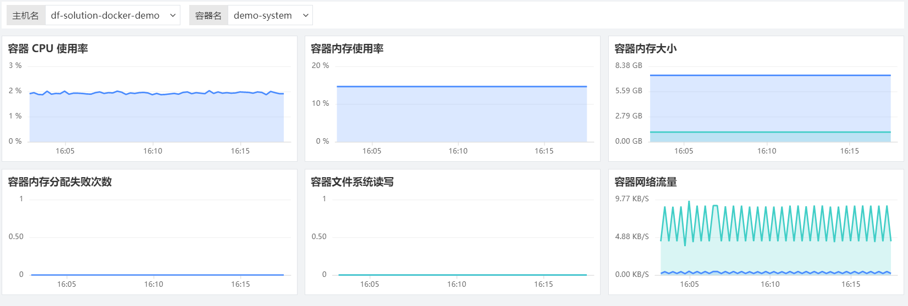

# 如何采集容器对象
---

## 简介

<<< custom_key.brand_name >>>支持采集对象数据、指标数据、日志数据，在DataKit 中开启容器数据接受服务后，您可以通过「基础设施」-「容器」-「Containers」快速查看和分析容器的健康状况、CPU，内存资源，以及网络流量的使用情况等，您也可以在「指标」中查看采集的容器指标数据，在「场景」中搭建容器指标可视化仪表板，在「监控」中创建容器监控器，通过设置告警第一时间获取容器指标的异常情况。

## 前置条件

- 安装 Docker v17.04 及以上版本（[docker 官方链接](https://www.docker.com/get-started)）
- 安装 DataKit（[DataKit 安装文档](../datakit/datakit-install.md)）
- 操作系统仅支持：`linux`

## 方法/步骤

### Step1：开启容器采集器

1. 进入 DataKit 安装目录下的 `conf.d/container` 目录
1. 复制 `container.conf.sample` 并命名为 `container.conf`
1. 打开 `container.conf`，确认开启input。示例如下：

```toml
[inputs.container]
  docker_endpoint = "unix:///var/run/docker.sock"
  containerd_address = "/var/run/containerd/containerd.sock"

  enable_container_metric = false
  enable_k8s_metric = false
  enable_pod_metric = false

  ## Containers logs to include and exclude, default collect all containers. Globs accepted.
  container_include_log = []
  container_exclude_log = ["image:pubrepo.<<< custom_key.brand_main_domain >>>/datakit/logfwd*", "image:pubrepo.<<< custom_key.brand_main_domain >>>/datakit/datakit*"]

  exclude_pause_container = true

  ## Removes ANSI escape codes from text strings
  logging_remove_ansi_escape_codes = false

  kubernetes_url = "https://kubernetes.default:443"

  ## Authorization level:
  ##   bearer_token -> bearer_token_string -> TLS
  ## Use bearer token for authorization. ('bearer_token' takes priority)
  ## linux at:   /run/secrets/kubernetes.io/serviceaccount/token
  ## windows at: C:\var\run\secrets\kubernetes.io\serviceaccount\token
  bearer_token = "/run/secrets/kubernetes.io/serviceaccount/token"
  # bearer_token_string = "<your-token-string>"

  [inputs.container.tags]
    # some_tag = "some_value"
    # more_tag = "some_other_value"
```

4. 配置完成后， 使用命令 datakit --restart, 重启datakit 即可生效，对象数据采集间隔是 5 分钟，即开启容器采集 5 分钟后即可在<<< custom_key.brand_name >>>工作空间查看对象的容器对象数据。


### Step2：开启容器的指标采集

DataKit 容器采集服务默认不开启指标采集。若需要开启指标采集，可在 `container.conf` 中将 `enable_metric` 改为 `true` 并重启 DataKit，您可以按照需求自定义开启 `container`、`k8s`、`pod`的指标采集。

```
[inputs.container]
  docker_endpoint = "unix:///var/run/docker.sock"
  containerd_address = "/var/run/containerd/containerd.sock"

  enable_container_metric = true
  enable_k8s_metric = true
  enable_pod_metric = true
  
......
```

指标数据采集后，可以在<<< custom_key.brand_name >>>场景仪表板选择内置视图，一键创建容器可视化仪表板。



## 其他

更多详细的容器对象采集的配置和说明，可查看文档 [容器](../integrations/container.md)。
