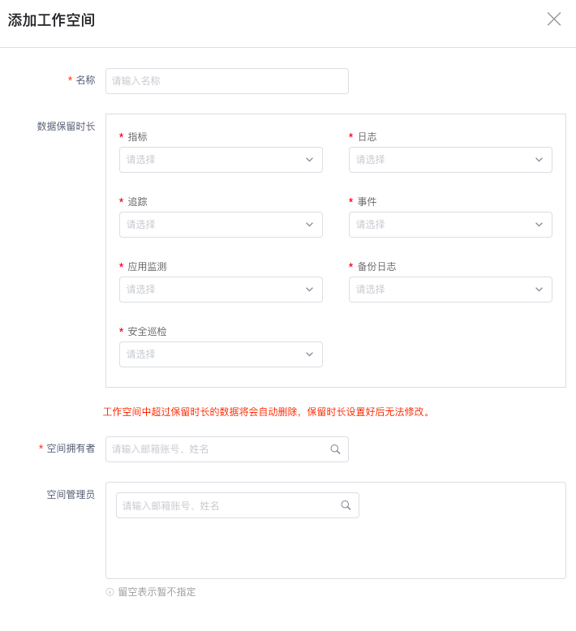

# 如何创建工作空间并添加成员
---

## 简介

工作空间基于多用户设计，可隔离不同单元数据。同时支持选择工作空间的数据存储策略，查看、添加和删除工作空间成员。

## 方法/步骤

### Step1：新建工作空间

在{{{ custom_key.brand_name }}}管理后台「工作空间列表」，点击右上角「新建工作空间」。

在弹出的对话框中，填入“名称”，选择“数据的保留时长”、“空间拥有者”和“空间管理员”，点击「确定」即可创建一个新的工作空间。

- **空间拥有者：**拥有工作空间最高操作权限，可以指定当前空间“管理员”并进行任意的空间配置管理，包括升级空间付费计划、解散当前空间。
- **空间管理员：**当前工作空间的管理者，可以设置用户权限为“只读成员”或“标准成员”，具有空间配置管理的权限，包括：访问当前工作空间的付费计划与清单；对工作空间的基本设置、成员管理、通知对象管理进行操作；对数据的采集、禁用/启用、编辑、删除等进行管理等；不包括升级空间付费计划、解散当前空间。

注意：添加工作空间时，可暂不指定空间管理员。后续可在「工作空间列表」页面中点击「查看成员」-「添加用户」进行设置。

### Step2：添加成员

点击「查看成员」，进入对应的工作空间成员页面，可以查看到该空间下的所有成员基本信息。

点击右上角「添加用户」，选择成员并设置好权限后，点击「确定」即可在此空间中添加一名新成员。

**注意：此处可添加成员为系统内已存在的成员，若为系统新成员，需到「用户」-「添加用户」页面中添加成功后，再返回此处进行操作。**

