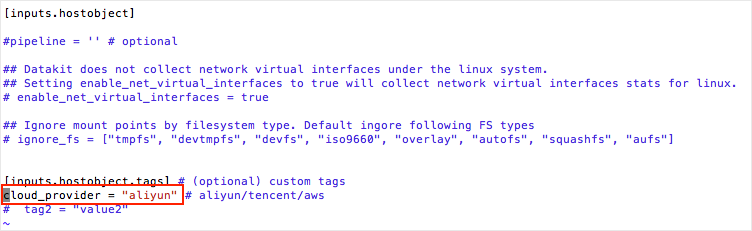
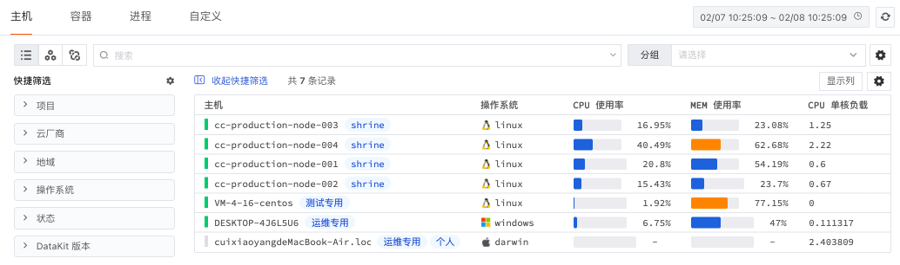
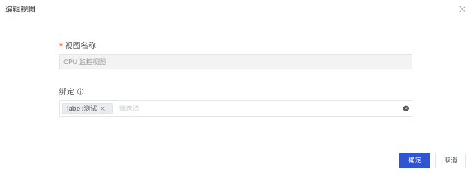
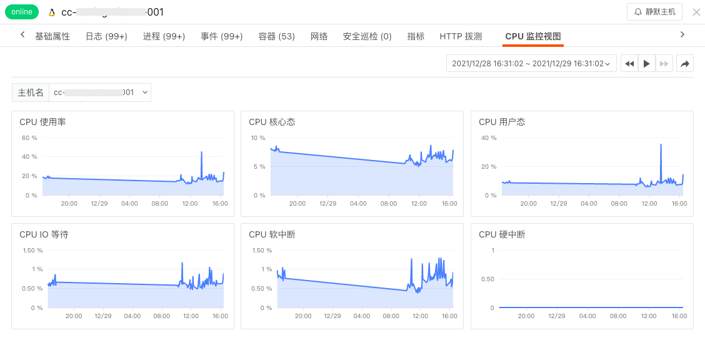
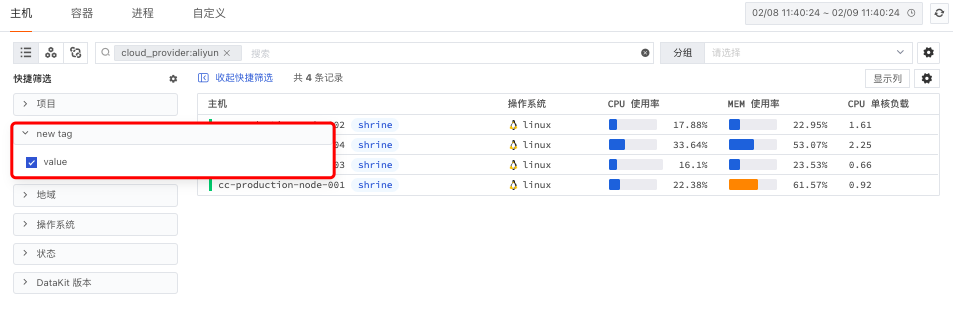
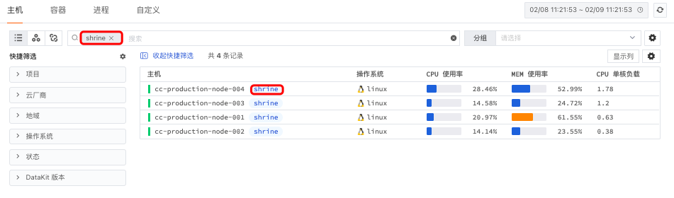

# 如何采集主机对象
---

## 简介

{{{ custom_key.brand_name }}}可以帮助您轻松观测任意一个主机设施，无论是传统主机、服务器、还是公有云或私有云对象，通过安装 DataKit，即可在工作台实时监测主机的状态、名称、操作系统、处理器、内存，网络，磁盘、连接跟踪、文件等。更有丰富的关联查询、自定义label、交互式主机分布图等功能，您不仅可以对主机进行统一管理，还可以从整体上观测主机状态。

## 前置条件

- 您需要先创建一个[{{{ custom_key.brand_name }}}账号](https://www.guance.com/)。
- [安装 DataKit](../datakit/datakit-install.md)
- 操作系统支持：`windows/amd64,windows/386,linux/arm,linux/arm64,linux/386,linux/amd64,darwin/amd64`

## 方法/步骤

### Step1：开启主机对象采集器

在宿主机/服务器上完成 DataKit 安装后，您可以依据以下步骤开启主机对象数据收集：

1.进入 DataKit 安装目录下的 `conf.d/host` 目录，复制 `hostobject.conf.sample` 并命名为 `hostobject.conf`。

2.配置完成后， 使用命令 `datakit --restart`，重启datakit 。

3.配置完成后，系统会默认开启一批与主机相关的采集器，并主动上报数据至“{{{ custom_key.brand_name }}}”工作空间。默认开启的采集器列表如下：

| 采集器名称 | 说明 |
| --- | --- |
| `cpu` | 采集主机的 CPU 使用情况 |
| `disk` | 采集磁盘占用情况 |
| `diskio` | 采集主机的磁盘 IO 情况 |
| `mem` | 采集主机的内存使用情况 |
| `swap` | 采集 Swap 内存使用情况 |
| `system` | 采集主机操作系统负载 |
| `net` | 采集主机网络流量情况 |
| `host_processes` | 采集主机上常驻（存活 10min 以上）进程列表 |
| `hostobject` | 采集主机基础信息（如操作系统信息、硬件信息等） |
| `container` | 采集主机上可能的容器对象以及容器日志 |

更多主机对象数据采集，可参考帮助文档 [DataKit主机对象采集器](../integrations/hostobject.md)。

### Step2：开启云同步

如果 DataKit 所在的主机是**云主机**，你可以通过 `cloud_provider` 标签开启云同步，具体步骤如下：

1.进入 DataKit 安装目录`/usr/local/datakit`下的 `conf.d/host` 目录，复制 `hostobject.conf.sample` 并命名为 `hostobject.conf`。

2.打开 `hostobject.conf` 文件，开启如下配置：

   - 开启`inputs.hostobject.tags`
   - 开启 `cloud_provider = "aliyun"`

3.配置完成后， 使用命令 `datakit --restart`, 重启datakit 即可生效。

4.开启了云同步后，系统会主动上报如下字段至“{{{ custom_key.brand_name }}}”工作空间（以同步到的字段为准）：

| 字段名 | 描述 |
| --- | --- |
| `cloud_provider` | 云服务商 |
| `description` | 描述 |
| `instance_id` | 实例 ID |
| `instance_name` | 实例名 |
| `instance_type` | 实例类型 |
| `instance_charge_type` | 实例计费类型 |
| `instance_network_type` | 实例网络类型 |
| `instance_status` | 实例状态 |
| `security_group_id` | 实例分组 |
| `private_ip` | 实例私网 IP |
| `zone_id` | 实例 Zone ID |
| `region` | 实例 Region ID |

更多主机对象数据采集，可参考帮助文档 [DataKit主机对象采集器](../integrations/hostobject.md)。

### Step3：查看主机数据

在{{{ custom_key.brand_name }}}工作空间「基础设施」-「主机」中，您可以通过**主机对象列表**查看当前空间最近24小时内每个主机的数据信息，包括主机名称及标签、主机的CPU使用率、MEM使用率，CPU的单核负载等。

点击主机对象列表中的主机名称，即可划出**主机详情页**，查看主机的详细信息，如硬件型号、基础资源消耗、关联的日志、进程、事件等。

更多主机对象分析，可参考帮助文档 [主机](../infrastructure/host.md)。

## 进阶参考

### 关联分析

- **挖掘关联数据**

假如您需要构建全面深入的主机可观测，开启主机相关的其他数据采集器后，即可通过“{{{ custom_key.brand_name }}}”工作台一键挖掘主机相关的日志、进程、异常事件、容器、网络、安全巡检。

开启主机相关的其他数据采集器，可参考[日志](../integrations/logging.md)、[进程](../integrations/host_processes.md)、[容器](../integrations/container.md)、[网络](../datakit/net.md)、[安全巡检](../integrations/sec-checker.md)。

- **自定义内置视图**

自定义内置视图可以帮助您 [绑定关联视图](../scene/built-in-view/bind-view.md) 到主机详情页面，实现数据的联动查看。依据您相关分析的需求，通过选择官方系统视图或自定义的用户视图作为内置视图，不仅方便您使用官方模板快速扩宽主机关联分析的范围，还支持您自定义编辑新的监控视图。

以观测 label标签为“测试”的主机对象CPU 为例，添加系统视图“CPU 监控视图”为主机详情的内置视图，联动查询主机 CPU 状态。具体步骤如下：

1.在 {{{ custom_key.brand_name }}} 工作空间「管理」-「内置视图」，选择 系统视图“CPU 监控视图”。

2.点击“编辑”，选择字段为 label：测试  的对象为绑定关系

3.点击“确定”，创建绑定关系

4.在对应的查看器详情页面查看该内置视图。

更多配置详情，可参考 [绑定内置视图](../scene/built-in-view/bind-view.md)。

### 交互式主机拓扑图

实现多主机环境的可观测，离不开一张可以清晰显示机房运维环境的拓扑图。在“{{{ custom_key.brand_name }}}”工作台，通过切换页面左上角查看器至「主机拓扑图」，能够帮助您可视化查询主机的指标数据大小，进而快速分析不同系统、不同状态、不同版本、不同地区等自定义标签下的主机的运行状态。

了解更多，可参考 [主机拓扑图](../infrastructure/host.md)

### 自定义指标集

为了便于您将熟悉的指标分类，“{{{ custom_key.brand_name }}}”支持您在主机采集器中，通过配置`[inputs.hostobject.tags]`，自定义 tag 赋予主机对象一个新的特征，并将这个特征用于筛选出相关主机对象。

详细的配置方法可参考：[DataKit主机对象采集器](../integrations/hostobject.md)

### 自定义label

为了方便您能更灵活、有效的管理IT基础设施环境，{{{ custom_key.brand_name }}}提供基础设施 label 的功能，支持您基于 label 标签对主机进行归类、搜索、筛选和集中管理。

