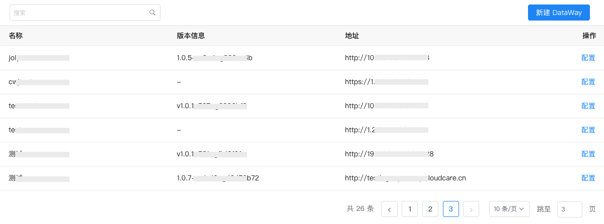
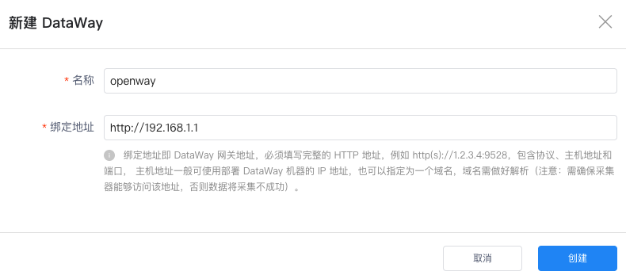
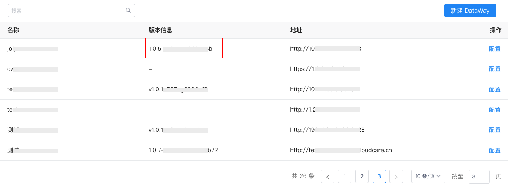
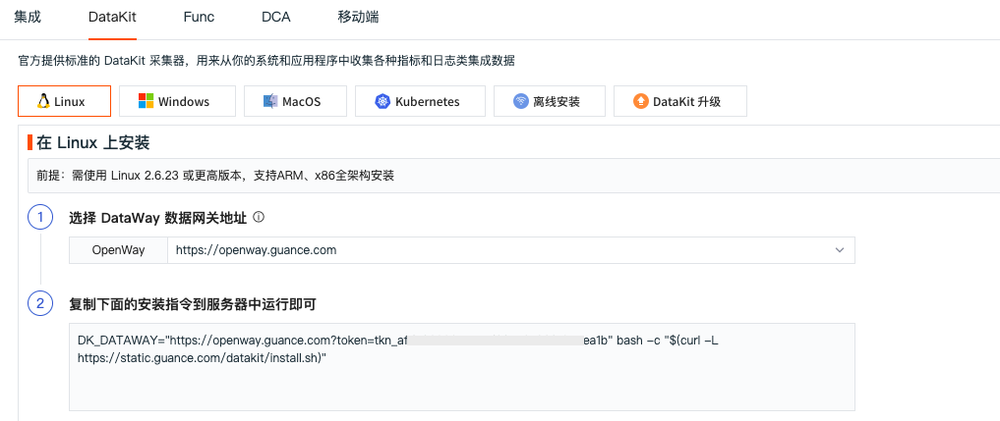

# 如何安装和使用 DataWay
---

## 简介

DataWay 是{{{ custom_key.brand_name }}}的数据网关，采集器上报数据到{{{ custom_key.brand_name }}}都需要经过 DataWay 网关，DataWay 网关主要作用有两个：

- 接收采集器发送的数据，然后上报到{{{ custom_key.brand_name }}}进行存储，多用于数据代理上报的场景； 
- 将采集的数据进行处理后再发送到{{{ custom_key.brand_name }}}进行存储，多用于数据清洗的场景。 

注意：{{{ custom_key.brand_name }}}部署版 DataWay 需要在本地服务器进行安装后才可以使用。

## 方法/步骤

### Step1：新建 DataWay

在{{{ custom_key.brand_name }}}管理后台「数据网关」页面，点击「新建 DataWay 」。

输入“名称”、“绑定地址”，点击「创建」。

**注意：**绑定地址，即 DataWay 网关地址，必须填写完整的 HTTP 地址，例如 http(s)://1.2.3.4:9528，包含协议、主机地址和端口， 主机地址一般可使用部署 DataWay 的 IP 地址，也可以指定为一个域名，域名需做好解析。需确保采集器能够访问该地址，否则数据将采集将不成功。

创建成功后会自动创建新的 DataWay 并生成 DataWay 的安装脚本。

### Step2：安装 DataWay

新建的 DataWay 支持 Linux 和 Docker 两种安装方式，复制安装脚本到需要部署 DataWay 的服务器中执行。安装成功会提示如下图所示信息。此时 DataWay 默认会自动运行。

安装完毕后，等待片刻刷新“数据网关”页面，如果在刚刚添加的数据网关的“版本信息”列中看到了版本号，即表示这个 DataWay 已成功与{{{ custom_key.brand_name }}}中心连接，用户可以通过它来接入数据了。

### Step3：使用 DataWay 

DataWay 成功与{{{ custom_key.brand_name }}}中心连接后，登录{{{ custom_key.brand_name }}}控制台，在「集成」-「DataKit」页面，即可查看所有的 DataWay 地址，选择需要的 DataWay 网关地址，获取 DataKit 安装指令在服务器上执行，即可开始采集数据。

