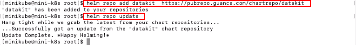
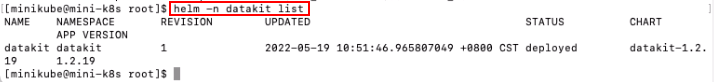
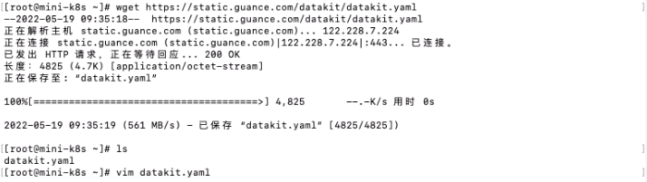
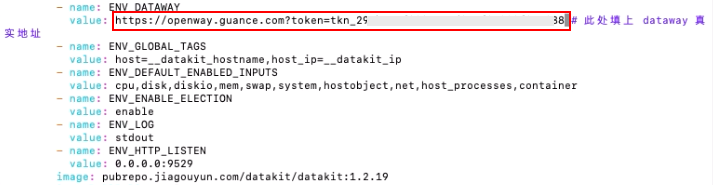
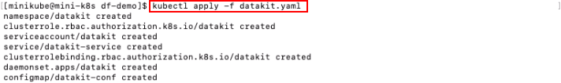

# 如何采集 Kubernetes 资源
---

## 简介

<<< custom_key.brand_name >>>支持对 Kubernetes 中各类资源的运行状态和服务能力进行监测，包括 Containers、Pods、Services、Deployments、Clusters、Nodes、Replica Sets、Jobs、Cron Jobs 等。您可以在 Kubernetes 中通过 DaemonSet 方式安装 DataKit，进而完成对 Kubernetes 资源的数据采集。最终，在<<< custom_key.brand_name >>>中实时监测 Kubernetes 各类资源的运行情况。

## 前置条件

您需要先创建一个[<<< custom_key.brand_name >>>账号](https://<<< custom_key.brand_main_domain >>>/)。

## 方法/步骤

在 Kubernetes 中通过 DaemonSet 方式安装 DataKit 有两种方法：

- Helm 安装
- Yaml 安装

### Helm 安装

#### 前提条件

- Kubernetes >= 1.14
- Helm >= 3.0+

#### Step1：添加 DataKit Helm 仓库

使用 Helm 安装 DataKit 采集 Kubernetes 资源，需要先在服务器上 [安装 Helm](https://helm.sh/zh/docs/intro/install/)。Helm 安装完成后，即可添加 DataKit Helm 仓库。

注意：添加完 DataKit Helm 仓库后，必须执行升级操作 `helm repo update` 。

```
$ helm repo add datakit  https://pubrepo.guance.com/chartrepo/datakit
$ helm repo update 
```



#### Step2：Helm 安装 DataKit

修改 Helm 安装 DataKit 执行代码中 `datakit.dataway_url` 的 token 数据。

```
$ helm install datakit datakit/datakit -n datakit --set datakit.dataway_url="https://openway.guance.com?token=<your-token>" --create-namespace 
```

token 可以在<<< custom_key.brand_name >>>工作空间的「管理」-「基本设置」获取。


token 替换后，执行 Helm 安装 DataKit 代码。


#### Step3：查看部署状态

DataKit 安装完成后，即可通过 `$ helm -n datakit list` 查看部署状态。




#### Step4：在<<< custom_key.brand_name >>>工作空间查看和分析采集的K8S数据

DataKit 部署状态正常，即可在<<< custom_key.brand_name >>>工作空间「基础设施」-「容器」查看和分析采集的 K8S 数据。


### Yaml 安装

#### Step1：下载 yaml 文件

开启 Kubernetes 资源采集前，需要使用终端工具登录到服务器执行下面的脚本命令来下载 yaml 文件。

```
wget https://static.<<< custom_key.brand_main_domain >>>/datakit/datakit.yaml
```



#### Step2：修改 datakit.yaml 文件

编辑 datakit.yaml 文件中数据网关 dataway 的配置，把 token 替换成工作空间的 token。

```
	- name: ENV_DATAWAY
		value: https://openway.guance.com?token=<your-token> # 此处填上你工作空间的 token
```

token 可以在<<< custom_key.brand_name >>>工作空间的「管理」-「基本设置」获取。


token 替换后，保存 datakit.yaml 文件。



#### Step3：安装 yaml 文件

datakit.yaml 文件的数据网关修改完成后，使用命令`kubectl apply -f datakit.yaml`安装 yaml 文件，其中`datakit.yaml`为文件名，以您保存的文件名为准。



#### Step4：查看 datakit 运行状态

yaml 文件安装完后，会创建一个 datakit 的 DaemonSet 部署，可通过命令`kubectl get pod -n datakit`查看 datakit 的运行状态。


#### Step5：在<<< custom_key.brand_name >>>工作空间查看和分析采集的K8S数据

datakit 运行状态正常，即可在<<< custom_key.brand_name >>>工作空间「基础设施」-「容器」查看和分析采集的 K8S 数据。


