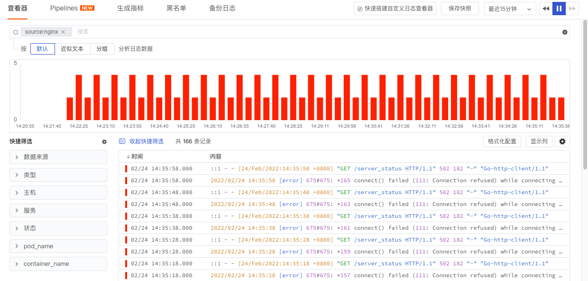
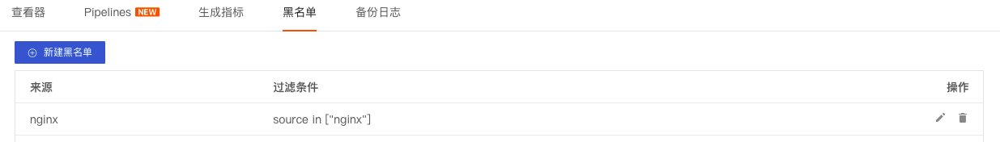
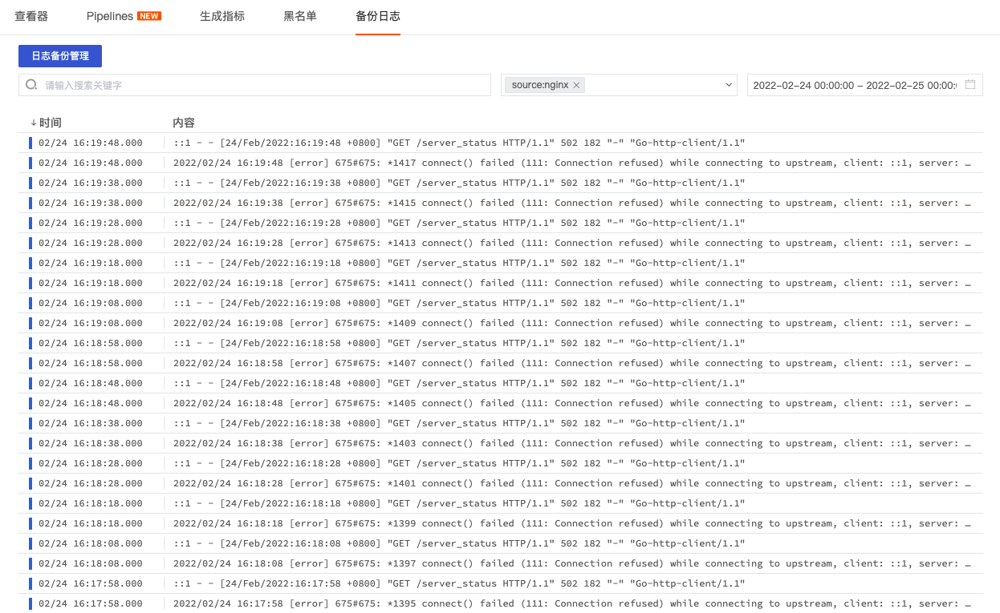

# 如何开启日志监测
---

<<< custom_key.brand_name >>>拥有全面的日志采集能力，包括系统日志、应用日志、安全日志等多种日志类型，通过<<< custom_key.brand_name >>>提供的自定义日志采集器可采集任意日志汇总到<<< custom_key.brand_name >>>进行统一存储和分析；通过<<< custom_key.brand_name >>>提供的文本处理器（Pipeline）可对采集的日志进行自定义切割，并把切割出来的字段作为属性使用。通过属性字段，我们可以快速筛选相关日志、进行数据关联分析，帮助我们快速去定位问题并解决问题。

本文以 Nginx 日志为例，介绍如何开启日志监测。

## 前置条件

您需要先创建一个[<<< custom_key.brand_name >>>账号](https://www.guance.com/)，并在您的主机上[安装 DataKit](../datakit/datakit-install.md)。

## 方法/步骤

### Step1: 开启 Nginx 采集器

主机安装 Datakit 以后，在`/usr/local/datakit/conf.d/nginx`目录下，复制 `nginx.conf.sample` 并命名为 `nginx.conf`，编辑 `nginx.conf`，开启存放 Nginx 日志的地址和Pipeline。如：

- `files = ["/var/log/nginx/access.log","/var/log/nginx/error.log"]`
- `Pipeline = "nginx.p"`（其中 `""`中可以不填写具体的 Pipeline 脚本名称，DataKit 会自动匹配跟 source 同名的脚本文件）

注意：Pipeline 开启后，DataKit 会自动根据日志来源来匹配 Pipeline 脚本文件。若日志来源和 Pipeline 文件名称不一致，则需要在采集器配置，如日志来源`nginx`，Pipeline 文件名`nginx1.p`，则需要配置`Pipeline = "nginx1.p"`。

```
[[inputs.nginx]]
        url = "http://localhost/server_status"
        # ##(optional) collection interval, default is 30s
        # interval = "30s"
        use_vts = false
        ## Optional TLS Config
        # tls_ca = "/xxx/ca.pem"
        # tls_cert = "/xxx/cert.cer"
        # tls_key = "/xxx/key.key"
        ## Use TLS but skip chain & host verification
        insecure_skip_verify = false
        # HTTP response timeout (default: 5s)
        response_timeout = "20s"

        [inputs.nginx.log]
                files = ["/var/log/nginx/access.log","/var/log/nginx/error.log"]
        #       # grok pipeline script path
                pipeline = "nginx.p"
        [inputs.nginx.tags]
        # some_tag = "some_value"
        # more_tag = "some_other_value"
        # ...
```

配置完成后，使用命令行`datakit --restart`重启 DataKit 使配置生效。更多 Nginx 采集器配置可参考文档 [Nginx](../integrations/nginx.md)。

### Step2: 在<<< custom_key.brand_name >>>工作空间查看和分析日志数据

开启 Nginx 采集器，配置日志文件路径，开启 Pipeline 以后，即可在<<< custom_key.brand_name >>>工作空间查看采集到的 Nginx 日志。



在<<< custom_key.brand_name >>>工作空间的日志下，选择 nginx 的日志，在日志详情页，我们可以看到产生日志的主机及其属性指标视图、日志来源、通过pipeline切割的日志属性、日志内容详情等数据，通过 [配置链路关联日志](../application-performance-monitoring/collection/connect-log/index.md) ，我们还可以在日志详情页查看相关的链路详情，帮助您快速做数据关联分析。


## 进阶参考

### 日志文本处理（Pipeline）

<<< custom_key.brand_name >>>提供两种日志 Pipeline 文本处理方式：

- [Pipelines](../pipeline/index.md)：支持在<<< custom_key.brand_name >>>工作空间手动配置和查看日志 pipeline 文件，无需登录 DataKit 服务器进行操作，帮助您方便的使用在线日志Pipeline功能来切割您的日志；

- DataKit：在服务器安装DataKit以后，在终端工具中配置DataKit的日志采集器及其对应的 pipeline 文件，对文本数据进行处理。


### 生成指标

<<< custom_key.brand_name >>>支持通过生成指标的方式，基于当前工作空间内的现有数据来自定义指标数据。在<<< custom_key.brand_name >>>工作空间「日志」-「生成指标」页面，点击「新建规则」即可开始创建新的生成指标规则。更多详情参考文档 [生成指标](../metrics/generate-metrics.md)。


生成的指标可统一在<<< custom_key.brand_name >>>「指标」中查看，或者在「生成指标」页面，点击规则右侧的「查看指标」，跳转至「指标」页面查看对应的指标集和指标。


生成的指标支持在<<< custom_key.brand_name >>>「场景」搭建仪表板，结合其他指标对采集的日志数据进行全面的可视化监测。


### 日志黑名单

<<< custom_key.brand_name >>>支持通过设置日志黑名单的方式过滤掉符合条件的日志，即配置日志黑名单以后，符合条件的日志数据不再上报到“<<< custom_key.brand_name >>>” 工作空间，帮助用户节约日志数据存储费用。

在 <<< custom_key.brand_name >>>工作空间，点击「日志」-「黑名单」-「新建黑名单」，选择「日志来源」，添加一条或多条日志筛选过滤规则，点击确定即默认开启该日志过滤规则。



在日志黑名单设置了过滤掉所有日志来源为“nginx”的日志，在设置生效后，我们可以看到“02/24 15:06:28”之后，nginx日志不再上报到工作空间。更多详情参考文档 [日志黑名单](../logs/blacklist.md)。


### 日志备份

<<< custom_key.brand_name >>>基础日志最多存储60天，如果需要更长时间的存储和查看需要对基础日志进行备份。日志备份支持两种方式：

- 备份到 “<<< custom_key.brand_name >>>”：支持备份日志最多存储长达720天。
- 备份到外部存储：支持备份日志到阿里云 OSS，具体可参考文档 [日志数据备份到 OSS 最佳实践](../best-practices/partner/log-backup-to-oss-by-func.md)。

在日志「备份日志」页面，点击「日志备份管理」-「新建规则」，输入「规则名称」即可添加一条新的规则，支持通过「过滤条件」和「搜索关键字」更精准定位需要备份的日志，节省备份日志存储费用。

**注意：**

- 备份周期：按天进行备份，每天 `00:00:00` 开始备份前一天 `00:00:00—23:59:59` 的日志数据
- 免费版用户：无法备份日志数据


设置日志备份规则以后，在日志「备份日志」页面，默认数据为空，需要先选择查看备份日志的时间范围。更多详情可参考文档 [日志备份](../management/backup/index.md)。

