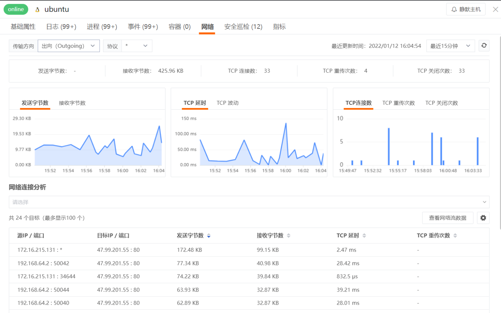
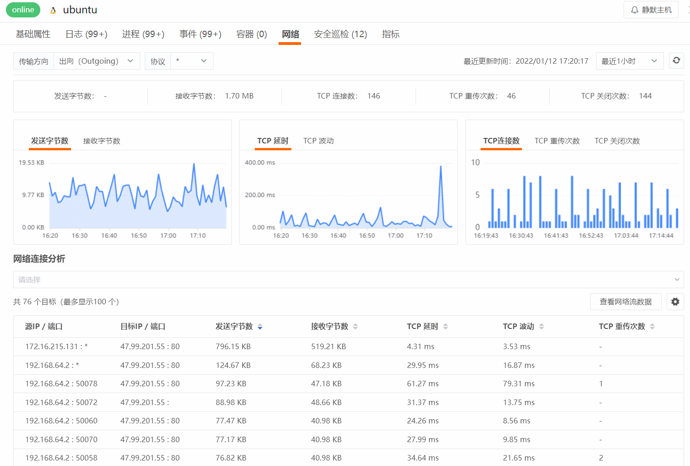
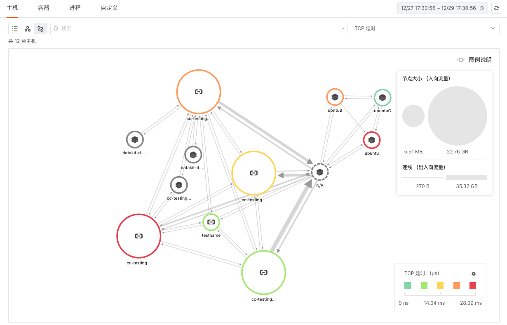

# 如何开启网络监控
---

## 简介

无论是在本地服务器还是云上环境运行，现代服务和应用程序都尤其依赖于网络性能。网络的稳定性对于业务系统来说至关重要。如果关键业务应用程序出现故障，程序无法使用，您可能需要通过梳理日志、查看系统、访问程序、查看进程、调试服务等等去找到故障点，这样会花费很多宝贵时间。

所以对网络的全面可见性成为监控应用程序运行状态和性能的关键部分，但随着您的应用程序规模不断扩大，越来越复杂，获得这种可见性就变得具有挑战性。[<<< custom_key.brand_name >>>](https://www.guance.com/) 将为提供主机网络的全面可观测。

## 前置条件

- 您需要先创建一个 [<<< custom_key.brand_name >>>账号](https://www.guance.com)；
- 在您的主机上 [安装 DataKit](../datakit/datakit-install.md)；

## 方法步骤

### Step1：开启 [eBPF](../integrations/ebpf.md) 集成的运行，采集网络数据

ebpf 采集器，采集主机网络 tcp、udp 连接信息，bash 执行日志等，包含 ebpf-net 及 ebpf-bash:

-  ebpf-net: 
   - 数据类别: Network
   - 由 netflow 和 dnsflow 构成，分别用于采集主机 tcp/udp 连接统计信息和主机 dns 解析信息；
-  ebpf-bash: 
   - 数据类别: Logging
   - 采集 bash 的执行日志，包含 bash 进程号，用户名，执行的命令和时间等;

ebpf 采集器，操作系统支持：`linux/amd64`，除 CentOS 7.6+ 和 Ubuntu 16.04 以外，其他发行版本需要 Linux 内核版本高于 4.0.0 。

#### 配置ebpf 采集器

进入 DataKit 安装目录下的 `conf.d/host` 目录，复制 `ebpf.conf.sample` 并命名为 `ebpf.conf`。示例如下：

```toml

[[inputs.ebpf]]
  daemon = true
  name = 'ebpf'
  cmd = "/usr/local/datakit/externals/datakit-ebpf"
  args = ["--datakit-apiserver", "0.0.0.0:9529"]
  envs = []

  ## all supported plugins:
  ## - "ebpf-net":
  ##     contains L4-network, dns collection
  ## - "ebpf-bash":
  ##     log bash
  ##
  enabled_plugins = ["ebpf-net"]

  [inputs.ebpf.tags]
    # some_tag = "some_value"
    # more_tag = "some_other_value"

#############################
# 参数说明(若标 * 为必选项)
#############################
#  --hostname               : 主机名，此参数可改变该采集器上传数据时 host tag 的值, 优先级为: 指定该参数 > datakit.conf 中的 ENV_HOSTNAME 值(若非空，启动时自动添加该参数) > 采集器自行获取(默认值)
#  --datakit-apiserver      : DataKit API Server 地址, 默认值 0.0.0.0:9529
#  --log                    : 日志输出路径, 默认值 DataKitInstallDir/externals/datakit-ebpf.log
#  --log-level              : 日志级别，默认 info
#  --service                : 默认值 ebpf
```

默认配置不开启 ebpf-bash，若需开启在 enabled_plugins 配置项中添加 "ebpf-bash"；

配置好后，重启 DataKit 即可。

### Step2：登录<<< custom_key.brand_name >>>查看主机网络详情视图

主机网络数据采集成功后会上报到<<< custom_key.brand_name >>>控制台，在「基础设施」-「主机」详情页中的「网络」，您可以查看到工作空间内全部网络性能监测数据信息。

<<< custom_key.brand_name >>>可以查询单个主机的详细网络信息，目前支持基于 TCP、UDP 协议，配合 incoming（入向）和 outgoing（出向），有多种组合选择的的网络性能监测 。同时提供了七种网络指标统计，全方位实时监控网络流量。分别有：接收/发送字节数、TCP延时、TCP波动、TCP连接数、TCP重传次数、TCP关闭次数。



#### 网络连接分析


<<< custom_key.brand_name >>>支持基于`源IP/端口`和“目标IP/端口”查看网络连接数据，您可以自定义添加需要关注的指标，支持针对字段进行数据的筛选，比如您当前想查询目标端口为 443 的网络连接，并查看连接的实时网络流数据，进行网络流量分析。



### Step3：进阶用法-主机网络分布图

在「基础设施」-「主机」，点击左上角网络分布图的小图标，即可切换到查看主机网络分布情况。在「网络分布图」，您能够可视化查询当前工作空间主机与主机之间的网络流量，快速分析不同主机之间的 TCP延迟、TCP波动、TCP重传次数、TCP连接次数以及 TCP关闭次数。

- 时间控件：默认获取最近 48 小时的数据且不支持自动刷新，需手动点击刷新获取新的数据；
- 搜索和筛选：您可以快速基于关键词模糊匹配搜索主机名称；或基于筛选 Tag 标签显示主机节点及其关联关系。
- 填充：您可以通过「填充」自定义填充主机节点，填充值的大小及自定义区间将决定填充的主机节点颜色。支持选择 TCP延迟、TCP波动、TCP重传次数、TCP连接次数以及 TCP关闭次数多种填充指标。
- 主机节点：
   - 主机节点的图标分成普通主机和云主机，云主机显示为云服务厂商的 Logo；
   - 主机节点边缘颜色根据填充的字段数值及自定义区间显示对应区段的颜色；
   - 主机节点之间通过连线表示网络流量，连线为双向曲线，显示源主机到目标主机的incoming / outgoing方向的流量；
   - 主机节点大小的显示根据当前节点的入向流量大小，确定节点的尺寸大小；
   - 主机节点粗细的显示根据获取节点的出入向流量数据大小，确定连线的粗细。
- 关联查询：您可以点击主机图标进行关联查询，支持查看主机详情、关联日志、关联链路以及关联事件。
- 自定义区间：您可以开启「自定义区间」为选择的填充指标自定义图例颜色区间范围。图例的颜色将依据图例的最大值和最小值等分为 5 个区间，每个区间将自动对应五个不同的颜色，不在数据区间范围内的连线和节点置灰显示。	
- 鼠标悬停：悬停鼠标至主机对象节点，可查看发送字节数、接收字节数、TCP延迟、TCP波动、TCP重传次数、TCP连接次数以及 TCP关闭次数。



通过观察主机网络分布及关键性能指标，了解当前流量情况。假如你添加的一项托管服务无意中耗尽了您的所有带宽，你可以可视化您的带宽数据，通过TCP重传技术可快速揭示网络问题在您的基础设施中导致连接问题的位置。之后您就可以通过了解相关日志，并请求跟踪监控流量的去向进行故障排除。


## 更多参考
更多关于网络性能监测可参考：[ebpf 采集器](../integrations/ebpf.md)

