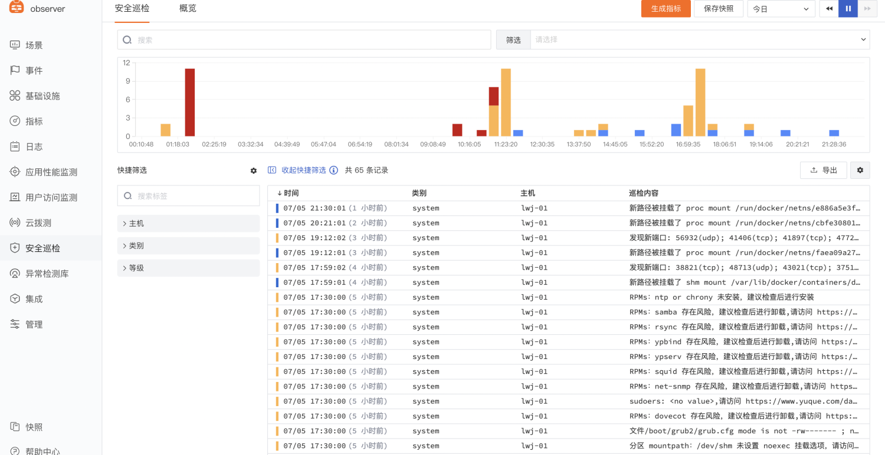
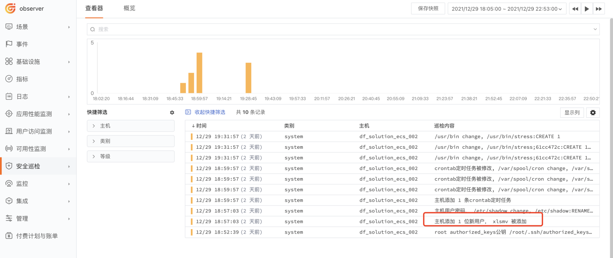

# 如何开启安全巡检
---

## 简介

{{{ custom_key.brand_name }}}支持您通过「安全巡检」对系统，容器，网络，安全，包括日志等一系列的状态进行巡检，以一种新型的安全脚本方式（限制命令执行，限制本地IO，限制网络IO）来保证所有的行为安全可控。

一般在运维过程中有非常重要的工作就是对系统，软件，包括日志等一系列的状态进行巡检，传统方案往往是通过工程师编写shell（bash）脚本进行类似的工作，通过一些远程的脚本管理工具实现集群的管理。但这种方法实际上非常危险，由于系统巡检操作存在权限过高的问题，往往使用root方式运行，一旦恶意脚本执行，后果不堪设想。实际情况中存在两种恶意脚本，一种是恶意命令，如rm -rf，另外一种是进行数据偷窃，如将数据通过网络 IO 泄露给外部。 因此 Security Checker 希望提供一种新型的安全的脚本方式（限制命令执行，限制本地IO，限制网络IO）来保证所有的行为安全可控，并且 Security Checker 将以日志方式通过统一的网络模型进行巡检事件的收集。同时 Security Checker 将提供海量的可更新的规则库脚本，包括系统，容器，网络，安全等一系列的巡检。

## 前置条件

- 您需要先创建一个 [{{{ custom_key.brand_name }}}账号](https://www.guance.com)；
- 在您的主机上 [安装 DataKit](../datakit/datakit-install.md)；

## 方法步骤

### Step1：安装 Scheck

通过DataKit 安装Security Checker

```shell
$ sudo datakit --install scheck
```

**注意**：安装完后，Security Checker 默认将数据发送给 DataKit `:9529/v1/write/security` 接口。

### Step2: 配置数据采集

- 进入默认安装目录 `/usr/local/scheck`，打开配置文件 `scheck.conf`，配置文件采用 [TOML](https://toml.io/en/) 格式，说明如下：

```toml
rule_dir = '/usr/local/scheck/rules.d'

# ##(必选) 将检测结果采集到哪里，支持本地文件或http(s)链接
# ##本地文件时需要使用前缀 file://， 例：file:///your/file/path
# ##远程server，例：http(s)://your.url
output = ''

# ##(可选) 程序本身的日志配置
disable_log = false #是否禁用日志
log = '/usr/local/scheck/log'
log_level = 'info'
```

- 配置完成后，重启服务即可生效。

```
systemctl restart scheck
```

### Step3: 配置检测规则

检测规则放在规则目录中：由配置文件中 `rule_dir` 指定。每项规则对应两个文件：

1. 脚本文件：使用 [Lua](http://www.lua.org/) 语言来编写，必须以 `.lua` 为后缀名。
1. 清单文件：使用 [TOML](https://toml.io/en/) 格式，必须以 `.manifest` 为后缀名。

通过添加/修改清单文件以及 Lua 代码，即可完成检测规则的配置。

**注意**：

- 脚本文件和清单文件必须同名。
- 添加/修改规则后不需要重启服务，10 秒后规则将会自动生效。

### Step4: 查看安装状态以及datakit运行状态

- 查看scheck 状态

```shell
$systemctl status scheck
● scheck.service - security checker with lua script
   Loaded: loaded (/usr/lib/systemd/system/scheck.service; enabled; vendor preset: disabled)
   Active: active (running) since 六 2021-07-03 00:13:15 CST; 2 days ago
 Main PID: 15337 (scheck)
    Tasks: 10
   Memory: 12.4M
   CGroup: /system.slice/scheck.service
           └─15337 /usr/local/scheck/scheck -config /usr/local/scheck/scheck.conf
```

- 查看datakit 状态

```shell
$ systemctl status datakit
● datakit.service - Collects data and upload it to DataFlux.
   Loaded: loaded (/etc/systemd/system/datakit.service; enabled; vendor preset: disabled)
   Active: active (running) since 六 2021-07-03 01:07:44 CST; 2 days ago
 Main PID: 27371 (datakit)
    Tasks: 9
   Memory: 29.6M
   CGroup: /system.slice/datakit.service
           └─27371 /usr/local/datakit/datakit
```

### Step5: 登录{{{ custom_key.brand_name }}}查看安全巡检记录

- 选择左侧栏-安全巡检 查看巡检内容	



## 进阶参考

### 安全可观测

“{{{ custom_key.brand_name }}}” 为用户提供了一键发现恶意程序、系统漏洞、安全缺陷的安全巡检功能。即通过「安全巡检」，您不但可以及时的发现主机、系统、容器、网络等存在的漏洞和异常，还可以发现一些日常管理问题（例如：将数据通过网络 IO 泄露给外部）

#### 模拟黑客入侵操作

-  登录主机终端


- 模拟添加用户和添加crontab记录  

```
useradd xlsm
crontab -e
```

#### 登录{{{ custom_key.brand_name }}}查看安全巡检信息并分析

可以看到12/19 18:52 添加了一个用户，遇到这个问题，我们该如何处理？



点击记录查看建议进行主机补救


在主机控制台执行命令：userdel xlsm
## 更多参考
更多详情可参考文档 [安全巡检](../scheck/explorer.md)。

