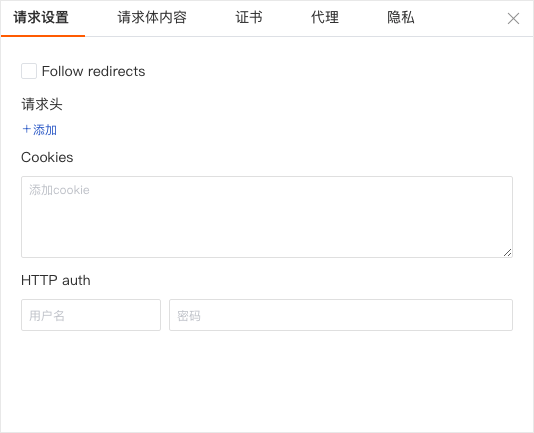
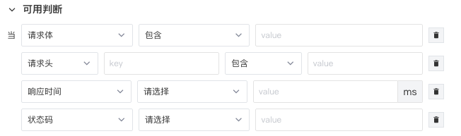
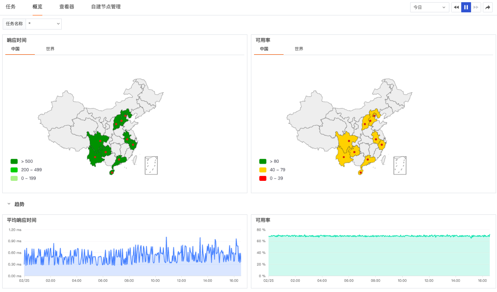
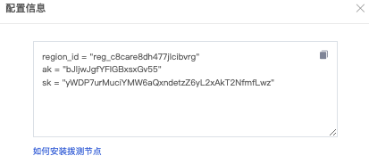
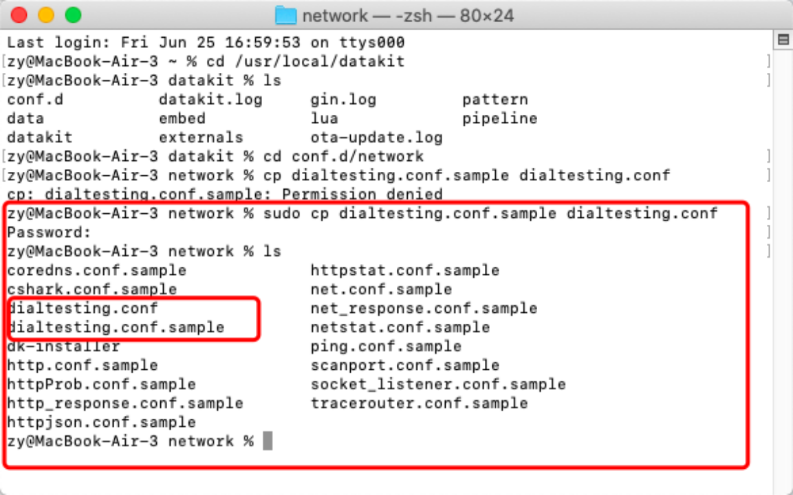
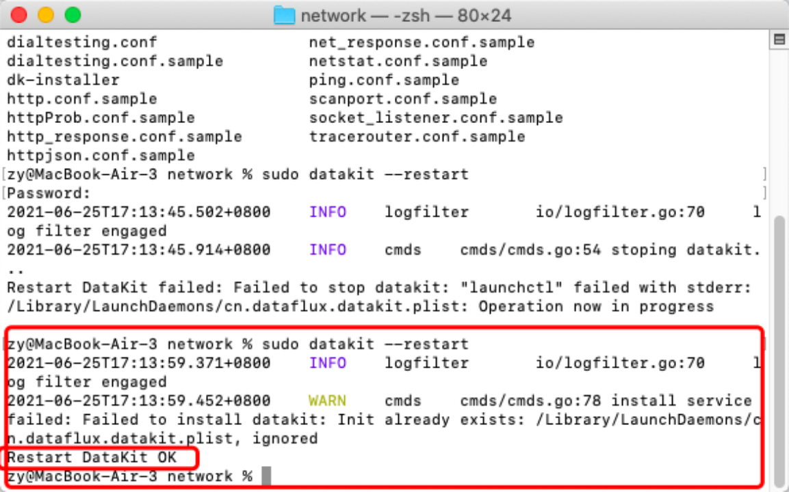

# 如何开启可用性监测
---

## 简介

您是否还在为无法提前感知用户访问体验而烦恼？您是否由于低质量的网站可用性而流失用户？随着用户访问环境场景变得多样化，如何获取应用的真实用户体验，以及用户体验下降时及时预警进行处理至关重要。

为了帮助您主动发现用户的体验问题，预先感知网络站点的错误，“<<< custom_key.brand_name >>>” 为您提供了开箱即用的可用性监测解决方案。利用可覆盖全球的监控网络，通过API 拨测快速实现网络站点的可用性监测，您可以结合地域、运营商、时间等维度，周期性的对URL站点质量进行监测，先于用户挖掘站点的潜在问题，并及时定位问题产生原因。

API 拨测是对基于`HTTP` 协议下的网站、域名、后台接口等进行周期的可用性监测。通过对站点的实时监测，统计其可用情况，提供拨测日志和实时告警，帮助您快速发现网络问题，提高网络访问质量。

## 前置条件

您需要先创建一个 [<<< custom_key.brand_name >>>账号](https://www.guance.com/)。

## 方法/步骤

### Step 1: 创建拨测任务

在<<< custom_key.brand_name >>>工作空间「可用性监测」，点击「新建」即可新建API拨测任务，周期性的监控基于`HTTP` 协议下的网站、域名、后台接口等，探测各地区用户选取不同运营商到各个服务接入点的性能状况和用户体验情况。

**注意：**

- 仅支持当前空间管理员「新建」拨测任务，其他空间成员仅支持名称、域名、类型、任务状态的信息查看等。
- 免费版工作空间最多可创建 5 个拨测任务，且仅支持“中国区”拨测节点的使用，如需创建更多拨测任务或使用更多的国外拨测节点，请前往空间内「付费计划与账单」页面进行升级。

### Step 2: 自定义拨测任务

进入新建「API拨测」任务后，您可以自由配置您的周期性探测需求，包括：

- 选择拨测类型：目前支持 `HTTP` 协议请求；
- 定义请求格式：输入URL，包括四种请求方式 `GET`、`POST`、`PUT` 和 `HEAD`；


- 高级设置：根据实际情况进行高级设置，包括请求设置、请求体内容、证书、代理、隐私。



- 名称：用户自定义的云拨测名称，在当前空间内不支持重名
- 可用判断：支持添加判断条件匹配数据，当选择多个判断条件时，多个判断条件之间是并且关系。



- 选择拨测节点：目前<<< custom_key.brand_name >>> 在全球已覆盖16个节点，支持选择中国地区、海外地区（仅支持商业版及以上版本用户）的一个或多个节点，，快速开启站点的服务质量监测。
- 选择拨测频率：选择云拨测的数据返回频率，支持1分钟（仅支持商业版及以上版本用户）、5分钟（仅支持商业版及以上版本用户）、15分钟（仅支持商业版及以上版本用户）、30分钟、1小时、6小时、12小时、1天等8种选择

### Step 2: 查看站点的可用性状态

基于已选的检测频率，在配置完成后等待完成第一次检测（一个检测周期的时间），即可通过「概览」和「查看器」查看不同拨测任务对应的站点可用性数据。**例如：您选择监测频率为“1h”, 配置完成后等待1-2个小时，即可查看相关数据。**

首先，通过「概览」，您可以通过从地区、城市、运营商等多个维度组合分析站点的可用率和响应时间，结合丰富的可视化数据分析体系，如地图，折线图，时序图等实时图表，切换上方「时间组件」，您可以快速分析出变化趋势、分布等。



其次，通过「查看器」，可以查看当前工作空间内存在的全部应用性能数据。


## 进阶参考

### 自建节点

<<< custom_key.brand_name >>> 支持通过「自建节点管理」快速建立分布于全球的私有部署节点，操作详情可参考[自建节点管理](../usability-monitoring/self-node.md)，具体部署文档可参考 [网络拨测](../integrations/network/dialtesting.md)。

<<< custom_key.brand_name >>>平台支持在全球范围内自建新的拨测节点，即通过「自建节点管理」您可以基于地理位置和运营商自建探测节点，对内/外网的服务站点进行可用性监测。如若您需要对企业内网进行云拨测，您需要在可访问内网环境的服务器上部署datakit并配置您的私有部署节点。如若您需要对公网站点进行云拨测，无需特殊操作。

以增加如下节点为例：

- 地理位置：Albania/Elbasan
- 运营商：unicom
- 节点code: Albania-Elbasan-unicom
- 节点名称：阿尔巴尼亚-爱尔巴桑州-联通

1.通过「可用性监测」-「自建节点管理」，点击「新建节点」，创建一个新的节点，输入以下内容，并点击确定快速建立分布于全球的服务质量监测点，增加您的服务质量检测范围。


2.完成「新建节点」后，在「自建节点管理」的列表中获取该节点的「配置信息」



3.依据以上获取的配置信息，在具备节点能力的服务器中完成拨测节点的安装。

首先，请确保您的服务器已安装有最新版的datakit。**若您未安装DataKit, 请前往工作台的「集成」-「DataKit」中进行安装。若您已安装有dataKit，请确认其为最新版本的datakit。**

- 安装DataKit后，打开安装目录下的 conf.d/network，复制dialtesting.conf.sample 并命名为 dialtesting.conf. 



- 将配置内容依填入conf.d/network/dialtesting.conf 即可。

```
region_id = "reg_c8care8dh477jlcibvrg"
ak = "bJljwJgfYFIGBxsxGv55"
sk = "yWDP7urMuciYMW6aQxndetzZ6yL2xAkT2NfmfLwz"
```

- 保存文件内容后，重启DataKit后，等待1-2分钟，即可开启该节点的使用。


