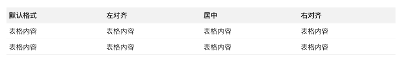

# 如何撰写文本文档
---

文本文档采用 Markdown 的编辑方式， Markdown 是一种轻量级标记语言，语法简单，易读易写，用来编写文本文档。本文将介绍如何通过 Markdown 撰写文档。

## 1.标题

支持6级标题，格式如下：

```
# 一级标题
## 二级标题
### 三级标题
#### 四级标题
##### 五级标题
###### 六级标题
```

效果如下：


## 2.文字

支持为文字加粗、斜体，添加删除线、下划线，且效果可叠加。格式如下：

```
*文字斜体*
**文字加粗**
***文字斜体加粗***
~~文字删除~~ 
~~**文字加粗删除**~~ 
~~*文字斜体删除*~~ 
<u>文字下划线</u>
```

效果如下：


## 3.分割线

支持使用三个连续的`*` 或`-`为文档添加分割线，格式如下：

```
***
---
```

效果如下：


## 4.代码

支持使用反引号 ```（即Tab 键上边那个键）显示代码，格式如下：

C
```
// C 代码
```

Java
```
// Java 代码
```

Python
```
# python 代码
```

效果如下：


## 5.表格

支持用`竖线|`来分隔不同的单元格，使用 `横线-` 来分隔表头和其他行。格式如下：

```
默认格式  | 左对齐 | 居中 | 右对齐 |
| --- | :--- | :---: | ---: |
| 表格内容  | 表格内容 | 表格内容 | 表格内容 |
| 表格内容  | 表格内容 | 表格内容 | 表格内容 |
```

效果如下：



## 6.超链接

支持使用`中括号`和`小括号`表示超链接，`文字描述`写在`中括号`内，`网址`写在`小括号`内，格式如下：

```
[<<< custom_key.brand_name >>>](https://<<< custom_key.brand_main_domain >>>)
```

效果如下：

[<<< custom_key.brand_name >>>](https://<<< custom_key.brand_main_domain >>>)

支持使用使用`<>` 符号直接显示链接地址，格式如下：

```
<https://<<< custom_key.brand_main_domain >>>>
```

效果如下：

[https://<<< custom_key.brand_main_domain >>>](https://<<< custom_key.brand_main_domain >>>)

## 7.图片

支持在文本文档中插入网络图片，格式如下：

```

```

效果如下：


