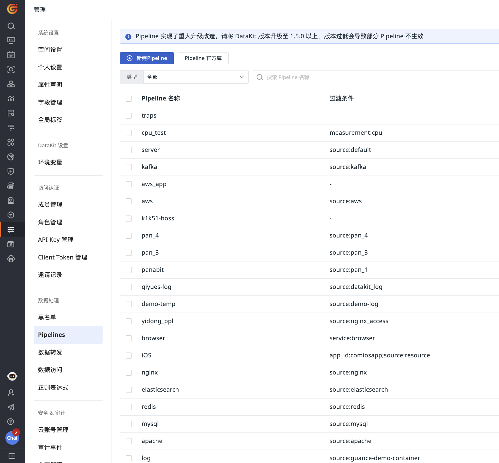

# Pipelines

---

Pipelines 是一种运行在 DataKit 上的轻量级脚本语言，用于对采集到的数据进行自定义解析和修改。通过定义解析规则，它们能够将不同种类的数据细粒度地切割并转换为结构化的格式，以满足具体的数据管理需求。例如，用户可以通过 Pipelines 提取日志中的时间戳、状态和其他关键字段，并将这些信息作为标签使用。

DataKit 利用 Pipelines 的强大功能，使得用户能够在观测云工作空间页面上直接编写和调试 Pipeline 脚本，从而实现对数据的更细粒度的结构化处理。这种处理不仅提高了数据的可管理性，而且通过 Pipeline 提供的丰富函数库，支持对常见数据进行标准化操作，如解析时间字符串和补全 IP 地址的地理信息等。

Pipeline 的主要特点包括：
- 作为一种轻量化脚本语言，Pipeline 提供了高效的数据处理能力；
- 它拥有丰富的函数库，支持对多种常见数据类型的标准化操作；
- 用户可以在观测云工作空间页面直接编写和调试 Pipeline 脚本，使得脚本的创建和批量生效变得更加便捷。


目前，观测云支持配置本地 Pipeline 和中心 Pipeline。

- 本地 Pipeline：在数据采集时运行，要求 DataKit 采集器版本不低于 1.5.0；
- 中心 Pipeline：在数据上传到控制台中心后运行；

## 使用场景

| <div style="width: 130px">类型</div> | 场景       |
| ------ | -------- |
| 本地 Pipeline  | 在数据转发前处理日志。       |
| 中心 Pipeline  | 1. 用户访问 (Session) 数据、Profiling 数据、可用性监测数据；<br />2. 处理应用性能链路中的 RUM 数据，如提取链路 `message` 中的 `session`、`view`、`resource` 等字段。       |

除上述说明之外的数据，本地/中心 Pipeline 均可处理。

## 使用前提

<div class="grid" markdown>

=== "本地 Pipeline"

    - [安装 DataKit](../datakit/datakit-install.md)；
    - DataKit 版本要求 >= 1.5.0。

    为了保证正常使用 Pipeline，请将 DataKit 升级到 1.5.0 及以上。版本过低会导致部分 Pipeline 功能失效。

    在 `DataKit<1.5.0` 版本之前：

    - 不支持默认 Pipeline 功能；

    - 数据来源不支持多选，每个 Pipeline 只能选择一个 `source`。所以若您的版本低于 1.5.0，同时又多选了数据来源，则不会生效；

    - Pipeline 名称为固定生成不支持修改。例如：日志来源选择了 `nginx`，则 Pipeline 名称固定为 `nginx.p`。所以若您的版本低于 1.5.0，Pipeline 名称与数据来源名称不一致，则 Pipeline 不会生效。

=== "中心 Pipeline"

    该功能需付费使用。

</div>

## 新建 Pipeline

在观测云工作空间**管理 > Pipelines**，点击**新建 Pipeline**。

或者您可以在指标、日志、用户访问、应用性能、基础设施、安全巡检菜单目录入口，点击 **Pipelines** 进行创建。



**注意**：Pipeline 文件创建以后，需要安装 DataKit 才会生效，DataKit 会定时从工作空间获取配置的 Pipeline 文件，默认时间为 1 分钟，可在 `conf.d/datakit.conf` 中修改。

```
[pipeline]
  remote_pull_interval = "1m"
```

### 配置说明 {#config}

在新建 Pipeline 页面，可以先**过滤**出想要进行文本处理的数据范围，然后再**定义解析规则**，若想要测试输入的解析规则是否正确有效，可以在**样本解析测试**输入对应的数据进行测试，测试通过后点击**保存**即可创建 Pipeline 文件。


:material-numeric-1-circle: 基础设置

1. 过滤：即过滤出 Pipeline 要解析的数据；数据类型包括日志、指标、用户访问监测、应用性能监测、基础对象、资源目录、网络、安全巡检；支持多选。  
2. 类型：包含本地 Pipeline 和中心 Pipeline；默认选中前者。
3. Pipeline 名称：自定义的 Pipeline 文件名。


???+ warning "注意事项"

    1. 若您选择了过滤对象为日志时，观测云会自动为您过滤掉拨测数据，当“设置为默认 Pipeline” 时，也不会应用在拨测数据中。
    2. 当您选择过滤对象为“可用性拨测”时，类型自动选中“中心 Pipeline”，且无法选择本地 Pipeline。
    3. Pipeline 文件命名需避免重名。如必要，需了解 [Pipeline 脚本的存储、索引、匹配的逻辑](./use-pipeline/pipeline-category.md#script-store-index-match)。
    4. 每个数据类型只能设置一个默认 Pipeline，新建/导入时出现重复会弹出确认框，询问是否进行替换，已勾选为默认的 Pipeline，名称后会有一个 `default` 标识。


:material-numeric-2-circle: 定义解析规则

定义不同来源数据的解析规则，支持多种脚本函数，可通过观测云提供的脚本函数列表直接查看其语法格式，如 `add_pattern()` 等。

> 关于如何定义解析规则，可参考 [Pipeline 手册](./use-pipeline/index.md)。

:material-numeric-3-circle: 样本解析测试

根据选择的数据类型，输入对应的数据，基于配置的解析规则进行测试。

- 点击**一键获取样**可自动获取已经采集的数据； 
- 点击**添加**可添加多条样本数据（最多 3 条）；
- 点击**开始测试**，返回多条测试结果；若您在同一个测试文本框中输入多条样本数据进行测试，只返回一条测试结果。

**注意**：在观测云工作空间创建的 Pipeline 统一保存在 `<datakit 安装目录>/pipeline_remote 目录下` ，每种类型的 Pipeline 文件都保存在对应的二级目录下，其中一级目录下的文件默认为日志 Pipeline。如指标 `cpu.p` 保存在 `<datakit 安装目录>/pipeline_remote/metric/cpu.p 目录下`。

> 更多详情，可参考 [Pipeline 各类别数据处理](./use-pipeline/pipeline-category.md)。


### 调试 Pipeline {#test}

在 Pipeline 编辑页面，支持针对已填写的解析规则进行测试，只需要**样本解析测试**中输入数据进行测试，若解析规则不符合，则返回错误提示的结果。样本解析测试为非必填项，样本解析测试后，测试的数据同步保存。

#### 一键获取样本测试

观测云支持一键获取样本测试数据，在创建/编辑 Pipeline 时，点击**样本解析测试 > 一键获取样本**，系统会自动从已采集上报到工作空间的数据中，按照筛选的数据范围选取最新的一条数据，作为样本填入测试样本框内进行测试。一键获取样本数据时，每次**只会查询最近 6 小时内的数据**，若最近 6 小时数据断档上报，则无法自动获取到。

*调试示例：*

以下是一键获取的上报的指标数据样本，指标集为 `cpu`，标签为 `cpu` 和 `host`，从 `usage_guest` 到 `usage_user` 都为字段即指标数据，最后的 1667732804738974000 为时间戳。从返回结果可以很清楚的了解一键获取样本的数据结构。


#### 手动输入样本测试

您也可以直接手动输入样本数据进行测试，观测云支持两种格式类型：

- 日志数据可在样本解析测试中直接输入 `message` 内容进行测试；
- 其他数据类型先将内容转换成“行协议”格式的内容，再输入进行样本解析测试。
  
> 更多日志 Pipeline 详情，可参考 [日志 Pipeline 使用手册](../logs/manual.md)。

##### 行协议示例


- `cpu`、`redis` 为指标集；tag1、tag2 为标签集；f1、f2、f3 为字段集（其中 f1=1i 表示为 int，f2=1.2 表示默认为 `float`，f3="abc" 表示为 `string`）；162072387000000000 为时间戳；    
- 指标集和标签集之间用逗号隔开；多个标签之间用逗号隔开； 
- 标签集和字段集之间用空格隔开；多个字段之间用逗号隔开；      
- 字段集和时间戳之间用空格隔开；时间戳必填；           
- 若是对象数据，必须有 `name` 标签，否则协议报错；最好有 `message` 字段，主要便于做全文搜索。

> 更多行协议详情，可参考 [DataKit API](../datakit/apis.md)。

更多行协议数据的获取方式，可在 `conf.d/datakit.conf` 中配置 `output_file` 的输出文件，并在该文件中查看行协议。

  ```
  [io]
    output_file = "/path/to/file"
  ```


#### 终端命令行调试

除了在观测云控制台调试 Pipeline 以外，您也可以通过终端命令行来调试 Pipeline。

> 更多详情，可参考 [如何编写 Pipeline 脚本](./use-pipeline/pipeline-quick-start.md)。

## 更多阅读

<font size=3>

<div class="grid cards" markdown>

- [<font color="coral"> :fontawesome-solid-arrow-right-long: &nbsp; **日志 Pipeline 使用手册**</font>](../logs/manual.md)

</div>

</font>