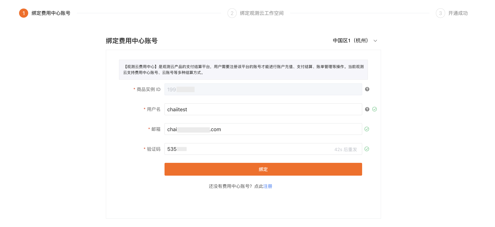
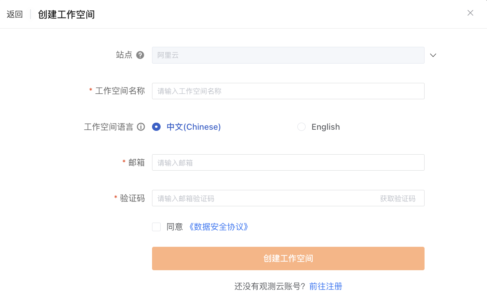

# 阿里云云市场开通<<< custom_key.brand_name >>>专属版
---

本文将介绍在阿里云云市场购买<<< custom_key.brand_name >>>专属版的相关开通使用操作。

## 第一步：购买<<< custom_key.brand_name >>>专属版

1、登录到阿里云，进入 [阿里云云市场<<< custom_key.brand_name >>>专属版](https://market.aliyun.com/products/56838014/cmgj00060481.html)，点击**立即开通**。

2、提示**开通按量服务**，同意协议后，点击**开通**。

3、开通后前往控制台。

## 第二步：免登进入<<< custom_key.brand_name >>>

确认开通申请后，直接跳转到阿里云已购买的服务列表查看购买的<<< custom_key.brand_name >>>专属版实例。

点击该实例右侧的**免登**。在弹出的对话框，点击**确定**。

在<<< custom_key.brand_name >>>侧，如果当前阿里云账号 ID 未绑定<<< custom_key.brand_name >>>费用中心账号，会出现两种情况：

:material-numeric-1-circle-outline: [没有费用中心账号](#method)：需要注册<<< custom_key.brand_name >>>账号和费用中心账号，再实现云账号绑定结算；

:material-numeric-2-circle-outline: [有费用中心账号](#bond)：可以直接绑定费用中心账号，实现云账号结算。

???+ warning "什么是费用中心账号？"

    费用中心账号是<<< custom_key.brand_name >>>费用中心平台内用于管理商业版计费的独立账户，它允许单个账号关联多个工作空间，以便于统一处理这些工作空间的计费。

    整体流程参考如下：

    

### 注册<<< custom_key.brand_name >>>商业版 {#method}

若还未有费用中心账号，点击下一步，即可自动跳转至注册页面，完成注册流程后，即可获得<<< custom_key.brand_name >>>账号和费用中心账号。

1. 填写基本信息；
2. 填写企业信息；
3. 选择开通方式：输入工作空间名称，选择工作空间语言，输入[账号 ID](#uid)、[商品实例 ID](#entity-id)；
4. 点击**确定**；
5. 查看并同意<<< custom_key.brand_name >>>平台用户服务协议，点击**下一步**。

???+ warning

    - <<< custom_key.brand_name >>>、SLS 联合解决方案仅支持 ”中国区-杭州“、”中国区-张家口“站点。选择 SLS 数据存储方案后不能更改；
    - 输入的**用户名**同时用来注册<<< custom_key.brand_name >>>费用中心的账号，费用中心的用户名账号会检查唯一性，一旦注册不能修改；

#### 绑定阿里云账号

在**绑定阿里云账号**页面，<<< custom_key.brand_name >>>提供两种授权方式来保证您的数据安全：**RAM 账号授权**、**第三方快捷授权**。

##### RAM 账号授权

选择 **RAM 账号授权**，下载获取 SLS 授权文件，在 [阿里云控制台](https://www.aliyun.com/) 创建阿里云 RAM 账号，获取该账号的 AccessKey ID、AccessKey Secret 信息。

> 关于使用 SLS 授权文件给 RAM 账号授权的具体操作，可参考 [RAM 账号授权](../plans/sls-grant.md)。

填写 AccessKey ID、AccessKey Secret 并进行验证，若验证通过，可以进行下一步。

##### 第三方快捷授权

选择**第三方快捷授权**，点击**立即前往授权**。即可跳转至阿里云，登录后进行授权操作；   

点击**同意授权**，弹出**服务商 UID 校验**窗口，UID 获取可点击**服务商权限说明页面**查看。

输入 UID 后点击确定，自动跳转前往**阿里云云市场 > 已购买的服务**，此时已授权完成。

回到<<< custom_key.brand_name >>>**绑定阿里云账号**页面，点击**验证**。验证通过后即可点击**确认开通**。

???+ warning "一些您可能遇到的问题"
    
    - <<< custom_key.brand_name >>>专属版采用 SLS 存储方式，如果您的云账号<u>未开通阿里云日志服务 SLS</u>，将无法正常使用日志存储服务；
  
    - 操作跨账号角色授权需使用<u>阿里云主账号</u>或<u>授权了 RAM 访问控制 GetRole、GetPolicy、CreatePolicy、CreatePolicyVersion、CreateRole、UpdateRole、AttachPolicyToRole 权限</u>的子账号；

    - 在验证过程中，如果验证的是被授权的子账号，会自动定位到该子账号所属的主账号，拉取主账号下的 project 和 Logstore；  
    
    - 如果验证失败，请检查是否已完成云资源访问授权。可前往**阿里云 RAM 控制台 > RAM 访问控制 > 角色/授权**查看；

    

    

第四步：开通成功

验证通过后，点击**确认开通**，提示**成功开通<<< custom_key.brand_name >>>商业版**。

### 绑定<<< custom_key.brand_name >>>工作空间

若已经有<<< custom_key.brand_name >>>账号，可以点击**已有费用中心账号，去绑定**，提示**如何快速绑定阿里云账号结算**。

点击**知道了**，开始绑定<<< custom_key.brand_name >>>工作空间，在绑定工作空间之前需要先绑定<<< custom_key.brand_name >>>的费用中心账号。

#### 绑定<<< custom_key.brand_name >>>费用中心账号

- 站点：支持选择后续创建工作空间的站点；  
- 用户名：若您已经有<<< custom_key.brand_name >>>费用中心账号，可直接输入<<< custom_key.brand_name >>>费用中心账号**用户名**，通过邮箱验证进行绑定；
- 注册：若您还未有<<< custom_key.brand_name >>>费用中心账号，可先进行注册。

#### 绑定<<< custom_key.brand_name >>>工作空间

=== "绑定已有工作空间"

    如果您在该<<< custom_key.brand_name >>>费用中心账号下存在可绑定的工作空间，则直接点击**绑定**，并在弹出的对话框中确认绑定。

    **注意**：此处列出的都为 SLS 存储空间，若您的账号未创建过 SLS 存储的工作空间，您可以选择创建工作空间。

    

    跳转至**绑定<<< custom_key.brand_name >>>工作空间**页面，提示已绑定。

    

    点击**确定**，显示开通成功。

    

=== "创建工作空间"

    如果您已经注册过<<< custom_key.brand_name >>>账号，但还未创建工作空间，请先点击**创建工作空间**。

    

    输入工作空间名称、选择工作空间语言、输入注册<<< custom_key.brand_name >>>账号时使用的邮箱，通过邮箱验证进行创建。

    **注意**：工作空间是<<< custom_key.brand_name >>>数据洞察的协作空间，工作空间语言选项会影响工作空间内事件、告警、短信等模板。若选择英文，上述对应模板将默认使用英文模板，一旦创建，此工作空间的模版语言不可修改，请谨慎选择。

    

    工作空间创建成功后，需要绑定阿里云账号，您可以下载 SLS 授权文件在阿里云控制台创建 AK/AKS 并进行授权，然后把 AK/AKS 信息填入以下对话框进行验证。

    

    AK/AKS 信息验证成功并确认开通后，自动跳转至**绑定<<< custom_key.brand_name >>>工作空间**页面，提示工作空间**已绑定**。

    

    点击**确定**，跳转至**成功绑定以下<<< custom_key.brand_name >>>工作空间**页面。

    

=== "注册<<< custom_key.brand_name >>>账号"

    如果您之前未使用过<<< custom_key.brand_name >>>服务，请先注册<<< custom_key.brand_name >>>账号并创建工作空间。

    

    点击**注册<<< custom_key.brand_name >>>账号**，输入相关信息，通过邮箱验证进行注册。

    **注意**：工作空间是<<< custom_key.brand_name >>>数据洞察的协作空间，工作空间语言选项会影响工作空间内事件、告警、短信等模板。若选择英文，上述对应模板将默认使用英文模板，一旦创建，此工作空间的模版语言不可修改，请谨慎选择。

    

### 开始使用<<< custom_key.brand_name >>>

注册完成后，即可开始使用<<< custom_key.brand_name >>>专属版。

#### 同步 SLS 数据

<<< custom_key.brand_name >>>支持您通过[绑定日志索引](../logs/multi-index.md#sls)同步查看所属阿里云账号下的其他 SLS 数据。

## 如何获取账号 ID {#uid}

### 阿里云主账号

通过主账号登录[阿里云](https://www.aliyun.com)，进入阿里云控制台，点击右上角账号头像，即可找到账号 ID。

<!--

### 阿里云 RAM 子账号

通过 RAM 方式登录[阿里云](https://www.aliyun.com)，进入阿里云控制台，点击右上角账号头像，即可找到 RAM 账号中@后面的主账号 UID。

-->

## 如何获取商品实例 ID {#entity-id}

<<< custom_key.brand_name >>>在阿里云心选确认开通申请后，直接跳转到阿里云已购买的服务列表，在已购买的<<< custom_key.brand_name >>>服务下方，可以查看到商品的**实例 ID**，复制此**实例 ID**，填入到更改结算方式对话框的**商品实例 ID**。

## FAQ

### 版本

:material-chat-question: 若已经开通使用过<<< custom_key.brand_name >>>商业版的工作空间还能再开通<<< custom_key.brand_name >>>专属版吗？

可以，通过**阿里云云市场 > <<< custom_key.brand_name >>>专属版**商品入口开通，新建 SLS 工作空间。

:material-chat-question: 已经开通的<<< custom_key.brand_name >>>商业版的工作空间能够切换成<<< custom_key.brand_name >>>专属版吗？

不可以，商业版和 SLS 专属版的最大区别在于后端的数据存储所在位置，工作空间一经开通，索引存放归属不可变。所以不管之前开通成功的商业版是什么结算方式，都不可以转换成 SLS 的专属版工作空间。

:material-chat-question: 若注册时创建的体验版工作空间能升级成<<< custom_key.brand_name >>>专属版吗？

不可以，目前仅支持通过阿里云云市场-<<< custom_key.brand_name >>>专属版商品入口开通 SLS 专属版工作空间，正常的升级流程不支持开通 SLS 专属版工作空间。

### 数据查看

:material-chat-question: 为什么 SLS 有日志，但在<<< custom_key.brand_name >>>无法显示？

Default 索引必须有日志，即<<< custom_key.brand_name >>> DataKit 采集的日志，<<< custom_key.brand_name >>>日志查看器才能看到 SLS 的日志。

:material-chat-question: 为什么 SLS 日志输入上报后，内容显示为空？

由于 SLS 内容字段是 content，<<< custom_key.brand_name >>>使用 message，需要通过字段映射来解决。

:material-chat-question: SLS 控制台的数据如何判断是用户自己还是<<< custom_key.brand_name >>>的接入数据？

可以通过 project 的名称来做判断，若 project 名称是 `guance-wksp-工作空间ID` 格式的，可以认为是<<< custom_key.brand_name >>> SLS 专属版开通时创建的资源及数据索引，如果有查看需求可以从**工作空间 > 管理> 基本设置**页面获取**工作空间 ID** 后在 SLS 控制台找到对应的数据查看。

:material-chat-question: 用户自己的 SLS 存储数据可以使用<<< custom_key.brand_name >>>查看吗？

用户自己的 SLS 存储数据可以在<<< custom_key.brand_name >>>的工作空间做查看分析，目前仅支持针对绑定的索引数据查看分析，暂不支持与其他功能模块数据做关联分析。

> 关于如何绑定索引，可参考 [绑定索引](../logs/multi-index.md#sls)。

### 数据存储

:material-chat-question: <<< custom_key.brand_name >>>专属版如何存储数据？

<<< custom_key.brand_name >>>专属版的指标、日志、备份日志、可用性监测、CI、安全巡检、事件等数据存储在 SLS，除了上述的数据之外的基础设施、应用性能监测、用户访问监测数据目前是存在<<< custom_key.brand_name >>>的 ES 集群。

- 指标：SLS 的 Metricstore；
- 日志、可用性监测、CI 可视化、安全巡检、事件：SLS Standard 类型的 Logstore；
- 备份日志：SLS Query 类型的 Logstore。

**注意**：因为 SLS 的数据过期策略仅支持 TTL 到期自定清除，所以<<< custom_key.brand_name >>>通过调整指标集的数据保存策略来减少时间线数量的做法，在 SLS 专属版工作空间不生效。

:material-chat-question: 是否可以变更<<< custom_key.brand_name >>>专属版数据存储的地域？

不可以，<<< custom_key.brand_name >>>会根据用户当前选中开通的站点所在 Region 同步在 SLS 的相同 Region 创建 Project 及 Metricstore 和 Logstore 数据索引。除非是重新创建新的 SLS 专属版工作空间，数据的存储 Region 是不可以变更的。目前<<< custom_key.brand_name >>>专属版仅支持“中国区1（杭州）"站点和“中国区3（张家口）”站点。

- 中国区1（杭州）站点开通 SLS 专属版，数据会保存在 SLS “cn-hangzhou” Region；
- 中国区3（张家口）站点开通 SLS 专属版，数据会保存在 SLS “cn-zhangjiakou” Region；

### 计费

:material-chat-question: 开通<<< custom_key.brand_name >>>专属版以后，使用<<< custom_key.brand_name >>>采集器 DataKit 采集的日志数据如何计费？

通过 DataKit 采集的日志数据按照<<< custom_key.brand_name >>>日志[计费方式](../billing-method/index.md)进行收费。

:material-chat-question: 若在 SLS 中的日志数据，通过<<< custom_key.brand_name >>>提供的绑定日志索引功能，在<<< custom_key.brand_name >>>控制台进行查看、搜索和筛选的日志数据如何计费？

通过[索引绑定](../logs/multi-index.md#sls)获取的 SLS 日志数据，费用仍按照 SLS 来进行计费。

如果您要执行数据加工、投递、从外网接入点流式读取数据操作，由日志服务收取加工计算费用、数据投递费用和外网读取流量费用。

> 更多详情，可参考 [计费项](https://help.aliyun.com/document_detail/107745.htm?spm=a2c4g.11186623.0.0.1d086860NWfUQP#concept-xzl-hjg-vgb)。

:material-chat-question: 若之前在费用中心的预购卡可以用于<<< custom_key.brand_name >>>专属版的账单支付吗？<<< custom_key.brand_name >>>专属版如何进行支付？

可以，<<< custom_key.brand_name >>>专属版的前提条件是使用阿里云账号结算。对于云账号结算，<<< custom_key.brand_name >>>按量付费账单抵扣顺序为：普通代金券，满减代金券，预购卡，云账号现金余额。短信和拨测的按量消费，只能使用预购卡和云账号现金余额支付。

### 函数查询

:material-chat-question: 为什么有些查询函数无法使用？

SLS 存储使用的语言是 promql，存在部分函数无法使用的情况。

> 更多关于 SLS 函数相关信息，可参考 [DQL 函数](../dql/funcs.md#sls)。

:material-chat-question: show 函数 tag 相关

`show_tag_key` ，`show_tag_value` ，`show_tag_key_cardinality` ，`show_tag_value_cardinality` 这四个函数只支持查询最近 5 分钟的数据，即如果最近 5 分钟没有数据，这些 show 函数结果为 0。当前<<< custom_key.brand_name >>>工作空间内存在以下场景使用到 show tag 函数：

- 视图变量中使用了 `show_tag_key` ，`show_tag_value` 等函数；
- 指标管理页面侧滑详情页显示标签数据；
- 所有图表配置指标数据查询时，`group by` 后面的下拉列表，或者筛选条件添加。

:material-chat-question:  SLS 指标查询是否支持一个 DQL 查询多个指标数据？

不支持，也不支持查询 `*`。

:material-chat-question: 日志数据中若存在超大日志的情况，为什么有可能会存在数据显示不全？

目前仅能保证根据 docid 和默认列表页的查询返回完整的 message，其他复杂筛选的条件下 message 会被截断，这是由 SLS 内部实现决定的。

### 字段筛选

:material-chat-question: 为什么开通<<< custom_key.brand_name >>>专属版以后，无法进行字段筛选？

<<< custom_key.brand_name >>>会自动为包含相同字段的日志数据创建字段索引来用于字段筛选，但若数据量较少，则不会触发自动创建，在这种情况下，您无法在<<< custom_key.brand_name >>>通过字段筛选的方式查询数据，您可以通过上报更多包含相同字段的日志数据来解决。

**注意**：若未创建字段索引时上报的数据和创建字段索引时上报的数据时间间隔过长，可能会导致未创建字段索引时上报的数据无法通过字段筛选查询，如昨天上报了 2 条相同字段的数据，未创建字段索引，今天上报了 100 条和昨天相同字段的数据，自动创建了字段索引，在进行字段筛选时，可能会查不到昨天上报的 2 条数据。

### 专属版 VS 商业版

:material-chat-question: 为什么 SLS 专属版的日志搜索无高亮显示？

因为 SLS 日志搜索高亮功能暂时不对外开放，仅支持 SLS 控制台使用，所以当前<<< custom_key.brand_name >>>上通过搜索某些关键词匹配到日志时不会有高亮效果。

:material-chat-question: SLS 专属版工作空间是否支持删除单个指标集？

不支持，目前仅支持删除全部指标集。

:material-chat-question: 为什么 SLS 专属版工作空间新上报的字段数据无法支持筛选、排序？

当前 SLS 字段索引会有 1 分钟的延迟时间，例如: 通过 Pipeline 切出新的字段，需要经过 1 分钟后，才可以搜索新字段，且在那 1 分钟延迟内的数据仍然是无法筛选、搜索的； ES 切出新字段可以立即搜索到。该问题同样影响到 “生成指标” 及其他图表查询等功能的使用。

:material-chat-question: SLS 专属版工作空间是否支持索引合并？

不支持，SLS 专属版工作空间默认开启多索引。商业版工作空间默认开启索引合并来减少索引的产生。

> 关于多索引，可参考 [日志索引](../logs/multi-index/index.md)。

:material-chat-question: SLS 专属版工作空间日志时间顺序为什么会乱序？

由于 SLS date 字段精确到秒级，而<<< custom_key.brand_name >>>的日志数据时间是到毫秒级别的，SLS 工作空间内日志排序可能会出现不正常升降序的情况。默认情况下只能保证单页内的数据有序，不保证跨页的全局有序。

:material-chat-question: 为什么 SLS 时序数据会写入重复？

SLS 时序数据在相同时间戳数据会重复写入，这个由 SLS 的特性问题导致的。
