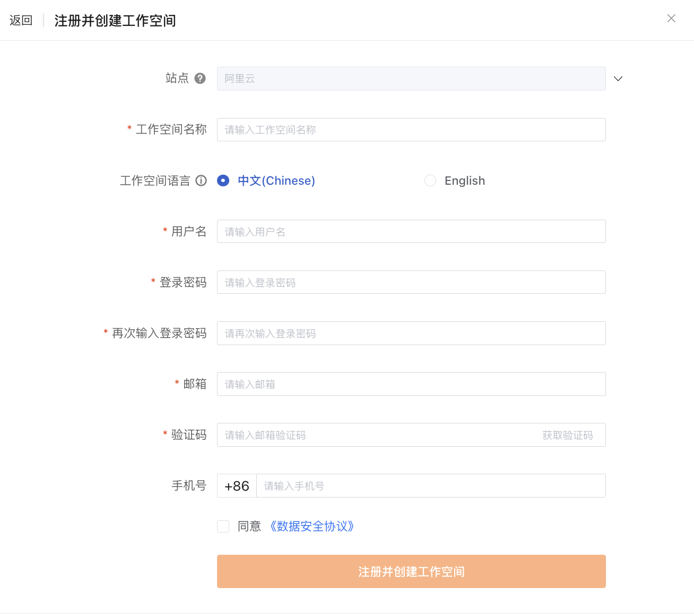

# 阿里云云市场开通观测云商业版
---

本文将介绍<u>在阿里云云市场购买观测云服务以后，如何开通观测云商业版</u>。

> 关于直接注册商业版，可参考 [注册商业版](./commercial-register.md)。
> 
> 若您需要在观测云开通 SLS 存储，可前往 [阿里云云市场开通观测云专属版](./commercial-aliyun-sls.md)。

## 购买观测云 

打开 [阿里云云市场观测云](https://market.aliyun.com/products/56838014/cmgj00053362.html?spm=5176.19720258.J_3207526240.210.62c176f4i6AFbF)，点击**立即开通**。

提示**开通按量服务**，同意协议后，点击**开通**。

显示**开通申请已提交**。

点击**确认**即跳转至云市场页面，可以查看到开通订阅的观测云实例。

## 开通观测云商业版

在**云市场 > 已购买的服务**可以查看到开通订阅的观测云实例，点击该实例右侧的**免登**直接前往观测云。

<!--

-->

在观测云侧，如果当前阿里云账号 ID 未绑定观测云费用中心账号，会出现两种情况：

:material-numeric-1-circle-outline: [没有费用中心账号](#register)：需要注册观测云账号和费用中心账号，再实现云账号绑定结算；

:material-numeric-2-circle-outline: [有费用中心账号](#bond)：可以直接绑定费用中心账号，实现云账号结算。

???+ warning "什么是费用中心账号？"

    费用中心账号是观测云费用中心用于管理观测云商业版计费相关的独立账号，一个费用中心账号可以关联多个工作空间计费。

    整体流程参考如下：

    

### 注册观测云商业版 {#register}

若还未有费用中心账号，点击下一步，即可自动跳转至注册页面，[完成注册流程](./commercial-register.md)后，<u>获取观测云账号和费用中心账号</u>。

### 已有费用中心账号 {#bond}

若您已有费用中心账号，点击下一步，直接进入绑定页面：

#### :material-numeric-1-circle: 绑定费用中心账号

输入费用中心账号的用户名，通过邮箱验证进行绑定；

#### 绑定工作空间

##### 绑定已有工作空间

:material-numeric-1-circle-outline: 如果您在该观测云费用中心账号下存在可绑定的工作空间，直接点击**绑定**。

跳转至**绑定观测云工作空间**页面，提示已绑定。

点击**确定**，显示开通成功。

:material-numeric-2-circle-outline: 如果您在该观测云费用中心账号下还未有可绑定的工作空间，选择[立即创建工作空间](#create-workspace)即可。

##### 创建工作空间 {#create-workspace}

:material-numeric-1-circle-outline: 如果您已经注册过观测云账号，但还未创建工作空间，进入**创建工作空间 > 有观测云账号**。

输入工作空间名称，选择工作空间语言与工作空间风格，输入注册观测云账号时使用的邮箱，通过邮箱验证进行创建。

工作空间创建成功后，自动回到**绑定观测云工作空间**页面，显示**已选择**。

点击**确定**，进入下一个页面。

:material-numeric-2-circle-outline: 如果您之前未使用过观测云服务，请先注册观测云账号并创建工作空间。进入**创建工作空间 > 无观测云账号**。

点击**注册观测云账号**，输入相关信息，通过邮箱验证进行注册。

工作空间创建成功后，自动回到**绑定观测云工作空间**页面，显示**已选择**。

## 开通成功

以上步骤走完，即可成功开通观测云商业版。

点击确定后，自动跳转至[观测云登录页](https://auth.guance.com/login/pwd)。

