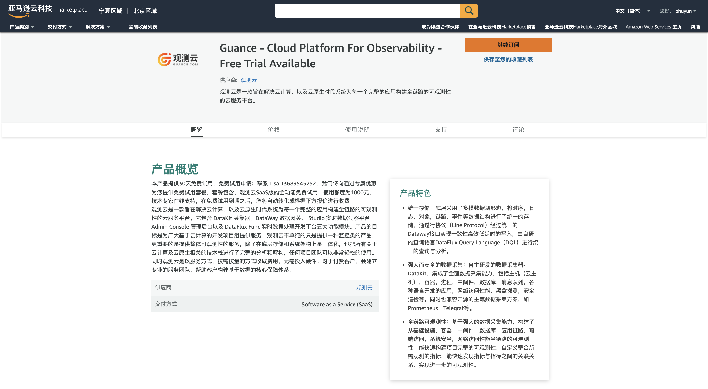
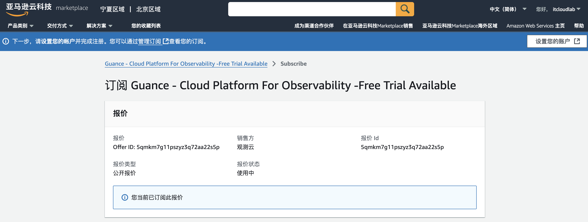

# AWS 云市场开通<<< custom_key.brand_name >>>商业版
---

本文将介绍在 AWS 云市场订阅<<< custom_key.brand_name >>>服务以后，如何开通<<< custom_key.brand_name >>>商业版并使用 AWS 账号进行费用结算。

## 第一步：订阅<<< custom_key.brand_name >>> {#subscribe}

登录进入 [AWS 云市场](https://awsmarketplace.amazonaws.cn/marketplace/pp/prodview-duyx7ds3f3cq2)的<<< custom_key.brand_name >>>商品页，点击**继续订阅**。

成功订阅后，点击**设置您的账户**。

## 第二步：开通<<< custom_key.brand_name >>>商业版

点击后自动跳转回<<< custom_key.brand_name >>>的开通页面。如果当前 AWS 账号未绑定<<< custom_key.brand_name >>>费用中心账号，会出现两种情况：

:material-numeric-1-circle-outline: [没有费用中心账号](#register)：需要注册<<< custom_key.brand_name >>>账号和费用中心账号，再实现云账号绑定结算；

:material-numeric-2-circle-outline: [有费用中心账号](#bond)：可以直接绑定费用中心账号，实现云账号结算。

???+ warning "什么是费用中心账号？"

    费用中心账号是<<< custom_key.brand_name >>>费用中心平台内用于管理商业版计费的独立账户，它允许单个账号关联多个工作空间，以便于统一处理这些工作空间的计费。

    整体流程参考如下：

    

### 没有费用中心账号 {#register}

若还未有费用中心账号，点击下一步，即可自动跳转至注册页面，完成注册流程后，即可获得<<< custom_key.brand_name >>>账号和费用中心账号。

1. 填写基本信息；
2. 填写企业信息；
3. 选择开通方式：输入工作空间名称，选择工作空间语言；
4. 点击**开通**即可完成注册。

### 已有费用中心账号 {#bond}

若您已有费用中心账号，点击下一步，直接进入绑定页面：

**注意**：此处页面右上角的站点与费用中心绑定流程无关，仅影响后续创建工作空间时的站点，且后续无法在创建的页面无法更改站点。

#### :material-numeric-1-circle: 绑定费用中心账号

输入费用中心账号的用户名，通过邮箱验证进行绑定；

#### :material-numeric-2-circle: 绑定工作空间

##### 创建工作空间

如果当前费用中心账号下尚未关联工作空间，需先创建工作空间。由于<<< custom_key.brand_name >>>控制台和费用中心是两个独立的平台，此时需要确认您是否注册过<<< custom_key.brand_name >>>、拥有<<< custom_key.brand_name >>>账号。

:material-numeric-1-circle-outline: 如果您已经注册过<<< custom_key.brand_name >>>账号，且还需要创建工作空间，进入**创建工作空间 > 有<<< custom_key.brand_name >>>账号**。

1. 输入工作空间名称；
2. 选择工作空间语言；
3. 输入注册<<< custom_key.brand_name >>>账号时使用的邮箱
4. 填入验证码；
5. 同意协议；
6. 点击创建，工作空间即可创建成功。

工作空间创建成功后，自动回到绑定页面，显示**已绑定**。

:material-numeric-2-circle-outline: 如果您之前未使用过<<< custom_key.brand_name >>>服务，请先注册<<< custom_key.brand_name >>>账号。进入**创建工作空间 > 没有<<< custom_key.brand_name >>>账号**。

1. 输入工作空间名称；
2. 选择工作空间语言；
3. 输入用户名；
4. 输入并再次确认登录密码；
3. 输入邮箱；
4. 填入验证码；
5. 按需填入手机号；
6. 同意协议；
7. 点击注册并创建工作空间。

点击**注册<<< custom_key.brand_name >>>账号**，输入相关信息，通过邮箱验证进行注册。

##### 绑定已有工作空间

如果您在该<<< custom_key.brand_name >>>费用中心账号下存在可绑定的工作空间，则直接点击**绑定**。

1. 选择需要绑定的工作空间，点击绑定；
2. 在新页面中点击确定；
3. 此时显示已绑定。

## 第三步：开通成功

成功绑定工作空间后，点击确定，跳转至登录页面，输入用户名和密码进入即可该工作空间，开始使用<<< custom_key.brand_name >>>。

<!--
跳转至**绑定<<< custom_key.brand_name >>>工作空间**页面，提示已绑定。

点击**确认**，显示开通成功。

您可以在 [<<< custom_key.brand_name >>>费用中心](https://<<< custom_key.boss_domain >>>/#/signin)，**工作空间管理**查看已开通的结算方式。

<!--
### 注册<<< custom_key.brand_name >>>商业版

若还未有<<< custom_key.brand_name >>>账号，可以点击**立即注册<<< custom_key.brand_name >>>商业版**，进入账号注册流程。

=== "第一步：基本信息"

    在**基本信息**页面，选择 “中国区2（宁夏）” 或者 “海外区1（俄勒冈）”站点、输入注册信息，点击**下一步**。

    

=== "第二步：企业信息"

    在**企业信息**页面，输入相关信息，点击**注册**。

    

=== "第三步：选择开通方式"

    在**选择开通方式**，填写**工作空间名称**，选择**工作空间语言**，点击**确定**即可完成注册。

    **注意**：工作空间是<<< custom_key.brand_name >>>数据洞察的协作空间，工作空间语言选项会影响工作空间内事件、告警、短信等模板。若选择英文，上述对应模板将默认使用英文模板，一旦创建，此工作空间的模版语言不可修改，请谨慎选择。
    
    

=== "第四步：开通成功"

    成功选择开通方式后，将会提示成功开通<<< custom_key.brand_name >>>商业版。
    
    **注意**：开通成功后，绑定的工作空间所产生的费用将直接从购买该商品的 AWS 账户中进行结算。

    

    您可以使用刚才注册的账号登录到 [<<< custom_key.brand_name >>>费用中心](https://<<< custom_key.boss_domain >>>/#/signin)，在**工作空间管理**查看已开通的结算方式。

    

### 绑定<<< custom_key.brand_name >>>工作空间

若已经有<<< custom_key.brand_name >>>账号，可以点击**已有费用中心账号，去绑定**，提示**如何快速绑定AWS账号结算**。

点击**知道了**，开始绑定<<< custom_key.brand_name >>>工作空间，在绑定工作空间之前需要先绑定<<< custom_key.brand_name >>>的费用中心账号。

#### 绑定<<< custom_key.brand_name >>>费用中心账号

- 站点：支持选择后续创建工作空间的站点；
- 用户名：若您已经有<<< custom_key.brand_name >>>费用中心账号，可直接输入<<< custom_key.brand_name >>>费用中心账号**用户名**，通过邮箱验证进行绑定；
- 注册：若您还未有<<< custom_key.brand_name >>>费用中心账号，可先进行注册。

#### 绑定工作空间

=== "绑定已有工作空间"

    如果您在该<<< custom_key.brand_name >>>费用中心账号下存在可绑定的工作空间，则直接点击**绑定**。

    

    在弹出的确认对话框，点击**确认**.

    
    
    跳转至**绑定<<< custom_key.brand_name >>>工作空间**页面，提示已绑定。

    

    点击**确认**，显示开通成功。

    

    您可以在 [<<< custom_key.brand_name >>>费用中心](https://<<< custom_key.boss_domain >>>/#/signin)，**工作空间管理**查看已开通的结算方式。

    

=== "创建工作空间"

    如果您已经注册过<<< custom_key.brand_name >>>账号，但还未创建工作空间，请先点击**创建工作空间**。

    

    输入工作空间名称、选择工作空间语言、输入注册<<< custom_key.brand_name >>>账号时使用的邮箱，通过邮箱验证进行创建。

    **注意**：工作空间是<<< custom_key.brand_name >>>数据洞察的协作空间，工作空间语言选项会影响工作空间内事件、告警、短信等模板。若选择英文，上述对应模板将默认使用英文模板，一旦创建，此工作空间的模版语言不可修改，请谨慎选择。

    

    工作空间创建成功后，自动跳转至**绑定<<< custom_key.brand_name >>>工作空间**页面

    

    点击**确认**，跳转至**成功绑定以下<<< custom_key.brand_name >>>工作空间**页面。

    

=== "注册<<< custom_key.brand_name >>>账号"

    如果您之前未使用过<<< custom_key.brand_name >>>服务，请先注册<<< custom_key.brand_name >>>账号并创建工作空间。

    

    点击**注册<<< custom_key.brand_name >>>账号**，输入相关信息，通过邮箱验证进行注册。

    **注意**：工作空间是<<< custom_key.brand_name >>>数据洞察的协作空间，工作空间语言选项会影响工作空间内事件、告警、短信等模板。若选择英文，上述对应模板将默认使用英文模板，一旦创建，此工作空间的模版语言不可修改，请谨慎选择。

    

## 开始使用<<< custom_key.brand_name >>>

注册完成后，可观看<<< custom_key.brand_name >>>介绍小视频，或者您可以点击**从安装 DataKit 开始**即可安装配置第一个 DataKit。

-->