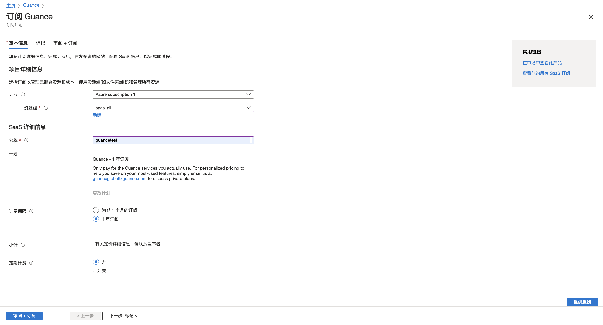
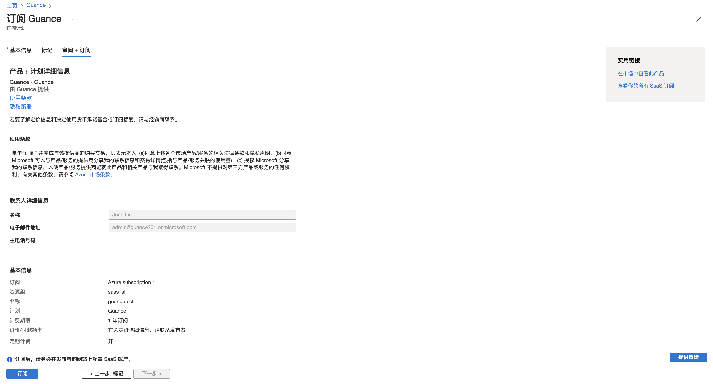
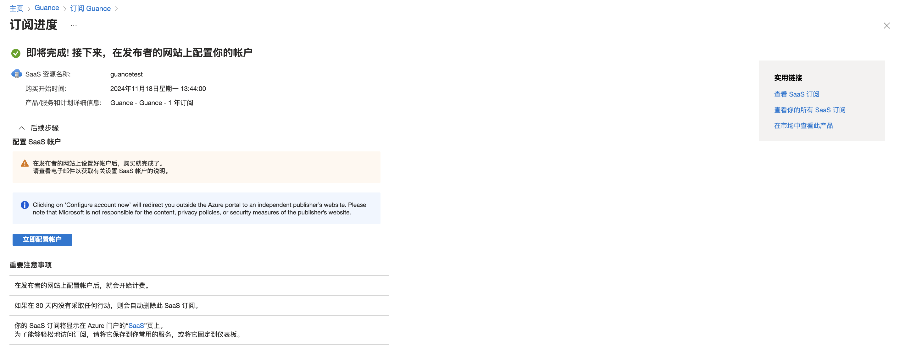

# 微软云市场开通观测云商业版
---

本文将介绍<u>在微软云市场订阅观测云服务以后，如何开通观测云商业版并使用微软账号进行费用结算</u>。

**注意**：通过微软云账号进行结算，仅支持美元这一币种。

## 订阅观测云 {#subscribe}

1. 登录进入[微软云市场](https://azuremarketplace.microsoft.com/en-us/marketplace/apps/ceinformationtechnologycompanylimited1715838939322.guance_saas?tab=Overview)的观测云商品页；
2. 点击 **Get It Now**；
3. 在弹出的窗口中勾选同意协议，点击 **Continue**；
4. 默认跳转至订阅页面，选择订阅资源组；
5. 在新页确认您的订阅信息，定义名称、选择计费期限及是否续订；
6. 点击左下角**审阅 + 订阅**；
7. 确认信息无误后，点击**订阅**；
8. 显示订阅成功。

## 开通观测云商业版

点击后自动跳转回观测云的开通页面。如果当前微软云账号未绑定观测云费用中心账号，会出现两种情况：

:material-numeric-1-circle-outline: [没有费用中心账号](#register)：需要注册观测云账号和费用中心账号，再实现云账号绑定结算；

:material-numeric-2-circle-outline: [有费用中心账号](#bond)：可以直接绑定费用中心账号，实现云账号结算。

???+ warning "什么是费用中心账号？"

    费用中心账号是观测云费用中心平台内用于管理商业版计费的独立账户，它允许单个账号关联多个工作空间，以便于统一处理这些工作空间的计费。

    整体流程参考如下：

    

### 没有费用中心账号 {#register}

若还未有费用中心账号，点击下一步，即可自动跳转至注册页面，完成注册流程后，即可获得观测云账号和费用中心账号。

1. 填写基本信息；
2. 填写企业信息；
3. 选择开通方式：输入工作空间名称，选择工作空间语言，点击**开通**即可完成注册。

### 已有费用中心账号 {#bond}

若您已有费用中心账号，点击下一步，直接进入绑定页面：

**注意**：此处页面右上角的站点与费用中心绑定流程无关，仅影响后续创建工作空间时的站点，且后续无法在创建的页面无法更改站点。

#### :material-numeric-1-circle: 绑定费用中心账号

输入费用中心账号的用户名，通过邮箱验证进行绑定；

#### :material-numeric-2-circle: 绑定观测云工作空间

##### 创建工作空间

如果当前费用中心账号下尚未关联工作空间，请先点击创建工作空间。

由于观测云控制台和费用中心是两个独立的平台，此时需要确认您是否注册过观测云、拥有观测云账号。

:material-numeric-1-circle-outline: 有观测云账号

1. 输入工作空间名称；
2. 选择工作空间语言；
3. 输入邮箱；
4. 填入验证码；
5. 同意协议；
6. 点击创建，工作空间即可创建成功。

:material-numeric-1-circle-outline: 没有观测云账号

1. 输入工作空间名称；
2. 选择工作空间语言；
3. 输入用户名；
4. 输入并再次确认登录密码；
3. 输入邮箱；
4. 填入验证码；
5. 按需填入手机号；
6. 同意协议；
7. 点击注册并创建工作空间。
   

##### 绑定已有工作空间

如果您在该观测云费用中心账号下存在可绑定的工作空间，则直接点击**绑定**。

1. 选择需要绑定的工作空间，点击绑定；
2. 在新页面中点击确定；
3. 此时显示已绑定。

