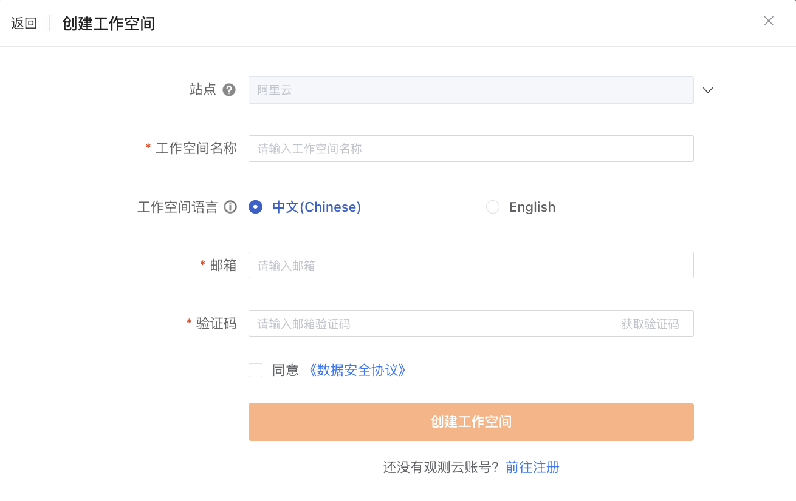

# 华为云云商店开通观测云商业版
---

在华为云商店订购观测云服务，主要需要两个步骤：[购买观测云服务](#purchase)、[绑定联营服务](#team)。订阅成功后，通过华为云侧提供的链接登录进入观测云。

## 第一步：在云商店购买云服务 {#purchase}

登录进入华为云 > 云商店的[观测云 SaaS 版](https://marketplace.huaweicloud.com/contents/8990a122-f456-43a4-892c-a458be31e336#productid=OFFI845592654693900288)商品购买页面。

点击**立即开通**，提示**购买观测云 SaaS 版**，同意协议后，点击**立即开通**。

提示**开通 SaaS 任务提交成功**，点击**返回到我的云商店**。

返回华为云**已购买的服务列表**查看购买的观测云服务，若还未有购买的商品，可刷新页面。

**注意**：华为云账号需要实名认证后才能购买观测云服务。

## 第二步：绑定联营服务 {#team}

在华为云云商店购买联营 SaaS 类商品后，进入买家中心。

1. 点击“待办事项”弹窗中的“开启使用”；或点击页面左侧导航栏“我的云商店 > 联营服务”，进入新手引导页面；
2. 点击“立即使用”，进入联营服务页面；
3. 选择角色，推荐选择“自己用”。
4. 点击确认。

> 更多详情，可参考 [联营 SaaS 类商品使用指导](https://support.huaweicloud.com/ug-marketplace/sp_topic_0000212.html)。

:material-numeric-1-circle: 新建企业：填写企业名称与企业域名；

**注意**：

1. 企业创建后不允许修改企业名称；
2. 企业简称是一个企业的唯一标识，一旦创建后将不允许修改。组织内授权用户在通过云商店统一登录页面登录时，云商店将通过用户账号和企业简称来唯一识别登录用户信息；
3. 首次创建企业需要 1-3 分钟的开通时间。

:material-numeric-2-circle: 添加成员：填写员工姓名、部门、联系方式等信息；

**注意**：

1. **此处创建的“账号”和“密码”将用于免登到观测云费用中心注册或费用中心账号登录。**
2. 首次添加，华为云会为您自动填入帐号信息（华为云账号的实名信息、手机号或邮箱号、华为云账号名称），您可以进行修改；
3. 设置的账号和密码需要您线下告知企业成员。

:material-numeric-3-circle: 应用授权成员：单击勾选成员列表，勾选“协议许可”，并单击“确认授权”；

授权完成后，请将该登录地址、企业账号名称、账号密码传递给使用观测云产品的企业员工。

:material-numeric-4-circle: 登录应用

1. 使用已授权的企业员工账号通过云商店提供的统一登录链接登录到观测云使用，输入在关联组织添加成员时的账号和密码；
2. 首次登录成功后需要修改初始密码；
3. 修改密码成功后，跳转到观测云产品页面。

## 第三步：开始使用观测云

如果当前华为云账号已绑定观测云费用中心账号，点击链接，直接免登即可。

若未绑定观测云费用中心账号，自动跳转至下图页面:
    
:material-numeric-1-circle-outline: [没有费用中心账号](#register)：需要注册观测云账号和费用中心账号，再实现云账号绑定结算；

:material-numeric-2-circle-outline: [有费用中心账号](#bond)：可以直接绑定费用中心账号，实现云账号结算。

  
    
???+ warning "什么是费用中心账号？"

    费用中心账号是观测云费用中心平台内用于管理商业版计费的独立账户，它允许单个账号关联多个工作空间，以便于统一处理这些工作空间的计费。

    整体流程参考如下：

    

### 没有费用中心账号 {#register}

若还未有费用中心账号，点击下一步，即可自动跳转至注册页面，[完成注册流程](./commercial-register.md)后，<u>获取观测云账号和费用中心账号</u>。

1. 填写基本信息；
2. 填写企业信息；
3. 选择开通方式：输入工作空间名称，选择工作空间语言与工作空间风格，输入[华为云账号 ID](#id)；
4. 点击**开通**即可完成注册。

### 已有费用中心账号 {#bond}

若您已有费用中心账号，点击下一步，直接进入绑定页面：

**注意**：此处页面右上角的站点与费用中心绑定流程无关，仅影响后续创建工作空间时的站点，且后续无法在创建的页面无法更改站点。
    

2）输入**用户名**和**邮箱**，点击进入下一步。 

3）在**企业信息**页面，输入所需的信息，点击**确定**。

4）进入**绑定观测云工作空间**流程。

=== "绑定已有工作空间"

    如果您在该观测云费用中心账号下存在可绑定的工作空间，则直接点击**绑定**，并在弹出的对话框中确认绑定。

      

    提示确认窗口，点击**确定**页面。

    

    跳转至**绑定观测云工作空间**页面，提示已绑定。

    

    点击**确定**，显示开通成功。

    

=== "创建工作空间"

    如果您已经注册过观测云账号，但还未创建工作空间，请先点击**创建工作空间**。

    

    输入工作空间名称、选择工作空间语言、输入注册观测云账号时使用的邮箱，通过邮箱验证进行创建。

    **注意**：工作空间是观测云数据洞察的协作空间，工作空间语言选项会影响工作空间内事件、告警、短信等模板。若选择英文，上述对应模板将默认使用英文模板，一旦创建，此工作空间的模版语言不可修改，请谨慎选择。

    

    工作空间创建成功后，自动跳转至**绑定观测云工作空间**页面

    

    点击**确定**，跳转至**成功绑定以下观测云工作空间**页面。

    

=== "注册观测云账号"

    如果您之前未使用过观测云服务，请先注册观测云账号并创建工作空间。

    

    点击**注册观测云账号**，输入相关信息，通过邮箱验证进行注册。

    **注意**：工作空间是观测云数据洞察的协作空间，工作空间语言选项会影响工作空间内事件、告警、短信等模板。若选择英文，上述对应模板将默认使用英文模板，一旦创建，此工作空间的模版语言不可修改，请谨慎选择。

    

**注意**：如果[华为云账号 ID](./billing-account/huawei-account.md#id) 已绑定观测云费用中心账号，点击**登录链接**，您可以直接免登进入。

## 开始使用观测云

注册完成后，可观看观测云介绍小视频，或者您可以点击**从安装 DataKit 开始**即可安装配置第一个 DataKit。

## 如何获取华为云账号 ID {#id}

通过账号登录到 [华为云](https://www.huaweicloud.com) 控制台，把鼠标悬停在右上角账号头像上，在下拉列表中点击**我的凭证**。

进入到**我的凭证**，在 API 凭证页面，点击复制**帐号 ID**，填入观测云费用中心购买预购卡对话框的**华为云账号 ID**。

## 如何获取华为云实例 ID {#instanceid}

在华为云云商店，进入**我的云商店 > 已购买的服务**。进入商品详情页，在当前服务的**应用信息**，即可查看华为云实例 ID。

