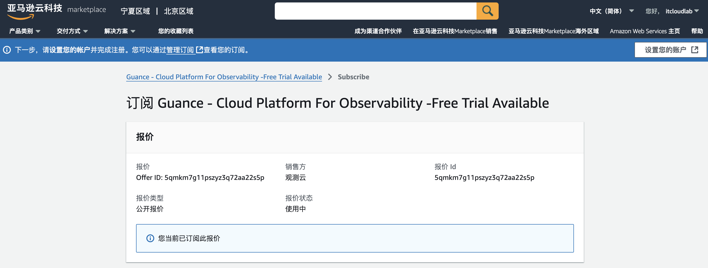

# AWS 云市场开通观测云商业版
---

本文将介绍<u>在 AWS 云市场订阅观测云服务以后，如何开通观测云商业版并使用 AWS 账号进行费用结算</u>。

## 订阅观测云 {#subscribe}

登录进入 [AWS 云市场](https://awsmarketplace.amazonaws.cn/marketplace/pp/prodview-duyx7ds3f3cq2)的观测云商品页，点击**继续订阅**。

成功订阅后，点击**设置您的账户**。

## 开通观测云商业版

点击后自动跳转回观测云的开通页面。如果当前 AWS 账号未绑定观测云费用中心账号，会出现两种情况：

:material-numeric-1-circle-outline: [没有费用中心账号](#register)：需要注册观测云账号和费用中心账号，再实现云账号绑定结算；

:material-numeric-2-circle-outline: [有费用中心账号](#bond)：可以直接绑定费用中心账号，实现云账号结算。

???+ warning "什么是费用中心账号？"

    费用中心账号是观测云费用中心用于管理观测云商业版计费相关的独立账号，一个费用中心账号可以关联多个工作空间计费。

    整体流程参考如下：

    

### 没有费用中心账号 {#register}

若还未有费用中心账号，点击下一步，即可自动跳转至注册页面，[完成注册流程](./commercial-register.md)后，<u>获取观测云账号和费用中心账号</u>。

1. 填写基本信息；
2. 填写企业信息；
3. 选择开通方式：输入工作空间名称，选择工作空间语言与工作空间风格，点击**开通**即可完成注册。

### 已有费用中心账号 {#bond}

若您已有费用中心账号，点击下一步，直接进入绑定页面：

**注意**：此处页面右上角的站点与费用中心绑定流程无关，仅影响后续创建工作空间时的站点，且后续无法在创建的页面无法更改站点。

#### :material-numeric-1-circle: 绑定费用中心账号

输入费用中心账号的用户名，通过邮箱验证进行绑定；

#### :material-numeric-2-circle: 绑定观测云工作空间

=== "绑定已有工作空间"

    如果您在该观测云费用中心账号下存在可绑定的工作空间，则直接点击**绑定**。

    

    在弹出的确认对话框，点击**确认**.

    
    
    跳转至**绑定观测云工作空间**页面，提示已绑定。

    

    点击**确认**，显示开通成功。

    

    您可以在 [观测云费用中心](https://boss.guance.com/#/signin)，**工作空间管理**查看已开通的结算方式。

    

=== "创建工作空间"

    如果您已经注册过观测云账号，但还未创建工作空间，请先点击**创建工作空间**。

    

    输入工作空间名称、选择工作空间语言、输入注册观测云账号时使用的邮箱，通过邮箱验证进行创建。

    **注意**：工作空间是观测云数据洞察的协作空间，工作空间语言选项会影响工作空间内事件、告警、短信等模板。若选择英文，上述对应模板将默认使用英文模板，一旦创建，此工作空间的模版语言不可修改，请谨慎选择。

    

    工作空间创建成功后，自动跳转至**绑定观测云工作空间**页面

    

    点击**确认**，跳转至**成功绑定以下观测云工作空间**页面。

    

=== "注册观测云账号"

    如果您之前未使用过观测云服务，请先注册观测云账号并创建工作空间。

    

    点击**注册观测云账号**，输入相关信息，通过邮箱验证进行注册。

    **注意**：工作空间是观测云数据洞察的协作空间，工作空间语言选项会影响工作空间内事件、告警、短信等模板。若选择英文，上述对应模板将默认使用英文模板，一旦创建，此工作空间的模版语言不可修改，请谨慎选择。

    

<!--
### 注册观测云商业版

若还未有观测云账号，可以点击**立即注册观测云商业版**，进入账号注册流程。

=== "第一步：基本信息"

    在**基本信息**页面，选择 “中国区2（宁夏）” 或者 “海外区1（俄勒冈）”站点、输入注册信息，点击**下一步**。

    

=== "第二步：企业信息"

    在**企业信息**页面，输入相关信息，点击**注册**。

    

=== "第三步：选择开通方式"

    在**选择开通方式**，填写**工作空间名称**，选择**工作空间语言**，点击**确定**即可完成注册。

    **注意**：工作空间是观测云数据洞察的协作空间，工作空间语言选项会影响工作空间内事件、告警、短信等模板。若选择英文，上述对应模板将默认使用英文模板，一旦创建，此工作空间的模版语言不可修改，请谨慎选择。
    
    

=== "第四步：开通成功"

    成功选择开通方式后，将会提示成功开通观测云商业版。
    
    **注意**：开通成功后，绑定的工作空间所产生的费用将直接从购买该商品的 AWS 账户中进行结算。

    

    您可以使用刚才注册的账号登录到 [观测云费用中心](https://boss.guance.com/#/signin)，在**工作空间管理**查看已开通的结算方式。

    

### 绑定观测云工作空间

若已经有观测云账号，可以点击**已有费用中心账号，去绑定**，提示**如何快速绑定AWS账号结算**。

点击**知道了**，开始绑定观测云工作空间，在绑定工作空间之前需要先绑定观测云的费用中心账号。

#### 绑定观测云费用中心账号

- 站点：支持选择后续创建工作空间的站点；
- 用户名：若您已经有观测云费用中心账号，可直接输入观测云费用中心账号**用户名**，通过邮箱验证进行绑定；
- 注册：若您还未有观测云费用中心账号，可先进行注册。

#### 绑定工作空间

=== "绑定已有工作空间"

    如果您在该观测云费用中心账号下存在可绑定的工作空间，则直接点击**绑定**。

    

    在弹出的确认对话框，点击**确认**.

    
    
    跳转至**绑定观测云工作空间**页面，提示已绑定。

    

    点击**确认**，显示开通成功。

    

    您可以在 [观测云费用中心](https://boss.guance.com/#/signin)，**工作空间管理**查看已开通的结算方式。

    

=== "创建工作空间"

    如果您已经注册过观测云账号，但还未创建工作空间，请先点击**创建工作空间**。

    

    输入工作空间名称、选择工作空间语言、输入注册观测云账号时使用的邮箱，通过邮箱验证进行创建。

    **注意**：工作空间是观测云数据洞察的协作空间，工作空间语言选项会影响工作空间内事件、告警、短信等模板。若选择英文，上述对应模板将默认使用英文模板，一旦创建，此工作空间的模版语言不可修改，请谨慎选择。

    

    工作空间创建成功后，自动跳转至**绑定观测云工作空间**页面

    

    点击**确认**，跳转至**成功绑定以下观测云工作空间**页面。

    

=== "注册观测云账号"

    如果您之前未使用过观测云服务，请先注册观测云账号并创建工作空间。

    

    点击**注册观测云账号**，输入相关信息，通过邮箱验证进行注册。

    **注意**：工作空间是观测云数据洞察的协作空间，工作空间语言选项会影响工作空间内事件、告警、短信等模板。若选择英文，上述对应模板将默认使用英文模板，一旦创建，此工作空间的模版语言不可修改，请谨慎选择。

    

## 开始使用观测云

注册完成后，可观看观测云介绍小视频，或者您可以点击**从安装 DataKit 开始**即可安装配置第一个 DataKit。

-->