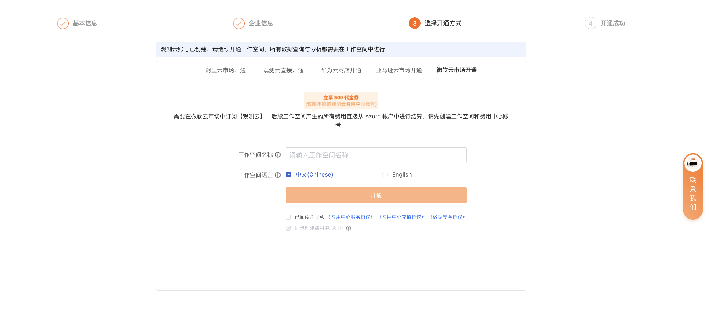
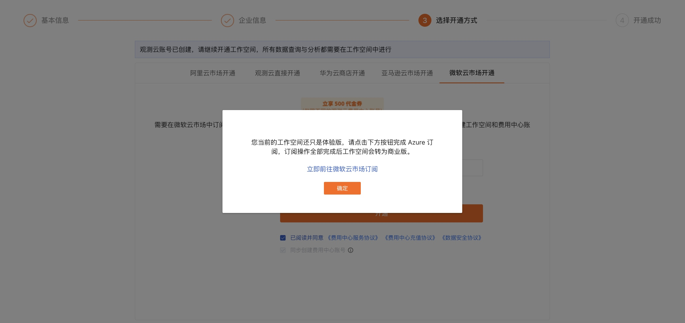

# 从官网注册商业版
---

在[观测云官网](https://www.guance.com/)，点击**[免费注册](https://auth.guance.com/businessRegister)**，填写相关信息后即可成为观测云用户。

## 第一步：基本信息 {#info}

1. 选择站点；
2. 定义用户名与登录密码；
3. 输入邮箱信息炳并填入发送的验证码；
4. 输入手机号；
5. 点击**下一步**。

### 站点说明 {#site}

观测云提供多个注册站点，您可根据当前的云环境或者结算方式等实际情况，选择对应站点。

**注意**：

- 不同站点的账号和数据相互独立，无法互相共享和迁移数据，请谨慎选择；

- 注册商业版的同时，您可以根据所选择的站点，设置对应的[结算方式](../billing/billing-account/index.md)，后续可按需修改。

| 站点    | 登录地址 URL    |  运营商 |
| ----------------- | ---------------- | ------------------ |
| 中国区1（杭州）   | [https://auth.guance.com/](https://auth.guance.com/login/pwd) |阿里云（中国杭州） |
| 中国区2（宁夏）   | [https://aws-auth.guance.com/](https://aws-auth.guance.com/login/pwd) |AWS（中国宁夏） |
| 中国区4（广州）   | [https://cn4-auth.guance.com/](https://cn4-auth.guance.com/login/pwd) | 华为云（中国广州） |
| 中国区6（香港）   | [https://cn6-auth.guance.com/](https://cn4-auth.guance.com/login/pwd) | 阿里云（国际站） |
| 海外区1（俄勒冈） | [https://us1-auth.guance.com/](https://us1-auth.guance.com/) | AWS（美国俄勒冈） |
| 欧洲区1（法兰克福）   | [https://eu1-auth.guance.com/](https://cn4-auth.guance.com/login/pwd) | AWS（法兰克福） |
| 亚太区1（新加坡）   | [https://ap1-auth.guance.com/](https://cn4-auth.guance.com/login/pwd) | AWS（新加坡） |

## 第二步：企业信息 {#corporate}

1. 输入企业名称；
2. 阅读并同意相关协议后；
3. 点击**更多信息**，您可按需填写其他企业相关信息；
4. 点击注册。

**注意**：完成第二步，即**成功注册了观测云账号**。接下来的第三步将继续指导您**开通该账号下的工作空间**。

## 第三步：选择开通方式 {#methods}

根据[第一步](#info)中选择的站点，第三步会显示对应默认的开通方式页面。

1. 输入工作空间名称；
2. 定义工作空间语言；
3. 按需选择[开通方式](#specific_method)。

### 开通方式 {#specific_method}

#### 观测云直接开通 {#guanceyun}

即通过观测云账号直接创建工作空间。

开通成功后，工作空间内产生的所有费用会直接从您的观测云账号进行结算。

#### 华为云商店开通 {#huawei-cloud}

须先前往华为云购买观测云商业版产品，通过华为云账号开通工作空间，后续工作空间内产生的所有费用会直接从您的华为云账户中进行结算。

1. [**前往华为云免费开通**](./commercial-huaweiyun.md#purchase)，购买观测云服务；
2. 输入工作空间名称；
3. 选择工作空间语言；
4. 输入华为云账号 ID；
5. 点击开通，完成注册。

#### 阿里云市场开通 {#aliyun}

须先前往阿里云购买观测云商业版产品，通过阿里云账号开通工作空间，后续工作空间内产生的所有费用会直接从您的阿里云账户中进行结算。

1. [**前往阿里云免费开通观测云服务**](./commercial-aliyun.md#purchase)，购买观测云服务；
2. 输入工作空间名称；
3. 选择工作空间语言；
4. 输入账号 ID 与商品实例 ID；
5. 点击开通，完成注册。

<!--
???+ warning "阿里云用户还可采取以下方式开通："
    
    - 您可以直接在 [阿里云市场观测云](https://market.aliyun.com/products/56838014/cmgj00053362.html) ，购买观测云，并直接通过免登注册开通观测云。
    
    > 更多详情步骤，可参考 [阿里云市场开通观测云商业版](commercial-aliyun.md)。
    
    - 若您是阿里云 SLS 用户，且需要在观测云使用 SLS 存储方式，您可以直接在 [阿里云市场观测云专属版](https://market.aliyun.com/products/56838014/cmgj00060481.html)，购买观测云专属版，并直接通过免登注册开通观测云专属版。
    
    > 更多详情步骤，可参考 [阿里云市场开通观测云专属版](commercial-aliyun-sls.md) 、[观测云商业版和观测云专属版的区别](../billing/faq.md#_5)。
-->

#### 亚马逊云市场开通 {#aws}

须先前往 AWS 购买观测云商业版产品，通过 AWS 账号开通工作空间，后续工作空间内产生的所有费用会直接从您的 AWS 账号中进行结算。

1. 填入工作空间名称；
2. 选择工作空间语言；
3. 点击开通。

在弹出的窗口，[前往亚马逊云市场（中国区域）订阅](./commercial-aws.md#订阅观测云-subscribe)，在云市场订阅完成后，回到观测云测，点击**确定**即可完成注册。

#### 微软云市场开通 {#azure}

须先前往微软云市场购买观测云商业版产品，通过微软云账号开通工作空间，后续工作空间内产生的所有费用会直接从您的微软云账号中进行结算。

1. 填入工作空间名称；
2. 选择工作空间语言；
3. 点击开通。

在弹出的窗口，[前往微软云市场订阅](./commercial-azure.md#subscribe)，在云市场订阅完成后，回到观测云测，点击**确定**即可完成注册。

### 同步创建费用中心账号 {#sync}

[费用中心](https://boss.guance.com/)的**初始用户名和密码同观测云（即您在第一步中所填写的用户名/密码）**，两个平台账号体系相互独立，后续修改用户名/密码，不会影响另外一个平台。

在以上开通方式中，勾选此选项，即可为您同步创建费用中心账号。

## 第四步：开通成功 {#success}

完成以上步骤，即可成功开通观测云商业版。

登录工作空间后，可以在观测云[付费计划与账单](../billing/index.md#billing)模块，查看当前工作空间的版本信息。

若您注册时，只完成了第二步，登录时会提示创建工作空间，选择需要创建的工作空间类型即可完成注册登录。

