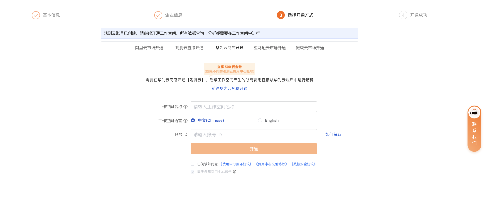
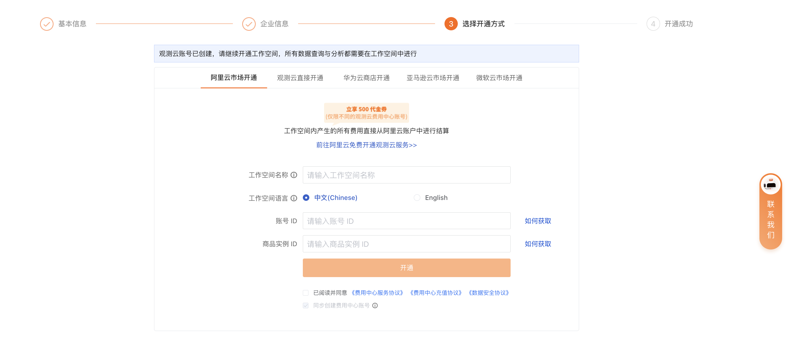
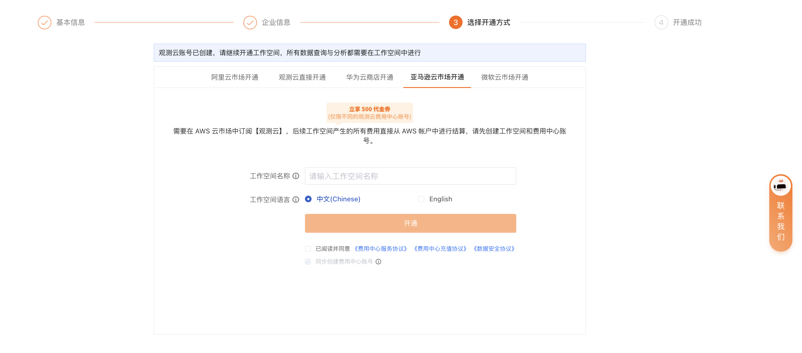

# 注册商业版
---

在[观测云官网](https://www.guance.com/)，点击**[免费注册](https://auth.guance.com/businessRegister)**，填写相关信息后即可成为观测云用户。

## 第一步：基本信息 {#info}

在**基本信息**页面，选择站点、输入注册信息，点击**下一步**。

### 站点说明 {#site}

观测云提供多个注册站点，可根据您当前云环境或者结算方式等实际情况，选择对应站点。

???+ warning "站点相关"

    - 不同站点的账号和数据相互独立，无法互相共享和迁移数据，请谨慎选择；

    - 注册商业版的同时，您可以根据所选择的站点，设置对应的结算方式，后续也可按需修改。

    > 更多详情，可参考 [费用结算方式](../billing/billing-account/index.md)。

| 站点    | 登录地址 URL    |  运营商 |
| ----------------- | ---------------- | ------------------ |
| 中国区1（杭州）   | [https://auth.guance.com/](https://auth.guance.com/login/pwd) |阿里云（中国杭州） |
| 中国区2（宁夏）   | [https://aws-auth.guance.com/](https://aws-auth.guance.com/login/pwd) |AWS（中国宁夏） |
| 中国区4（广州）   | [https://cn4-auth.guance.com/](https://cn4-auth.guance.com/login/pwd) | 华为云（中国广州） |
| 中国区5（世纪互联）   | [https://cn5-auth.guance.com/](https://cn4-auth.guance.com/login/pwd) |  |
| 中国区6（香港）   | [https://cn6-auth.guance.com/](https://cn4-auth.guance.com/login/pwd) | 阿里云（国际站） |
| 海外区1（俄勒冈） | [https://us1-auth.guance.com/](https://us1-auth.guance.com/) | AWS（美国俄勒冈） |
| 欧洲区1（法兰克福）   | [https://eu1-auth.guance.com/](https://cn4-auth.guance.com/login/pwd) | AWS（法兰克福） |
| 亚太区1（新加坡）   | [https://ap1-auth.guance.com/](https://cn4-auth.guance.com/login/pwd) | AWS（新加坡） |

## 第二步：企业信息 {#corporate}

在**企业信息**页面，输入企业名称，阅读并同意相关协议后，点击**注册**。

点击**更多信息**，您可<u>按需填写</u>其他企业相关信息。

完成第二步，即**成功注册了观测云账号**。接下来的[第三步](#methods)将继续指导您开通该账号下的工作空间。

## 第三步：选择开通方式 {#methods}

根据[第一步：基本信息](#info)中所选择的站点，第三步会显示对应默认的开通方式页面。

> 更多详情，可参考 [观测云费用结算方式](../billing/billing-account/index.md)。

### 工作空间名称

工作空间即为观测云数据洞察的协作空间，用户可以在工作空间进行数据查询与分析，支持自定义工作空间名称。

### 工作空间语言

工作空间语言选项会影响工作空间内事件、告警、短信等模板。若选择英文，上述对应模板将默认使用英文模板，一旦创建，此工作空间的模版语言不可修改，请谨慎选择。

### 工作空间风格

观测云设计了**研发、运维、测试、默认**四种工作空间风格。当您选择了特定风格，完成注册后，观测云将在工作空间为您展现对应的的功能菜单风格。

> 前往查看[不同风格的工作空间功能菜单](../management/index.md#create)。

若您需要设置菜单，可前往**管理 > 高级设置 > [功能菜单管理](../management/settings/customized-menu.md)** 进行修改。

### 四种开通方式

结合前面您已经创建成功的观测云账号，需要在这一步继续选择观测云直接开通或云市场开通工作空间，

#### 观测云直接开通 {#guanceyun}

即通过观测云账号直接创建工作空间。

开通成功后，工作空间内产生的所有费用会直接从您的[观测云费用中心](https://boss.guance.com/)所购买的代金券、预购卡余额等通过[观测云账号进行结算](./billing-account/enterprise-account.md)。

输入工作空间名称，选择工作空间语言与工作空间风格，点击**开通**即可完成注册。

#### 华为云商店开通 {#huawei-cloud}

即选择前往华为云购买观测云商业版产品，通过华为云账号开通工作空间，后续工作空间内产生的所有费用会直接从您的[华为云账户中进行结算](./billing-account/huawei-account.md)。

点击[**前往华为云免费开通**](../billing/billing-account/huawei-account.md#market)。服务购买完成后，输入工作空间名称，选择工作空间语言与工作空间风格，并输入华为云账号 ID，点击**开通**即可完成注册。

您也可以直接前往[华为云云商店](https://marketplace.huaweicloud.com/contents/8990a122-f456-43a4-892c-a458be31e336#productid=OFFI845592654693900288)，购买观测云 SaaS 版，并直接通过免登注册开通观测云。

#### 阿里云市场开通 {#aliyun}

即选择前往阿里云购买观测云商业版产品，通过阿里云账号开通工作空间，后续工作空间内产生的所有费用会直接从您的[阿里云账户中进行结算](./billing-account/aliyun-account.md)。

点击[**前往阿里云免费开通观测云服务**](https://market.aliyun.com/products/56838014/cmgj00053362.html)。服务购买完成后，输入工作空间名称，选择工作空间语言与工作空间风格，输入[**账号 ID**](../billing/billing-account/aliyun-account.md#uid)、[**商品实例 ID**](../billing/billing-account/aliyun-account.md#entity-id)，点击**开通**即可完成注册。

???+ warning "阿里云用户还可采取以下方式开通："
    
    - 您可以直接在 [阿里云市场观测云](https://market.aliyun.com/products/56838014/cmgj00053362.html) ，购买观测云，并直接通过免登注册开通观测云。
    
    > 更多详情步骤，可参考 [阿里云市场开通观测云商业版](commercial-aliyun.md)。
    
    - 若您是阿里云 SLS 用户，且需要在观测云使用 SLS 存储方式，您可以直接在 [阿里云市场观测云专属版](https://market.aliyun.com/products/56838014/cmgj00060481.html)，购买观测云专属版，并直接通过免登注册开通观测云专属版。
    
    > 更多详情步骤，可参考 [阿里云市场开通观测云专属版](commercial-aliyun-sls.md) 、[观测云商业版和观测云专属版的区别](../billing/faq.md#_5)。

#### 亚马逊云市场开通 {#aws}

即选择前往 AWS 购买观测云商业版产品，通过 AWS 账号开通工作空间，后续工作空间内产生的所有费用会直接从您的 [AWS 账号中进行结算](./billing-account/aws-account.md#register)。

填入工作空间名称，选择工作空间语言与风格，点击**开通**。

在弹出的窗口，点击 **[前往亚马逊云市场（中国区域）订阅](../billing/billing-account/aws-account.md#subscribe)**，订阅完成后点击**确定**即可完成注册。

#### 同步创建费用中心账号 {#sync}

[费用中心](https://boss.guance.com/)的<u>初始用户名和密码同观测云（即您在第一步中所填写的用户名/密码）</u>，两个平台账号体系相互独立，后续修改用户名/密码，不会影响另外一个平台。

在以上四种开通方式中，勾选此选项，即可为您同步创建费用中心账号。

## 第四步：开通成功 {#success}

成功**选择开通方式**后，将会提示成功开通观测云商业版。

登录工作空间后，可以在观测云付费计划与账单模块，查看当前工作空间的版本信息。

- [ :fontawesome-solid-arrow-up-right-from-square: &nbsp; 商业版付费计划与账单模块介绍](../billing/commercial.md#_4)

 

若您注册时，只完成了第二步，登录时会提示创建工作空间，选择需要创建的工作空间类型即可完成注册登录。

<!--
## 开始使用观测云 {#start}

首次注册进入工作空间，可观看观测云介绍小视频，或者您可以点击**从安装 DataKit 开始**即可安装配置第一个 DataKit。

-->
