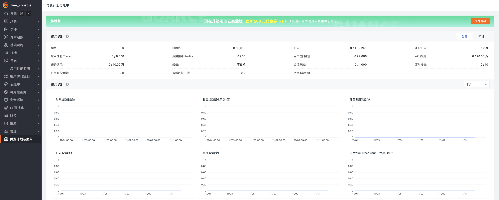

# 公有云体验版
---

## 体验版与商业版的区别 {#trail-vs-commercial}

公有云提供的体验版、商业版，均采用**按量付费**的计费方式。

体验版可接入的数据量规模存在限制，[升级到商业版](#upgrade-commercial)后可接入更大规模的数据量，更灵活地自定义数据存储时效。

???+ warning "体验版使用须知"

    - 体验版不升级则不收费，**一旦升级到商业版，不可回退**；
    - 体验版若升级到商业版，采集数据会继续上报到<<< custom_key.brand_name >>>工作空间，但是**体验版时期采集的数据将无法查看**；
    - 升级商业版仅支持当前工作空间拥有者查看和操作；
    - 备份日志统计的是全量数据，其他计费项都为增量数据；增量数据统计每天 0 点重置免费配额，当天有效；
    - 体验版不同计费项目若存在数据额度使用满载的情况，数据将停止上报更新；基础设施、事件这两类数据依旧支持上报更新，您仍然可以看到基础设施列表数据，事件数据；
    - 因为涉及数据内容安全问题，体验版工作空间**不支持快照分享**功能使用。

体验版和商业版所支持服务范围的区别：

| **区别** | 
项目
  | **体验版**    | **商业版**   |
| -------- | ---------------- | ---------- | --------- |
| 数据         | 每日数据上报限制 | 上报有限数据，超额数据不再上报       | 不限 |
|          | 数据存储策略     | 7 天循环        |自定义[存储策略](../billing-method/data-storage.md) |
|          | 时间线 | 3000 条 | 不限    |
|          | 日志类数据 | 每天 100 万条 日志类数据范围：事件、安全巡检、日志 (不含可用性监测的日志数据) | 不限    |
|          | 应用性能 Trace  | 每天 8000 个 | 不限    |
|          | 应用性能 Profile  | 每天 60 个 | 不限    |
|          | 用户访问 PV  | 每天 2000 个 | 不限    |
|          | 任务调用次数 | 每天 10 万次 |不限    |
|          | 可用性监测任务 | 每天 20 万次 |  不限    |
|          | 会话重放  | 每天 1000 个 | 不限    |
| 功能      | 基础设施         | :heavy_check_mark: | :heavy_check_mark:    |
|          | 日志            | :heavy_check_mark:| :heavy_check_mark: | 
|          | 备份日志         | /     | :heavy_check_mark: | 
|          | 应用性能监测     | :heavy_check_mark: | :heavy_check_mark: | 
|          | 用户访问监测     | :heavy_check_mark: | :heavy_check_mark: | 
|          | CI 可视化    | :heavy_check_mark: | :heavy_check_mark: | 
|          | 安全巡检         | :heavy_check_mark: | :heavy_check_mark: | 
|          | 监控      | :heavy_check_mark: | :heavy_check_mark: | 
|          | 可用性监测       | 中国区拨测（每天 20 万次）      |全球拨测       |
|          | 短信告警通知     | /     | :heavy_check_mark: | 
|          | DataFlux Func    | :heavy_check_mark: | :heavy_check_mark: | 
|          | 账号权限         | 只读、标准权限提升到管理员，无需审核 | 只读、标准权限提升到管理员，需要费用中心管理员审核           |
| 服务     | 基础服务         | 社区、电话、工单支持(5 x 8 小时)     | 社区、电话、工单支持(5 x 8 小时)      |
|          | 培训服务         | 可观测性定期培训              | 可观测性定期培训      |
|          | 专家服务         | /     | 专业产品技术专家支持       |
|          | 增值服务         | /     | 互联网专业运维服务         |
|          | 监控数字作战屏   | /     | 可定制   |

## 开通体验版 {#register-trail}

在[<<< custom_key.brand_name >>>官网](https://<<< custom_key.brand_main_domain >>>/)，点击[**免费开始**](https://<<< custom_key.studio_main_site_auth >>>/businessRegister)，填写相关信息后即可成为<<< custom_key.brand_name >>>用户。

### 第一步：基本信息

1. 选择站点；
2. 定义用户名与登录密码；
3. 输入邮箱信息炳并填入发送的验证码；
4. 输入手机号；
5. 点击**下一步**。

## 第二步：企业信息 {#corporate}

1. 输入企业名称；
2. 阅读并同意相关协议后；
3. 点击**更多信息**，您可按需填写其他企业相关信息；
4. 点击注册。

**注意**：完成第二步，即**成功注册了<<< custom_key.brand_name >>>账号**。接下来的第三步将继续指导您**开通该账号下的工作空间**。

## 第三步：开通体验版

1. 点击当前页面右上角切换到**开通体验版工作空间**页面；

2. 输入工作空间名称；
3. 选择工作空间语言；
4. 建议勾选协议和**同步创建费用中心账号**；
5. 点击注册即可开通成功。

### 体验额度查询

<<< custom_key.brand_name >>>工作空间的拥有者、管理员可以在**付费计划与账单**模块，查看各个计费项目每天的体验额度及其使用情况。

## 升级到商业版 {#upgrade-commercial}

升级须知：

- 体验版成功升级到商业版以后，**无法回退**；
- 采集数据会继续上报到<<< custom_key.brand_name >>>工作空间，但是**体验版时期采集的数据将无法查看**。

### 前置条件

- 已注册[<<< custom_key.brand_name >>>控制台](https://<<< custom_key.studio_main_site >>>/)账号，已有体验版工作空间；
- 同步创建[<<< custom_key.brand_name >>>费用中心](https://<<< custom_key.boss_domain >>>/)账号，对接后续费用结算功能。

???- abstract "什么是费用中心账号？"

    [费用中心](../billing-center/index.md)是<<< custom_key.brand_name >>>的支付结算平台，只有注册该平台的账号，才能进行账户充值、支付结算、账单管理等操作。

### 开始升级 {#upgrade-entry}

在工作空间导航栏，点击**立即升级**：

或直接前往**付费计划与账单**，点击**立即升级**。

如果您是当前工作空间的 Owner，点击后可直接进入升级页面：

其他成员则需要联系工作空间的 Owner 进行升级。如果您拥有<<< custom_key.brand_name >>>费用中心账号，可以直接进入费用中心绑定该空间，从而实现版本的升级。

1. 进入**套餐升级**页面；
2. 点击**升级**；
3. 开始[绑定<<< custom_key.brand_name >>>费用中心账号](#bind-billing)。

### 绑定费用中心账号 {#bind-billing}

若您在开通体验版的过程中勾选了同步创建费用中心账号这一选项，则系统已为您与当前账号同名的费用中心账号。

1. 输入该用户名；
2. 输入绑定邮箱；
3. 获取验证码；
4. 点击绑定。

若当时未勾选，需先注册费用中心账号。

填写基础信息与企业信息，即可注册成功。

## 查看升级版本

返回<<< custom_key.brand_name >>>付费计划与账单，可以看到当前工作空间已经升级到**商业版**。

点击右上角**费用中心**，即可自动跳转到<<< custom_key.brand_name >>>费用中心。

## 更多阅读

- [ :fontawesome-solid-arrow-right-long: &nbsp; **<<< custom_key.brand_name >>>产品服务快速入门**](../getting-started/index.md)

- [ :fontawesome-solid-arrow-right-long: &nbsp; **如何更改结算方式？**](../billing/faq/settlement-bill.md#switch)

