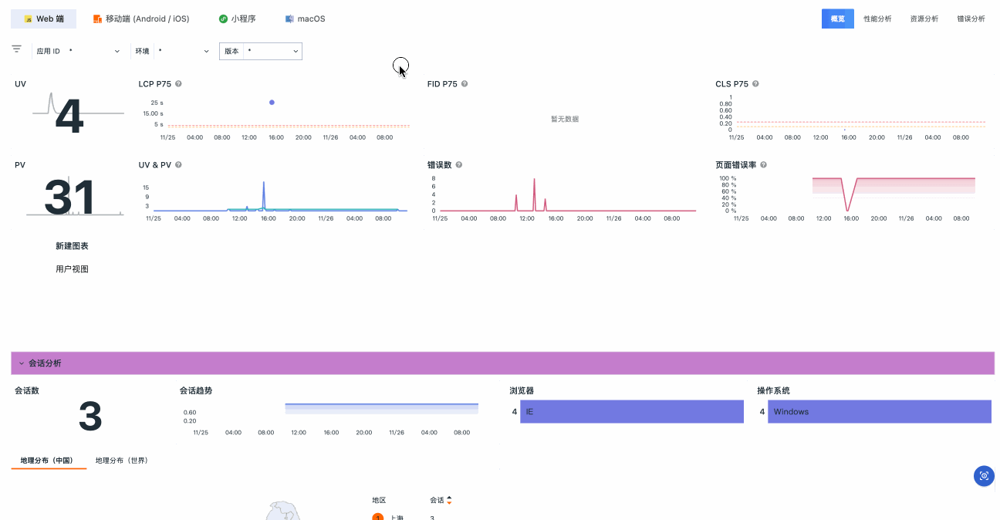

# 分析看板

{{{ custom_key.brand_name }}}支持对不同端口的应用进行可视化分析，并预设了多种监测方案。应用数据上传至{{{ custom_key.brand_name }}}后，您可以在监测分析看板中直接查看 Web 端、移动端、小程序以及 macOS 应用的分析情况，涵盖概览、性能、资源和错误等关键分析维度。

## 概念先解

LCP、FID、CLS 是谷歌网站核心指标，用来衡量网站的载入速度、互动性和页面稳定性。

| 指标 | 说明 | 目标值 |
| --- | --- | --- |
| LCP(Largest Contentful Paint) | 计算网页可视范围内最大的内容元件需花多少时间载入 | 小于 2.5s |
| FID(First Input Delay) | 计算用户首次与网页互动时的延迟时间 | 小于 100ms |
| CLS(Cumulative Layout Shift) | 计算网页载入时的内容是否会因动态加载而页面移动，0 表示没有变化。 | 小于 0.1 |

## 分析维度

包含四个维度：

1. Web 端；
2. 移动端 (Android / iOS)；
3. 小程序；
4. macOS 应用。

切换视图上方的 tab 即可切换视图查看。

<!--
**注意**：在 **macOS** 应用类型下，{{{ custom_key.brand_name }}}会默认展示五个以内的视图。您可以通过搜索栏进行搜索定位：

- 输入应用 ID：列出当前应用 ID 下绑定的视图；  
- 输入视图名称：列出所有被绑定的匹配视图。

-->

## 概览 {#overview}

统计当前端口应用访问的 UV 数、PV 数、页面错误率、页面加载时间等指标，并辅助从会话分析、性能分析、错误分析三方面可视化的展示用户访问应用的数据统计，快速定位用户访问应用的问题，提高用户访问性能。

您可以通过应用 ID、环境、版本等筛选快速定位查看已经接入的应用。

## 性能分析 {#performance}

统计 PV 数、页面加载时间、最受关注页面会话数、页面长任务分析、资源分析等指标，并从 Long Task 分析、XHR & Fetch 分析、资源分析三方面实时查看整体应用页面性能情况，进一步精准定位需要优化的页面。

您可以通过应用 ID、环境、版本、加载类型等进行细分筛选。

## 资源分析 {#resources}

统计资源分类、资源请求排行等指标，并从 XHR & Fetch 分析、资源耗时分析两方面，实时查看整体资源情况及需要优化的资源。

您可以通过应用 ID、环境、版本、资源地址分组、资源地址等进行细分筛选。

## 错误分析 {#errors}

统计错误率、Crash 版本、网络错误状态分布、页面错误率等指标快速定位资源错误。

您可以通过应用 ID、环境、版本、来源、页面地址分组、浏览器等进行细分筛选。

<!--

-->

## 关联视图

当前分析看板是{{{ custom_key.brand_name }}}为您提供的标准“系统视图”。如果您希望使用个性化的视图进行分析，可以创建一个与系统视图同名的“用户视图”，系统将自动优先使用您的“用户视图”来展示。

点击右上角跳转按钮即可。

